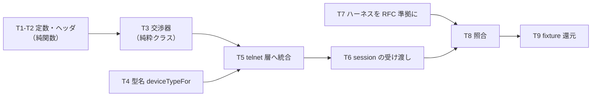

# 計画: 基本 TN3270E

## split 判定

`aidev-docs/DESIGN.md`「5.」の 3 層決定木で判定した。

**discriminator: そのピースは単独で検証・デリバリ可能か → NO（相互依存）**
交渉器だけ・ヘッダだけでは何も動かない。telnet 層に組み込んで初めて接続が成立する。

**大きく、漸進レビューで負荷を割れるか → NO**
変更は `telnet/` の 3 ファイル＋`session.ts` の受け渡し＋ハーネスに閉じ、
`protocol/` と `screen/` は無変更（spec D1）。**subtask 化は過剰分割**。

→ **分割しない。単一の tasks.md で進める。**

## 実装方針

**ガードを先に立て、既存経路を壊さないことを常に確かめながら進む。**
基本 TN3270 は実機で検証済みなので、**各段階で既存テストが緑であること**を条件にする。

**純粋な部分から作る**——ヘッダの付け外しと交渉の状態機械はソケットに触らない純関数／
純粋クラスなので、単体テストで固めてから telnet 層に差し込む。

**ハーネスを先に RFC 準拠にする**（research F3）。ハーネスが間違っていると誤検証になるので、
**自実装を書く前に「s3270 が受理するハーネス」を用意**し、それを正解の土台にする。

## 作業順序と依存関係

1. 定数（RFC の節番号つき）
2. 5 バイトヘッダの付け外し（純関数）＋単体
3. 交渉の状態機械（純粋クラス）＋単体
4. `deviceTypeFor()`（TN3270E 用の型名）＋単体
5. `telnet.ts` への統合（受理・SB 委譲・ヘッダ・経路分岐）＋単体
6. `session.ts` の受け渡し（`deviceType` / `deviceName` / `tn3270e`）
7. **ハーネスを RFC 準拠の TN3270E サーバに**（先に s3270 で受理を確認）
8. 照合（自実装 × ハーネス、s3270 との交渉列の突き合わせ）
9. fixture 化して docker 無しの回帰に還元

## リスク / 留意点

| リスク | 対応 |
|---|---|
| **既存経路の退行**（最重要） | 各段で TK4- / IBM i の E2E を回す。`protocol/`・`screen/` は触らない |
| ハーネス自身の仕様違反（research F3 の実例） | **s3270 が受理することを先に確認**してから自実装を当てる |
| `onNegotiated` の発火が早すぎる | TN3270E の `ready` と BINARY/EOR の**両方**が揃うまで発火させない（spec） |
| `FUNCTIONS` の無限往復 | 上限 5 回で impasse として失敗（spec D5） |
| 型名の取り違え（3279 / 3278） | 関数を分け、単体で両方を固定（spec D3） |

## テスト方針

**単体（既定・docker 不要）**
- `splitHeader` / `withHeader`: 往復・境界（5 バイト丁度／未満）・未知の DATA-TYPE
- 交渉器: 正常系（SEND→REQUEST→IS→FUNCTIONS）・REJECT＋REASON・対案の往復・上限超過
- `deviceTypeFor`: モデル 2/3/4/5 と `-E` の有無、**基本用と別物であること**
- telnet 層: `DO TN3270E` の受理／`tn3270e:false` での `WONT`／ヘッダの付け外し／
  `NVT-DATA` と未知種別を落とさないこと／`onNegotiated` の発火条件

**照合（`TN3270_E2E=1`）**
- ハーネス（TN3270E サーバ）に **s3270** を繋いで受理を確認 → 同じサーバに**自実装**を繋ぐ
- **サーバが受け取ったバイト列を s3270 と自実装で突き合わせる**（交渉列の一致）
- LU 名指定で `CONNECT` が飛ぶこと、REJECT で理由付きエラーになること
- **退行確認**: TK4-（basic）と IBM i（basic）の既存 E2E が緑のまま

**還元**: TN3270E セッションの trace を fixture 化し、docker 無しで replay できるようにする。
