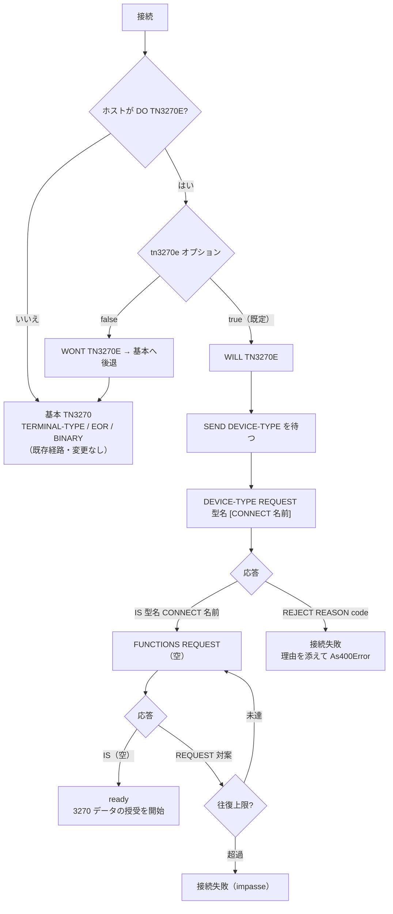

# 仕様: 基本 TN3270E（RFC 2355 §9）

## 概要

`@ts5250/tn3270` に**基本 TN3270E**を足す。任意機能は一切合意せず（`FUNCTIONS` 空集合）、
`3270-DATA` の授受と **LU 名指定**を可能にする。

**既存の基本 TN3270 経路は残す**——ホストが TN3270E を提示しなければ従来どおり動く。

## 設計方針

### D1: 5 バイトヘッダは **telnet 層で付け外しする**（最重要）

TN3270E のヘッダは「どの種別のメッセージか」を運ぶ**封筒**であって、3270 データストリームの
一部ではない。したがって **`TelnetLayer` が付け外しし、上位には中身だけを渡す**。

```
ホスト → [5 バイトヘッダ][3270 データ] IAC EOR
                ↓ TelnetLayer が剥がす
上位   →        [3270 データ]            ← inbound.ts は変更不要
```

**この設計の要点は「既存コードを触らない」こと。** `protocol/inbound.ts` /
`protocol/outbound.ts` / `screen/*` / `session` の 3270 側は**一切変更しない**。
基本 TN3270 で実機検証済みの経路に手を入れないので、退行の余地が構造的に無い。

**代替案**: セッションでヘッダを扱う。**採らない**——`applyInbound` の呼び出し前後に
条件分岐が増え、経路が 2 本に割れる。封筒は封筒を開ける層で扱う。

### D2: 交渉の状態機械は `telnet/tn3270e.ts` に分ける

`telnet.ts` は既に telnet の基本（オプション・IAC 二重化・EOR 切り出し・NEW-ENVIRON）で
270 行ある。TN3270E の交渉（DEVICE-TYPE / FUNCTIONS）は独立した状態機械なので別ファイルにし、
`telnet.ts` からは**サブネゴシエーション本文を渡して応答を受け取る**だけにする。

**純粋関数に寄せる**——`Tn3270eNegotiator` はバイト列を受けて「返すべきバイト列」と
「状態」を返す。ソケットに触らない。単体テストが書きやすく、`inbound` を無状態にしたのと同じ思想。

### D3: 型名は基本と TN3270E で**別に組み立てる**

research F4 の実測と RFC 2355 §7.1 のとおり:

| 経路 | 型名 | 例 |
|---|---|---|
| 基本 TN3270 | `IBM-3279-<model>[-E]` | `IBM-3279-2-E` |
| **TN3270E** | **`IBM-3278-<model>[-E]`** | **`IBM-3278-2-E`** |

s3270 も同じ機械でモードによって名前を変えている。**関数を分けて型で取り違えを防ぐ**
（`terminalTypeFor` はそのまま、`deviceTypeFor` を新設）。

### D4: LU 名は経路によって渡し方を変える

| 経路 | 渡し方 |
|---|---|
| 基本 TN3270 | 端末タイプ文字列に `@<名前>`（既存の慣行。実測で Hercules / IBM i が受理） |
| **TN3270E** | **`DEVICE-TYPE REQUEST <型名> CONNECT <名前>`**（RFC の正式な手段） |

**二重指定はしない。** どちらの経路になるかは交渉が始まるまで分からないので、
`TelnetLayer` が `deviceName` を保持し、**発火した経路の側でだけ使う**。

### D5: `FUNCTIONS` は空集合を要求し、減らすときは `REQUEST` で対案

RFC §7.2.1（research F3）:
- **`FUNCTIONS IS` は受け取ったリストをそのまま返す場合にしか使えない**
- 減らすなら **`FUNCTIONS REQUEST`** で対案
- 空リストでの合意＝**basic TN3270E**

こちらは何も支えないので **常に空リストを要求**する。ホストが対案を出してきたら
**再び空を要求**する。**往復に上限（既定 5 回）を設け、超えたら TN3270E を諦めて失敗**させる
（RFC の impasse 条項に相当）。無限往復を構造的に防ぐ。

### D6: TN3270E を明示的に切れるようにする

`tn3270e?: boolean`（既定 `true`）。`false` なら `DO TN3270E` に `WONT` で応じ、
基本 TN3270 へ後退する。**後退経路をテストで踏むため**に要る——実ホストが
TN3270E を提示しない現状では、切り替えを人為的に起こせないと分岐を検証できない。

## 対象範囲

### 追加

```
packages/tn3270/src/telnet/tn3270e.ts     交渉の状態機械 ＋ 5 バイトヘッダ（純粋）
packages/tn3270/test/tn3270e.test.ts      単体
packages/tn3270/test/e2e-tn3270e.test.ts  s3270 との照合
```

### 変更

| ファイル | 変更 |
|---|---|
| `telnet/constants.ts` | `OPT.TN3270E = 0x28` |
| `telnet/telnet.ts` | TN3270E の受理・SB の委譲・ヘッダの付け外し・経路の分岐 |
| `telnet/terminal-type.ts` | `deviceTypeFor()`（TN3270E 用の型名）を追加 |
| `session/session.ts` | `deviceType` / `deviceName` / `tn3270e` を telnet へ渡す |
| `test/harness/mini3270.ts` | TN3270E サーバとして振る舞える拡張（**RFC 準拠**。research F3） |

**`protocol/` と `screen/` は変更しない。**

## インターフェース / データ構造

### 定数（RFC 2355 §3 / §7.2.2 / §8.1.1。research F7）

```ts
export const TN3270E_CMD = {
  ASSOCIATE: 0x00, CONNECT: 0x01, DEVICE_TYPE: 0x02, FUNCTIONS: 0x03,
  IS: 0x04, REASON: 0x05, REJECT: 0x06, REQUEST: 0x07, SEND: 0x08
} as const;

export const TN3270E_FUNC = {
  BIND_IMAGE: 0x00, DATA_STREAM_CTL: 0x01, RESPONSES: 0x02,
  SCS_CTL_CODES: 0x03, SYSREQ: 0x04
} as const;

export const TN3270E_REASON = {
  CONN_PARTNER: 0x00, DEVICE_IN_USE: 0x01, INV_ASSOCIATE: 0x02, INV_NAME: 0x03,
  INV_DEVICE_TYPE: 0x04, TYPE_NAME_ERROR: 0x05, UNKNOWN_ERROR: 0x06, UNSUPPORTED_REQ: 0x07
} as const;

/** §8.1.1。**基本 TN3270E が要るのは 3270_DATA と NVT_DATA だけ**（§9） */
export const DATA_TYPE = {
  DATA_3270: 0x00, SCS_DATA: 0x01, RESPONSE: 0x02, BIND_IMAGE: 0x03,
  UNBIND: 0x04, NVT_DATA: 0x05, REQUEST: 0x06, SSCP_LU_DATA: 0x07, PRINT_EOJ: 0x08
} as const;
```

### 5 バイトヘッダ（§8.1）

```ts
export interface Tn3270eHeader {
  dataType: number;
  requestFlag: number;
  responseFlag: number;
  seq: number;
}

/** レコードからヘッダを剥がす。5 バイト未満なら null（壊れた入力） */
export function splitHeader(record: Uint8Array): { header: Tn3270eHeader; body: Uint8Array } | null;

/**
 * ヘッダを付ける。**基本 TN3270E ではフラグと順序番号を使わないので常に 0**（§9）。
 */
export function withHeader(payload: Uint8Array, dataType: number): Uint8Array;
```

### 交渉の状態機械

```ts
export type Tn3270eState =
  | "idle"          // まだ WILL TN3270E を返していない
  | "device-type"   // DEVICE-TYPE の応答待ち
  | "functions"     // FUNCTIONS の応答待ち
  | "ready"         // 交渉完了。3270 データを扱える
  | "rejected";     // REJECT された（理由は reason に入る）

export interface Tn3270eOptions {
  /** `IBM-3278-<model>[-E]`（D3） */
  deviceType: string;
  /** LU 名。省略時は CONNECT を送らずホストに任せる（D4） */
  deviceName?: string | undefined;
  /** FUNCTIONS の往復上限（既定 5。D5） */
  maxFunctionRounds?: number;
}

export class Tn3270eNegotiator {
  constructor(opts: Tn3270eOptions);
  get state(): Tn3270eState;
  /** サーバから受理された device-name（`IS … CONNECT <名前>`） */
  get deviceName(): string | undefined;
  /** REJECT の理由コードと名前 */
  get reason(): { code: number; name: string } | undefined;
  /**
   * `IAC SB TN3270E … IAC SE` の**本文**（オプション番号の次から SE の手前まで）を渡す。
   * 返り値は**送り返すべき本文**（`IAC SB TN3270E` … `IAC SE` は呼び出し側が包む）。
   * 送るものが無ければ null。
   */
  handle(body: readonly number[]): number[] | null;
}
```

### telnet 層の追加オプション

```ts
export interface TelnetOptions {
  terminalType: string;              // 既存（基本 TN3270 用。IBM-3279-*）
  /** TN3270E 用の型名（IBM-3278-*）。省略すると TN3270E を使わない */
  deviceType?: string | undefined;
  /** LU 名。経路に応じて `@` か CONNECT のどちらかで使う（D4） */
  deviceName?: string | undefined;
  /** TN3270E を使うか（既定 true）。false で `WONT` を返し基本へ後退（D6） */
  tn3270e?: boolean | undefined;
  // 既存: kbdType / codePage / charSet
}
```

`TelnetLayer` に読み取り専用の状態を足す:

```ts
/** TN3270E で接続しているか（交渉完了後に確定） */
get isTn3270e(): boolean;
/** サーバが割り当てた device-name（TN3270E 時のみ） */
get deviceName(): string | undefined;
```

## 振る舞いの詳細

### 1. 経路の分岐



**基本経路（左）は 1 行も変わらない。**

### 2. 交渉のバイト列（RFC §13.4 の例に従う）

```
< IAC DO   TN3270E                                    (fffd28)
> IAC WILL TN3270E                                    (fffb28)
< IAC SB TN3270E SEND DEVICE-TYPE IAC SE              (fffa280802fff0)
> IAC SB TN3270E DEVICE-TYPE REQUEST IBM-3278-2-E [CONNECT <名前>] IAC SE
< IAC SB TN3270E DEVICE-TYPE IS IBM-3278-2-E CONNECT <名前> IAC SE
> IAC SB TN3270E FUNCTIONS REQUEST IAC SE             ← **空リスト**（D5）
< IAC SB TN3270E FUNCTIONS IS IAC SE
  （以降 5 バイトヘッダ付きの 3270 データ）
```

型名・LU 名は **ASCII**（telnet のサブネゴシエーション本文。`IAC` は二重化する）。

### 3. データメッセージ（§8.1 / §9）

**送信**: `sendRecord(payload)` は TN3270E なら `[00 00 00 00 00] + payload` を送る
（`3270-DATA` ＋ フラグ・順序番号は 0。§9 で未使用と明記）。

**受信**: `IAC EOR` で切り出したレコードの先頭 5 バイトをヘッダとして解釈する。

| DATA-TYPE | 扱い |
|---|---|
| `3270-DATA`(00) | 本体を `onRecord` へ渡す（**上位は基本 TN3270 と区別しない**） |
| `NVT-DATA`(05) | **モード切替の要求**。今回は NVT を実装しないので記録して読み飛ばす（§9.1） |
| その他 | 記録して読み飛ばす（**落とさない**） |

- レコードが 5 バイト未満なら**壊れた入力として記録し読み飛ばす**（例外にしない）。
- 本体が空（ヘッダのみ）のレコードは `onRecord` を呼ばない。

### 4. 交渉完了の合図

既存の `onNegotiated` は BINARY と EOR の合意で発火する。**TN3270E では
BINARY / EOR も併せて交渉される**（RFC の例では TN3270E 側に明示が無いが、
実装は EOR でレコードを切るため必要）。

したがって `onNegotiated` は次のどちらかで発火する:
- 基本経路: BINARY ＋ EOR の合意（既存）
- **TN3270E 経路: 交渉が `ready` に達し、かつ BINARY ＋ EOR も合意済み**

**両方が揃うまで発火させない**——早すぎるとセッションが `ready` になった直後に
データを送って弾かれる。

## ドメイン固有の考慮

- **層規約**: `tn3270e.ts` はピュアロジック（`node:*` なし）。`transport/` 以外で Node API を使わない。
- **依存方向**: 追加の依存なし（`base` のみ）。
- **原典主義**: 各定数に RFC 2355 の節番号を参照コメントで残す。
  **s3270 の実挙動と食い違ったら RFC を正とし、理由を記録する**
  （research F3 で s3270 が仕様違反を受理した実例がある）。
- **ハーネスも RFC 準拠にする**——プロトタイプの `FUNCTIONS IS` で部分集合を返す誤りを直す。
  **ハーネスが間違っていると誤検証になる**（research F3）。

## エラー処理 / 異常系

| 事象 | 扱い |
|---|---|
| `DEVICE-TYPE REJECT REASON <code>` | `As400Error("CONNECT_FAILED")`。**理由コードの名前を含める** |
| `FUNCTIONS` の往復が上限超過 | `As400Error("NEGOTIATION_TIMEOUT")`（impasse）。往復回数を含める |
| ホストが `IS` で**要求と違う型名**を返す | 受理する（RFC §7.1.4: 通常クライアントは受け入れる） |
| LU 名を要求したのに違う名前が返る | **記録して受理**（§7.1.4 の例外は将来の厳格モード） |
| 5 バイト未満のレコード | 記録して読み飛ばす |
| 未知の DATA-TYPE | 記録して読み飛ばす |
| 交渉中の切断 | 既存どおり `CONNECT_FAILED` |

## 受け入れ基準との対応

| requirement の完了条件 | 満たし方 |
|---|---|
| TN3270E で画面を組み立てられる | `mini3270` を TN3270E サーバにして自実装を接続、画面を検証 |
| s3270 と同じ交渉列を送る | 同一サーバに s3270 と自実装を順に繋ぎ、**受信したバイト列を突き合わせる** |
| LU 名指定で `CONNECT` を送る | 単体（交渉器のバイト列）＋ 照合（サーバ側が受け取った名前） |
| `REJECT` + `REASON` で理由付きエラー | 単体（サーバ役が REJECT を返す） |
| ヘッダの付与・解釈が固定されている | `splitHeader` / `withHeader` の単体（境界・未知 DATA-TYPE・5 バイト未満） |
| **TN3270E 非対応ホストで退行なし** | 既存の TK4- / IBM i の E2E がそのまま緑であること |
| replay で docker 無し回帰 | TN3270E セッションの trace を fixture 化 |
| build / lint / test が通る | 全パッケージ |

## 残す判断（decisions.md へ）

- **D1**: ヘッダを telnet 層で扱う理由（3270 側を無変更に保ち、退行の余地を構造的に無くす）
- **D3**: 型名を経路別に分ける理由（RFC の一覧と s3270 の実挙動の一致）
- **D5**: `FUNCTIONS` の減らし方が `IS` ではなく `REQUEST` であること（プロトタイプの違反）
- **D6**: `tn3270e: false` を設ける理由（後退経路を検証可能にするため）
