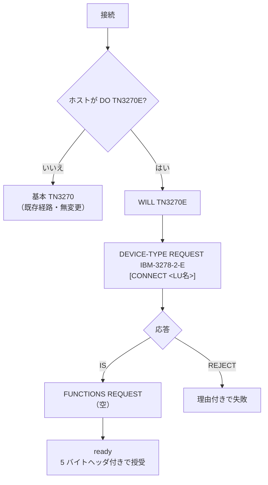
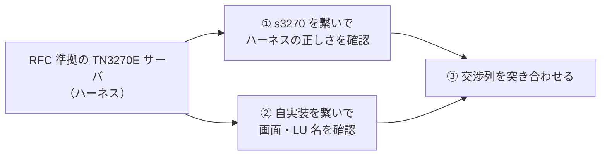

# レビューガイド: 基本 TN3270E

## この PR で何ができるようになったか

**TN3270E（RFC 2355）を提示するホストと、TN3270E で繋げるようになった。**
z/OS メインフレームは TN3270E が前提なので、その土台になる。

任意機能は一切合意しない **basic TN3270E**（RFC §9）に限定してある。



## 重点的に見てほしい 3 点

### 1. **既存コードを触っていないこと**（`telnet/telnet.ts`）

TN3270E の 5 バイトヘッダは「どの種別のメッセージか」を運ぶ**封筒**なので、
`TelnetLayer` が付け外しする。

```
ホスト → [5 バイトヘッダ][3270 データ] IAC EOR
                ↓ TelnetLayer が剥がす
上位   →        [3270 データ]            ← inbound.ts は無変更
```

**`protocol/` と `screen/` は 1 行も変わっていない。** 基本 TN3270 は TK4- と
IBM i（英語・日本語）で実機検証済みなので、そこに手を入れない設計にした。
**退行の余地を構造的に無くす**のが狙いで、実際 TK4- / IBM i の E2E は緑のまま通っている。

レビューでは `sendRecord` / `emitRecord` の分岐が **`isTn3270e` だけで閉じている**か、
基本経路が素通しになっているかを見てほしい。

### 2. 交渉器が**純粋**であること（`telnet/tn3270e.ts`）

`Tn3270eNegotiator` はソケットに触らない。**バイト列を受けて返すべきバイト列を返すだけ**。

おかげで交渉の全経路が単体テストで固定できている——正常系・`REJECT`＋理由・
**対案の往復**・**上限超過（impasse）**・要求していない機能を `IS` された場合。

### 3. `FUNCTIONS` の減らし方（**一度間違えた箇所**）

RFC §7.2.1:

> `FUNCTIONS IS` は **受け取ったリストをそのまま**返す場合にしか使えない。
> 減らすなら **`FUNCTIONS REQUEST`**（対案）を返す。

**プロトタイプでは部分集合を `IS` に載せて返していた**（仕様違反）。
s3270 が寛容に受理したので気づけなかった。

> **参照実装が受理したことは、仕様準拠の証明にならない。**
> 実装とハーネスの両方をこの規則に直してある。`decisions.md` D5 に経緯を残した。

往復には**上限（既定 5）**を設けた。RFC は対案の往復を許すが、双方が譲らないと無限に続く。

## 検証の作り（信頼してよい根拠）

**s3270 を独立オラクルにする三段構え。順序が大事。**



**① を飛ばすと誤検証になる。** 実際、`BIND-IMAGE` を合意してしまうハーネスでは
s3270 が `connected-unbound` のまま画面を描かず、「s3270 がモードに入らない」という
紛らわしい失敗になった。

**③ で確かめたこと**: `DEVICE-TYPE REQUEST` は s3270 と**完全一致**。
`FUNCTIONS` は s3270 が機能を並べるのに対し、こちらは**空**（＝基本 TN3270E）。

## 実ホストについて（正直な限界）

**TN3270E を提示する実ホストは手元に無い。** 実測で確認済み:

| ホスト | 結果 |
|---|---|
| TK4-（MVS 3.8j） | 提示なし |
| pub400（IBM i 7.5） | 提示なし |
| 社内 IBM i 7.3 | 提示なし |

IBM i の 3270 は 5250 の互換層なので基本 TN3270 止まり。
**z/OS が使える環境での確認が残課題**——ここが本命の接続先。

## 動かして確かめるには

```sh
sh packages/tn3270/test/harness/testenv.sh up
cd packages/tn3270 && TN3270_E2E=1 npx vitest run test/e2e-tn3270e.test.ts
```

`fixtures/tn3270e-basic.jsonl` の replay で、**docker 無しでも**交渉と 5 バイトヘッダが回帰する。

## レビューで判断してほしいこと

1. **スコープ**: 任意機能なし（basic TN3270E）で区切ってよいか。
   z/OS 実機で `RESPONSES` が要ると分かれば次の work になる。
2. **`tn3270e: false` という口**を残す是非。後退経路を検証するために設けたが、
   利用者向け API としても妥当か。
3. **スタック PR**: 本 PR は `develop-tn3270-emulator`（PR #330）の上に載っている。
   #330 が develop にマージされた後、宛先を develop へ付け替える想定でよいか。
