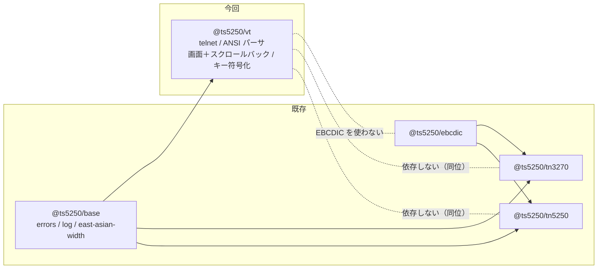

# 要件: VT 端末エミュレータ（ライブラリ層）

## 背景 / 課題

本プロジェクトは IBM i の 5250 エミュレータとして育ち、直近でメインフレームの 3270 まで広げた
（`@ts5250/tn5250` / `@ts5250/tn3270`）。**どちらもブロックモード**——ホストが画面を丸ごと送り、
クライアントがフィールドを編集し、AID キーで一括送信する方式である。

一方で **VT（DEC / ANSI 系）の文字モード端末は未対応**である。リポジトリ全体を走査しても
VT100 / VT220 / ANSI エスケープの実装は無い（`grep -rniE '\bvt(100|220|320|52)?\b'` が 0 件）。

VT に対応すると、同じアプリから届く範囲が次のように広がる。

- **IBM i の TELNET サーバー**は 5250 / 3270 に加えて **VT100 / VT220 クライアントを受け付ける**。
  5250 に無い経路（PASE の `QSH` / `CALL QP2TERM` 相当の対話）に届く。
- **AIX / Linux などの一般 telnet ホスト**。IBM i の周辺には Linux が同居していることが多く、
  「端末を 1 つのアプリで済ませたい」という要求に応えられる。

**VT はブロックモードではない**。フィールドも MDT も AID キーも無く、**1 打鍵ごとにバイトを送り、
ホストのエコーで画面が変わる**。5250 / 3270 で確立した「画面を組み立てて一括送信」の構えは
**そのままは使えない**。ここが本 work の中心的な難所である。

## 目的 / ゴール

`@ts5250/vt` パッケージとして、**xterm 相当の文字モード端末**を TypeScript で実装する。
telnet で接続し、ANSI / DEC のエスケープ列を解釈して画面（＋スクロールバック）を組み立て、
打鍵をホストへ送り返せる状態まで到達する。日本語（全角）を含む。

**`@ts5250/ebcdic` に依存しない**のが 5250 / 3270 との構造的な違いである。VT の世界は
ASCII / ISO-2022 / UTF-8 であって EBCDIC ではない。

## スコープ

利用者の選択（2026-08-22）により **xterm 相当まで**、**一通り使える水準**（`vi` / `less` が
実用になる）を今回の到達点とする。

### 対象

- **telnet ネゴシエーション**
  - `TERMINAL-TYPE`（RFC 1091）: `xterm-256color` / `xterm` / `vt220` / `vt100` を順に申告
  - `NAWS`（RFC 1073）: 画面サイズの通知と、リサイズ時の再通知
  - `ECHO` / `SUPPRESS-GO-AHEAD`（RFC 857 / 858）: **文字モードの成立条件**
  - `BINARY`（RFC 856）: 8 ビット透過（UTF-8 / 日本語に必要）
  - `NEW-ENVIRON`（RFC 1572）/ `TERMINAL-SPEED`: 送れる範囲で
  - **行モードへの縮退**（ホストが `ECHO` を拒む場合）も破綻せず扱う
- **エスケープ列の解釈（パーサ）**
  - 状態機械（ground / escape / csi / osc / dcs / sos-pm-apc）。設計は
    **Paul Williams の DEC ANSI パーサ**の状態遷移に従う
  - C0 / C1 制御（8 ビット C1 と `ESC` 2 バイト形式の両方）
  - **CSI**: カーソル移動（`CUU/CUD/CUF/CUB/CUP/HVP/CHA/VPA/CNL/CPL`）、消去（`ED/EL`）、
    挿入削除（`ICH/DCH/IL/DL/ECH`）、スクロール（`SU/SD`）、タブ（`CHT/CBT/TBC`）、
    スクロール領域（`DECSTBM`）、モード（`SM/RM` と `DECSET/DECRST`）、
    装置報告（`DA1/DA2/DSR/CPR`）、`SGR`
  - **SGR**: 太字 / 淡色 / イタリック / 下線 / 点滅 / 反転 / 隠蔽 / 取り消し線、
    16 色・**256 色（`38;5;n`）・24 ビット色（`38;2;r;g;b`）**、既定色への復帰
  - **DECSET/DECRST の主要モード**: `DECCKM`（カーソルキー）、`DECOM`（原点）、
    `DECAWM`（自動折返し）、`DECTCEM`（カーソル表示）、
    **`1049` 系（代替画面バッファ）**、`2004`（bracketed paste）、
    **マウス報告（`1000` / `1002` / `1003` / `1006`）**
  - **OSC**: `0` / `1` / `2`（ウィンドウ・アイコンのタイトル）。他は読み飛ばして壊れない
  - **DCS**: 読み飛ばし（`DECRQSS` への最小応答を含む）。Sixel は対象外
  - **ESC 単体**: `DECSC/DECRC`（`ESC 7 / 8`）、`IND/RI/NEL`、`DECALN`、`RIS`、
    文字集合指定（`ESC ( B` / `ESC ( 0` ＝ DEC 特殊図形）
- **画面モデル**
  - セル格子（文字・前景色・背景色・属性）と**カーソル**（位置・可視・保存/復元）
  - **スクロールバック**（行数上限つきのリングバッファ）
  - **代替画面バッファ**（`vi` / `less` が使う。スクロールバックを汚さない）
  - **スクロール領域**（`DECSTBM`）と `DECOM`
  - **タブストップ**（既定 8 桁・`HTS`/`TBC` で変更）
  - **全角文字**（`@ts5250/base` の `east-asian-width`）: 2 桁を占め、右半分は継続セルとする。
    行末に 1 桁しか残っていない全角の扱いを決めて固定する
  - **折返し（DECAWM）と遅延折返し**: 右端に書いた直後はまだ折り返さない DEC の挙動を再現する
- **キー入力の符号化**
  - 通常文字（UTF-8 / 選択した符号化）
  - 制御（`Ctrl+A`〜`Ctrl+_`・`BS`・`Tab`・`Enter`・`Esc`）
  - **カーソルキーの normal / application 切替**（`DECCKM`。`ESC [ A` ↔ `ESC O A`）
  - **キーパッドの numeric / application 切替**（`DECKPAM/DECKPNM`）
  - **機能キー**（xterm 方式の `F1`〜`F12` ＋ `ESC [ n ~` 系）と**修飾キー付き**（`;2`〜`;8`）
  - `Home` / `End` / `PageUp` / `PageDown` / `Insert` / `Delete`
  - **マウス報告**の送出（SGR 拡張 `1006` を主とする）
  - **bracketed paste**（`2004` 有効時に `ESC [ 200~` … `ESC [ 201~` で包む）
- **文字符号化**
  - **UTF-8**（既定。IBM i の PASE も Linux も既定でここ）
  - **Shift_JIS / EUC-JP**（IBM i / AIX の日本語ロケールで現役。読み書き両方）
  - 不正バイト列で**壊れない**（U+FFFD に落として続行する）
- **トレースと再生**: 5250 / 3270 と同じ方式で送受信バイトを記録し replay できる

### 対象外

- **server / web-ui への露出**（セッション種別・VT ペイン・描画・設定スキーマ）。
  **後続 work `vt-web-session`** とする。本 work はライブラリ層に閉じる。
- **SSH**（telnet のみ）。鍵管理・暗号は別の設計課題。
- **Sixel / ReGIS / 画像**（`iTerm2` / `kitty` のプロトコルを含む）。
- **プリンターセッション**（VT の媒体コピー `MC`）。
- **ローカル編集モード**（VT の block mode）。実運用でまず使われない。
- 5250 / 3270 側の既存挙動の変更（`tn5250` / `tn3270` には手を入れない）。

## 機能要件

- ホスト（host / port / TLS）へ接続し、telnet ネゴシエーションを完了できる。
- ホストから届いたバイト列を解釈し、画面（セル格子・カーソル・属性）を構築できる。
- 画面とスクロールバックをスナップショットとして取り出せる。
- 代替画面バッファへの切替と復帰で、**元の画面とスクロールバックが失われない**。
- 打鍵を現在のモード（`DECCKM` / `DECKPAM` / `2004`）に応じたバイト列へ符号化して送れる。
- 画面サイズの変更をホストへ通知でき、内部バッファも追随する（行の再折返しの方針を決めて固定する）。
- 全角文字が正しい桁を占め、カーソル移動・消去・挿入削除で半分だけ残らない。
- 接続・切断・エラー・タイトル変更をイベントとして通知できる。
- 送受信バイトを trace として記録し、再生（replay）できる。

## 非機能要件 / 制約

- **層規約（AGENTS.md）**: ピュアロジック層は Node API 非依存。`node:*` の import は
  `transport/` のみ許可（`eslint.config.js` の `no-restricted-imports` / `no-restricted-globals`）。
- **依存方向**: `@ts5250/vt` は **`base` にのみ依存**する。`tn5250` / `tn3270` / `hostserver` と同位で、
  互いに依存しない（`dependency-direction.test.ts` の層宣言に加える）。
- **ブラウザ入口**: `@ts5250/vt/browser` を持ち、root（`node:net` / `node:tls` を含む）を
  ブラウザから引き込ませない。
- **符号化表を抱え込まない**。Shift_JIS / EUC-JP は **`TextDecoder`（Node / ブラウザ標準）**で賄えるか
  research で確かめ、賄えない分だけを最小のデータとして持つ（`@ts5250/ebcdic` の 18,900 行の轍を踏まない）。
- **ログ**: `@ts5250/base` の sink 経由（既定 no-op）。`console.*` は lint で禁止。
- **原典主義（AGENTS.md「既存プロトコル実装の移植」）**: 知識ベースや類推で書き始めない。
  一次資料を直読する——**DEC STD 070 / VT220 プログラマ資料**、**`xterm` の `ctlseqs.txt`**、
  **Paul Williams の DEC ANSI パーサ状態図**、RFC 854/855/856/857/858/1073/1091/1572。
  未確認事項は「要確認」と明示して research へ送る。
- **参照実装の扱い**: `xterm`（MIT 系）・`xterm.js`（MIT）は参照してよいが、**逐語移植しない**。
  原典ソースをリポジトリに取り込まない（参照は作業ディレクトリのクローンに留める）。
- **既存クライアントと同じ挙動を優先する**（AGENTS.md「2.」）。規格解釈が割れる箇所は
  **実ホスト × 既存端末（`xterm` / `tmux` の実測）**を基準にし、外れる場合は理由を残す。
- ESM / Node ≥ 20。周辺コードのスタイル（逐次 ByteReader・型で分岐を閉じる）に合わせる。
- 秘密情報（実資格情報）を成果物・コメント・トレースに書かない。
- **ブランチ**: 作業は `feature/vt-terminal-core`、PR 宛先は **`develop`**。
  VT は複数 PR にまたがる見込みのため、3270 と同じく `develop` に集約してから `main` へ入れる。

## 完了条件 (受け入れ基準)

- [ ] docker で telnetd を立てた Linux ホストへ接続し、**ログイン → シェル → `ls` の往復**が成立する
- [ ] **IBM i（実機 / pub400）へ VT で接続**し、サインオンからコマンド入力まで到達できる
- [ ] `vi` を開いて編集・保存・終了ができる（**代替画面バッファ**の出入りで元の画面が戻る）
- [ ] `less` で長いファイルを開いてページ送り・終了ができる（**スクロール領域**）
- [ ] 日本語（全角）を含む出力が桁ずれせずに並ぶ。日本語を**打って**ホストのエコーが一致する
- [ ] 256 色・24 ビット色が属性として保持される（`ls --color` / `vim` の配色）
- [ ] **既存端末との突合**: 同じホスト・同じ操作で `xterm`（または `tmux capture-pane`）と
      画面内容が一致する。突合手順が再現可能な形で残っている
- [ ] ANSI パーサの状態遷移が単体テストで固定されている（不正・途中切断・分割到着を含む）
- [ ] 言語非依存の trace fixture が replay で回帰資産化されている
- [ ] `@ts5250/vt` が `tn5250` / `tn3270` / `ebcdic` / `hostserver` に依存しないことがテストで固定されている
- [ ] `npm run build` / `npm run lint` / 各パッケージの `npm test` が通る

## 未確定事項 / 確認したいこと

いずれも **research 工程で潰す**。

- **IBM i の TELNET サーバーが VT で何を交渉し、何を送ってくるか**。
  端末タイプに何を申告すると受かるか（`VT100` / `VT220` / `xterm` を受けるか）、
  `ECHO` を握るか、8 ビット透過（`BINARY`）が通るか。**5250 の `NEW-ENVIRON`（`IBMRSEED`）を
  送ってくる相手なので、VT でも IBM i 固有の交渉が挟まる可能性がある**。
- **IBM i で VT が実際に何に繋がるか**。サインオン画面が 5250 の画面を写したものなのか、
  PASE のシェルに落ちるのか、`QSH` を経由するのか。**到達できる範囲が受け入れ基準を左右する**。
- **日本語の符号化**。IBM i の PASE / AIX の日本語ロケールが Shift_JIS 系か EUC-JP か UTF-8 か。
  `TextDecoder` が `shift_jis` / `euc-jp` を**エンコード側でも**賄えるか（`TextEncoder` は
  **UTF-8 専用**なので、送信側は自前の表が要る可能性が高い）。
- **既存端末との突合手段**。`tmux capture-pane -e` で属性つきに取れるか、
  `xterm` の画面を機械的に読み出せるか（3270 で `s3270` を oracle にしたのと同じ役割が要る）。
- **リサイズ時の行の再折返し**。xterm は再折返しするが実装差が大きい。
  「折り返さない（単純に切る）」で始めてよいか、利用者が違和感を持つか。
- **スクロールバックの上限**と、メモリの見積り（80×24 のセルを何行分持つか）。
  web-ui へ渡す量にも効くため、後続 work の設計に影響する。
- **既存の trace / replay 資産の再利用範囲**。`tn3270/src/trace/` の形をそのまま使えるか。
