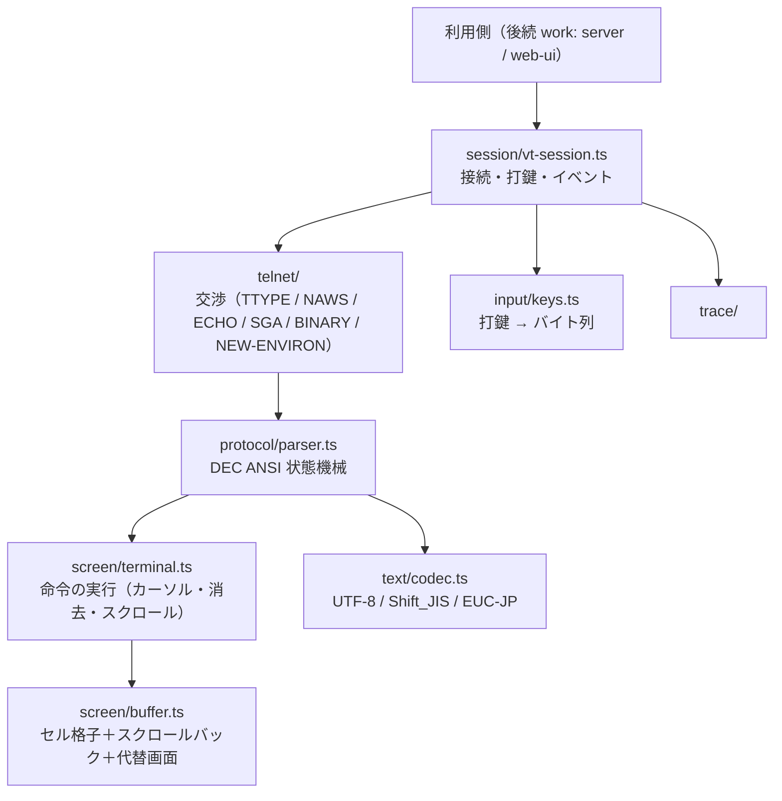

# 仕様: `@ts5250/vt`（VT 端末エミュレータ・ライブラリ層）

research の実測に基づく決定。番号（D1…）はコードから参照する。

## 全体像



**層の向きは一方向**。`buffer` は誰も知らない純データ、`terminal` が命令を実行し、
`parser` はバイト列を命令に割るだけで画面を知らない。

## D1. パッケージと依存

`@ts5250/vt`。**依存は `@ts5250/base` のみ**（`As400Error` / `log` / `east-asian-width`）。
`tn5250` / `tn3270` / `ebcdic` / `hostserver` に依存しない。`dependency-direction.test.ts` の
層宣言に **`tn5250` / `tn3270` と同じ段**として加える。

入口は `.`（Node。`transport/tcp.ts` を含む）と `./browser`（`node:*` を含まない）の 2 つ。

## D2. RFC 2877 のデバイス属性表は **`@ts5250/base` へ括る**

research 1.3 のとおり、VT でも `KBDTYPE` / `CODEPAGE` / `CHARSET` の申告が要る。
同じ表が `tn5250` と `tn3270` に**既に 2 つある**（tn3270 側のコメントが「複製」と明記している）。

**3 つ目を作らない。** AGENTS.md の「`base` に置く基準 2: 複数のパッケージが要るが、どれにも
属さないもの」に**そのまま当てはまる**ので `@ts5250/base` に移し、`tn5250` / `tn3270` / `vt` の
3 つがそこを見る。移動は**最初の独立したコミット**にして、後から切り離せるようにする。

## D3. パーサは Paul Williams の DEC ANSI 状態機械に従う

状態は `ground` / `escape` / `escape_intermediate` / `csi_entry` / `csi_param` /
`csi_intermediate` / `csi_ignore` / `osc_string` / `dcs_*` / `sos_pm_apc_string`。

- **バイト単位で回す**（UTF-8 の復号は `ground` の実行アクションで行う。D8）
- **分割到着で壊れない**——状態はインスタンスに持ち、`feed()` は何度呼ばれてもよい
- **不正列は捨てて次へ**（`csi_ignore`）。例外を投げて止まらない
- C1 は 8 ビット（0x80-0x9F）と `ESC` 2 バイト形式の**両方**を受ける。
  ただし**UTF-8 のときは 8 ビット C1 を採らない**（多バイト文字の後続バイトと衝突するため）

パーサの出力は**判別可能な命令の配列**（`{kind:"print",text}` / `{kind:"csi",prefix,params,intermediates,final}`
/ `{kind:"esc",…}` / `{kind:"osc",…}` / `{kind:"c0",…}`）。画面には触らない。

## D4. 画面バッファ

- **行は疎な配列ではなく固定長のセル列**（`cols` ぶん）。読み書きが O(1) で済み、
  折返し・挿入削除の実装が単純になる
- **スクロールバックはリングバッファ**（既定 1,000 行・上限は生成時に指定）。
  **主画面のスクロールアウトだけが入る**。代替画面のスクロールアウトは捨てる（D7）
- `Cell = { char, fg, bg, attrs, width }`。`width` は `1`（通常）/ `2`（全角の左）/ `0`（全角の右＝継続）
- **消去は「空白セル＋現在の背景色」で埋める**（`ED`/`EL`/`ECH` は SGR の背景を引き継ぐ。
  xterm の挙動。`ls --color` の背景が残るかどうかがここで決まる）

## D5. 色は 3 形態を保つ（潰さない）

```ts
type Color =
  | { kind: "default" }
  | { kind: "indexed"; index: number }   // 0-255（0-15 は名前つき 16 色も含む）
  | { kind: "rgb"; r: number; g: number; b: number };
```

**16 色を RGB に潰さない**——利用側（web-ui）がテーマに合わせて色を決められなくなるため
（AGENTS.md「既存クライアントの側が情報を捨てているなら、合わせない」）。

属性は `bold` / `dim` / `italic` / `underline` / `blink` / `reverse` / `hidden` / `strike`。
**SGR 22 / 23 / 24 / 25 / 27 / 28 / 29 の個別解除**を実装する（research 2.1 で `vi` が使っていた）。

## D6. 全角文字

`@ts5250/base` の `east-asian-width` で幅を決める。**左セルに文字と `width:2`、右セルは
`width:0` の継続セル**。

- カーソルが継続セルに乗ったら**左セルに寄せる**
- 継続セルを上書きしたら**対になる左セルを空白にする**（半分だけ残さない）
- **行末に 1 桁しか残っていない全角**は、`DECAWM` が有効なら次行へ送る（xterm と同じ）。
  無効なら**書かずに捨てる**（右端で潰し合わない）
- 結合文字（`U+0300` 等）と異体字セレクタは**直前のセルに足す**

## D7. 代替画面バッファは `1049` に寄せる

research 2.1 で `vi` も `less` も **`1049` しか使っていない**。`47` / `1047` も受け付けるが、
**内部の実装は 1 つ**（`1049` はカーソル保存と画面消去を伴う点だけ分岐）。

代替画面は**スクロールバックを持たない**。出るときに主画面とスクロールバックがそのまま戻る。

## D8. 符号化 — 復号は `TextDecoder`、符号化は**実行時に逆引き表を組む**

research 3 のとおり `TextEncoder` は UTF-8 専用。

- **復号**: `TextDecoder`（`utf-8` / `shift_jis` / `euc-jp` / `iso-2022-jp`）。
  UTF-8 は**ストリーミング**（`{stream:true}`）で、多バイトの途中切断を跨ぐ
- **符号化**: 起動時に**その符号化の全 2 バイト列を `TextDecoder` に通して逆引き `Map` を作る**
  （65,536 回の復号。実測で数十 ms）。**データファイルを 1 バイトも持たない**
- 表せない文字は `?` に落とし、**落としたことを警告 sink に出す**（黙って消さない）
- 不正バイトは `U+FFFD`。**例外にしない**（端末は壊れた出力でも動き続ける）

## D9. 打鍵の符号化

`{ key, ctrl, alt, shift, meta }` を受け、現在のモード（`DECCKM` / `DECKPAM` / `2004`）で
バイト列に落とす純関数にする（**セッションの状態を引数で渡す**。テストしやすさのため）。

- カーソルキー: `DECCKM` 無効 → `ESC [ A`、有効 → `ESC O A`
- 修飾つき: `ESC [ 1 ; m A`（`m` = 1 + shift(1) + alt(2) + ctrl(4)）
- 機能キー: `F1`-`F4` は `ESC O P`〜`ESC O S`、`F5`-`F12` は `ESC [ 15~`〜`ESC [ 24~`。
  修飾つきは `ESC [ 1 ; m P` / `ESC [ 15 ; m ~`
- `Home`/`End` は `ESC [ H` / `ESC [ F`（`DECCKM` で `ESC O H` / `ESC O F`）
- `Alt` は **ESC 前置**（`meta sends escape`）
- **貼り付けは `2004` 有効時に `ESC[200~` … `ESC[201~` で包む**

## D10. ホストへの応答（問われたら答える）

research 2.1 で `ESC[c` が飛んできた。**返さないとホストが待つ。**

| 要求 | 返す |
|---|---|
| `ESC[c`（DA1） | `ESC[?64;1;2;6;22c`（VT420 相当＋色）|
| `ESC[>c`（DA2） | `ESC[>41;0;0c`（xterm を名乗る）|
| `ESC[5n`（DSR） | `ESC[0n` |
| `ESC[6n`（CPR） | `ESC[<row>;<col>R` |

**応答はセッション層が送る**（画面層は「返すべき内容」を返すだけ。純粋さを保つ）。

## D11. 交渉（telnet）

- 申告する端末タイプは**利用側が決める**。既定は `xterm-256color`。
  **IBM i には `VT220`**（research 1.1。SEND が 2 回来たら 2 番目以降は同じ名前を返して打ち切る）
- `NAWS` は**必ず申告**し、リサイズで再送する
- `ECHO` / `SGA` は**ホストが WILL を出したら DO を返す**（＝ホストエコー＝文字モード）。
  ホストが `ECHO` を握らない場合は**ローカルエコーに落ちる**ことを利用側へイベントで伝える
- `BINARY` は双方向で合意を試みる（UTF-8 と日本語に要る）
- **`NEW-ENVIRON` は受ける**。`KBDTYPE`/`CODEPAGE`/`CHARSET`（D2）と、指定があれば `DEVNAME` を返す
- **IBM i の見分けは `DO NEW-ENVIRON`**（`tn3270` と同じ判別。IBM i 固有の既定を当てるのに使う）

## D12. 送信の間合い（IBM i）

research 1.4 で、打鍵を一括で流すと IBM i が取りこぼした。
**`VtSession` に「1 文字ずつ間を空けて送る」経路を持たせる**（既定は素通し。IBM i と判定したら
文字間 `writeDelayMs`（既定 20ms）を入れる）。**利用側に間合いの責任を持たせない。**

## D13. トレース

`tn3270/src/trace/` と**同じ形**（JSONL・方向・タイムスタンプ・バイト列）。
replay で言語非依存の回帰資産にする。

## 受け入れ基準（requirement から具体化）

- [ ] docker の telnetd に繋いでシェルが使える（`ls` の往復・プロンプト）
- [ ] pub400 に VT で**サインオンして IBM i メインメニューへ到達**する
- [ ] `vi` の出入りで**代替画面バッファ**が働き、抜けた後に元の画面が戻る
- [ ] `less` でページ送りと終了ができる
- [ ] UTF-8 の日本語が桁ずれせず並ぶ（全角＝2 桁）
- [ ] 256 色・24 ビット色・明色（90-97）が属性として保たれる
- [ ] `tmux capture-pane` と画面テキストが一致する
- [ ] パーサの状態遷移・分割到着・不正列の単体テスト
- [ ] 依存方向テストに `vt` が入っている
- [ ] `npm run build` / `npm run lint` / `npm test` が通る

## 対象外（requirement のまま）

server / web-ui への露出（後続 work）・SSH・Sixel/画像・プリンター・ローカル編集モード。
