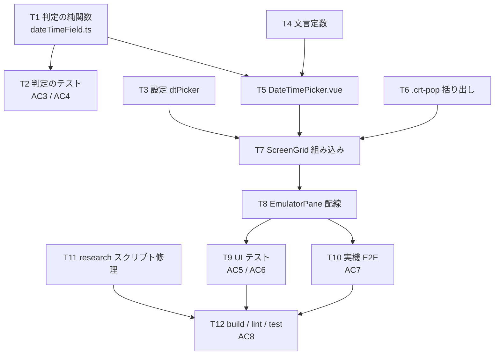

# 計画: EDTMSK 分割欄の日付・時刻ピッカー

## 実装方針

**下から上へ積む。** 純関数（判定）→ 設定・文言 → 部品（ピッカー）→ 組み込み（ScreenGrid /
EmulatorPane）→ 実機 E2E の順。判定ロジックが最も間違えやすく、かつ**単体テストだけで固められる**
ので最初に置き、UI を載せる前に正例・負例を確定させる。

**core（`@ts5250/tn5250`）は 1 行も変えない。** 材料は既に `snapshot` に届いており
（`research.md` F1）、書き込みも既存の `pasteFrom` に乗る（F6）。変更は `packages/web-ui/` と
`scripts/` に閉じる。

### subtask 分割の判定

**分割しない。** `aidev-docs/DESIGN.md`「5.」の決定木で:

- 判定の純関数だけを切り出しても**単独でデリバリする意味が無い**（消費側が無い＝前 work の D2 が
  「使わない配線は腐る」と結論した形）。
- UI・設定・テスト・E2E は**相互に依存し、共同でしか検証できない**が、規模は 1 PR に収まる
  （web-ui の 6 ファイル＋テスト 2＋スクリプト 2）。漸進レビューの価値より分割の管理コストが上回る。

→ **不可分**。単一 `tasks.md` ＋ walkthrough のコミット構成で進める。

## 作業順序と依存関係

1. **T1 判定の純関数**（依存: なし）— ここが仕様の核。UI を載せる前に形を決める。
2. **T2 判定のテスト**（依存: T1）— 正例・負例をここで固定してから先へ進む。
3. **T3 設定 / T4 文言**（依存: なし）— 小さく独立。並行して片づく。
4. **T5 ピッカー本体**（依存: T1・T4）— 型と文言が決まってから。
5. **T6 `.crt-pop` 括り出し**（依存: なし）— 既存の見た目を変えない前提の CSS 整理。
6. **T7 ScreenGrid 組み込み**（依存: T1・T3・T5・T6）— 判定 computed・ボタン・配置・書き込み・expose。
7. **T8 EmulatorPane 配線**（依存: T7）— props・`Alt+↓`・開いている間のキー優先。
8. **T9 UI テスト**（依存: T8）/ **T10 実機 E2E**（依存: T8）。
9. **T11 research スクリプトの修理**（依存: なし・独立）。
10. **T12 一式を通す**（依存: T9・T10・T11）。

## リスク / 留意点

- **R1: 誤検出が利用者に見える。** 対策は (a) 形で先に絞る（`3,2,4` を落とす）、(b) 既定 OFF、
  (c) 曖昧なときは断定せず両方出す（`spec.md` 方針1〜2）。T2 の負例で機械的に固定する。
- **R2: 既存の継続欄の挙動を壊す。** ピッカーは `pasteFrom` を呼ぶだけで編集経路に手を入れない。
  既存の `continued-field-edit.test.ts` / `continued-field-tab.test.ts` が回帰網になる（T12 で確認）。
- **R3: 矩形選択・コピペを壊す。** `optHints` の 3 点（`mousedown.stop.prevent` ／
  **グリッドに新しい `keydown` を足さない**）を T7・T8 で守り、T9 で固定する。
- **R4: `.crt-pop` の括り出しで既存の見た目が変わる。** `.opt-hints` のクラス名を**残す**ので
  セレクタとテストは壊れない。既存の 4 意匠（無効 / パネル / 枠 / 端末調）を目視でなく
  `opt-hints-ui.test.ts` の緑で担保する。
- **R5: web-ui の型検査漏れ。** root の `tsc -b` は web-ui を見ない。**`npm run build -w @ts5250/web-ui`
  （`vue-tsc`）を必ず通す**（AGENTS.md）。`test/` も型検査の対象である点に注意。
- **R6: web-ui のテストをルートから実行すると偽陽性が出る。**
  **`cd packages/web-ui && npx vitest run`** で実行する（AGENTS.md の実測）。
- **R7: 実機 E2E は QMAXSIGN に配慮する。** 装置名は `WEBSF0`〜`WEBSF4` のプールを回し、
  サインオンを繰り返さない（`research.md` N5）。

## テスト方針

| 層 | 何を | どこで |
|---|---|---|
| **判定（純関数）** | 判定表の正例 5＋`both` 2、負例 8（SSN・単独欄・隙間の桁数・保護/非数値の混在・区切り不揃い・`4,2,2 :`・`2,2,4`） | `packages/web-ui/test/datetime-field.test.ts`（AC3 / AC4） |
| **値の往復** | `parseValue` → `formatValue` が桁数ちょうどで戻る。2 桁年の窓。解釈できない値は `null` | 同上 |
| **UI** | 既定 OFF でボタン 0 件／`VIEW_ITEMS` に `dtPicker` がある／`mousedown.stop.prevent`／**グリッドに `keydown` を足していない**／選ぶと `pasteFrom` 経路で欄が変わる | `packages/web-ui/test/datetime-picker-ui.test.ts`（AC5 / AC6） |
| **回帰** | 継続欄の編集・Tab・Opt 選択肢が従来どおり | 既存テスト一式（T12） |
| **実機** | `D8U`（日付 `4,2,2`）と `TMW`（時刻 `2,2,2`・空欄＝`both` / 値あり＝`time`）で、選んだ値がホストへ届く | `scripts/verify-browser-edtmsk-edit.mjs`（AC7） |
| **人が触る操作感** | `Alt+↓` で開く／`Esc` で閉じる／矩形選択とコピペが従来どおり／Tab の停止数が増えていない | test 工程で実機ブラウザ操作として確認（AGENTS.md「test 方針」） |

**自動 E2E は単体テストの代替にしない**（AGENTS.md「実機検証を単体テストの代替にしない」）。
判定の網は単体テスト側に置き、実機は「本当にホストへ届くか」の確認に絞る。
