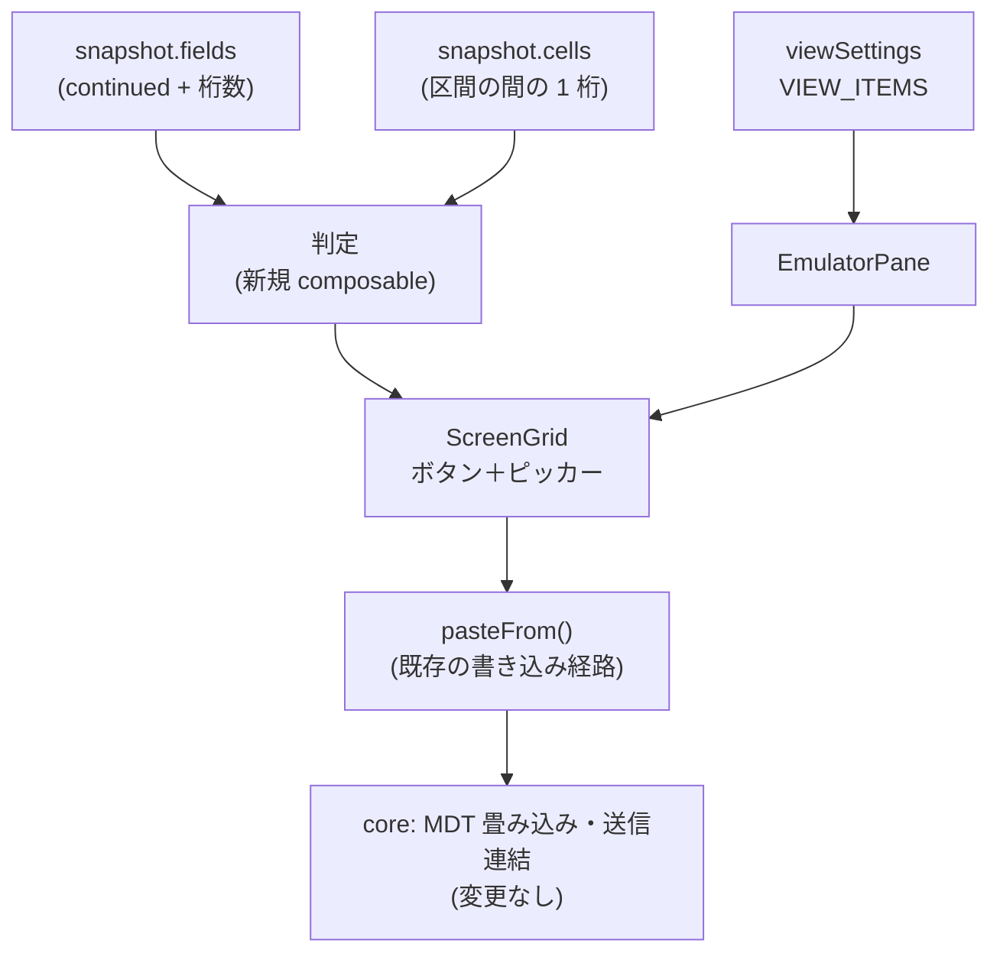

# 調査: EDTMSK 分割欄から日付・時刻を見分ける材料と、書き込み経路

実測日 2026-08-26 / 実機 IBM i 7.3（日本語機・CCSID 930）/ 対象 `TESTLIB/DTMPGM`（`DTMDSPF`）。
測定スクリプトは `scripts/research-edtmsk.mjs` の独立パーサを流用し、接続先を env 優先へ直した一時版
（詳細は「実装時の注意」N1）。

## 調査の問い

- **Q1**: 分割欄は core の `snapshot` に何として届くか（区間数・桁数・`continued` の刻印）。
- **Q2**: **区間の間の桁には何があるか。** 区切り文字は判定材料として常に使えるか。
- **Q3**: 日付・時刻・それ以外（SSN）を、届く情報だけで区別できるか。
- **Q4**（requirement U4）: `EDTMSK` で**片方の区切りだけ保護**した欄（`DMC`）は何区間で届くか。
- **Q5**: 選んだ値を欄へ書く経路は既にあるか。新設が要るか。
- **Q6**: 画面に部品を重ねる既存機能（`optHints`）は、矩形選択・コピペを妨げない作りをどう実現しているか。

## 判明した事実

### F1: 分割欄は「区間ごとの独立した `Field` ＋ `continued` 刻印」で届く（Q1）

`DTMDSPF` の全 15 欄を core の `snapshot.fields` で実測した結果（`I`=入力 / `num=1`=数値）:

| 欄 | DDS | 届いた形（桁/長さ/continued） | 区間の桁数 |
|---|---|---|---|
| `DMA` | `EDTCDE(Y)` ＋ `EDTMSK('  &  &  ')` | c24/2/first・c27/2/middle・c30/2/last | **2,2,2** |
| `TMW` | `EDTWRD('  :  :  ')` ＋ `EDTMSK('  &  &  ')` | c24/2/first・c27/2/middle・c30/2/last | **2,2,2** |
| `SSN` | `EDTWRD('   -  -    ')` ＋ `EDTMSK('   &  &    ')` | c24/3/first・c28/2/middle・c31/4/last | **3,2,4** |
| `D8M` | `EDTWRD('0   /  /  ')` ＋ `EDTMSK` | c24/4/first・c29/2/middle・c32/2/last | **4,2,2** |
| `D8U` | 同上 ＋ `COLOR(WHT)` `DSPATR(UL)` | c24/4/first・c29/2/middle・c32/2/last | **4,2,2** |
| `DMB` `DMC` `DTY` | `EDTCDE(Y)` 系（対照） | c24/**8**/`-`（単独欄） | — |
| `TMO` | `EDTWRD('  :  :  ')` のみ | c24/**8**/`-`（単独欄） | — |
| `PLN` | 素の 6,0 | c24/**7**/`-`（`ffw=4700`＝signed-num） | — |
| `D8W` `D8Z` `D8B` `D8Y` | `EDTWRD` のみ（対照） | c24/**10**/`-`（単独欄） | — |

- ワイヤ上は区間ごとに SF オーダーが並び、FCW は `8601`（先頭）/ `8603`（中間）/ `8602`（最終）。
  実測どおり core の `ContinuedPart` へ写っている（`packages/tn5250/src/screen/types.ts:45`）。
- **全区間が `ffw=4300`（digits-only・非保護）。** 日付・時刻・SSN で FFW に差は無い
  ——**FFW は種別の判定に使えない**。

### F2: 区間の間は「ちょうど 1 桁・どの欄にも属さない」（Q2）

区間の末尾桁と次の区間の先頭桁の間は、実測した 5 つの並びすべてで**ちょうど 1 桁**あき、
その桁は `snapshot.fields` のどの欄にも覆われていない（＝静的・保護）。

```
行 3 DMA  欄: c24/l2/first c27/l2/middle c30/l2/last
     間[25→27] 空き1桁: c26="/"(欄外)
     間[28→30] 空き1桁: c29="/"(欄外)
```

### F3: **区切り文字は「骨組みが画面に出ているとき」しか届かない**（Q2・最重要）

同じ 1 桁の隙間でも、そこに載る文字は欄の現在値に依存した:

| 欄 | 隙間の文字 | 理由 |
|---|---|---|
| `DMA`（`EDTCDE(Y)`） | **`"/"`** | `EDTCDE(Y)` は値 0 でも ` 0/00/00` と刷る（ゼロ抑制で骨組みが消えない） |
| `D8M` `D8U`（`EDTWRD('0   /  /  ')`） | **`"/"`** | 編集ワード先頭の `0` がゼロ抑制を打ち切る＝骨組みが常に出る |
| `TMW`（`EDTWRD('  :  :  ')`） | **`" "`（空白）** | 値が空／0 だと編集ワードごとゼロ抑制され、`:` が 1 つも刷られない |
| `SSN`（`EDTWRD('   -  -    ')`） | **`" "`（空白）** | 同上 |

**追試（同日・値を入れて再表示）**: `TMW` に `123456`、`SSN` に `123456789` を入れて Enter
（RPG は `dou *in03; exfmt DTMR;` なので再表示される）と、同じ 1 桁の隙間に骨組みが現れた:

```
行11 「TMW                  12:34:56」   間[25→27] c26=":"(欄外)   間[28→30] c29=":"(欄外)
行15 「SSN                  123-45-6789」 間[26→28] c27="-"(欄外)   間[29→31] c30="-"(欄外)
```

- **`:` は確かに 1 桁の隙間へ届く**（時刻の判定材料として使える）。
- **`-` も届くが、それは SSN だった**——**区切り文字だけで日付と決めてはいけない**。
  形（`3,2,4`）で先に弾く順序が要る（F4）。
- 副産物として、**3 つの区間へ別々に入れた値がホストへ 1 つの欄として届く**ことも確認できた
  （`123456` → `12:34:56`）。F6 の書き込みモデルの裏付けになる。

**つまり区切り文字は「あるときは確実に正しいが、無いことがある」材料。**
しかも編集ワードの適用はホスト側なので、**利用者がローカルで打っても区切りは現れない**
（次のホスト往復まで空白のまま）。requirement F1 が置いた「区間の間は保護された 1 文字の区切り」は
**骨組みが出ている欄でしか成立しない**。

### F4: 種別の区別は「区間の桁数」＋「区切り（あれば）」で付く（Q3）

実測から言えること:

- **`3,2,4` は日付でも時刻でもない**（SSN）。**桁数だけで弾ける**——区切りが空白でも誤検出しない。
  逆に**区切り（`-`）だけを見ると日付と誤判定する**ので、判定は**形が先・区切りが後**。
- **`4,2,2` は日付に限る。** 時刻の形（`HH`/`MM`/`SS`）で先頭が 4 桁になるものは無い。
  区切りが空白でも日付と断定してよい。
- **`2,2,2` は日付（`YY/MM/DD`）と時刻（`HH:MM:SS`）で同形。** 区切りが見えれば `/` と `:` で割れるが、
  **見えないときは届く情報だけでは割れない**（`DMA` と `TMW` は区切りを除くと完全に同一の形で届く）。
- 同じ理由で **`2,2` も日付（`MM/DD`）と時刻（`HH:MM`）で同形**。

### F5: 片方だけ保護した `EDTMSK` は**分割されない**（Q4 ＝ requirement U4 の答え）

`DMC`（`EDTCDE(Y)` ＋ `EDTMSK('  &     ')`＝1 つ目の区切りだけ保護）は、実機では
**`c24/長さ 8/continued 無し`の単独欄**として届いた（`DMB` `DTY` の対照と同一）。
2 区間にも 3 区間にもならない。**判定側で特別扱いする必要は無い**——単独欄なので入口で外れる。

### F6: 書き込み経路は既にある。新設不要（Q5）

`ScreenGrid.vue` の `pasteFrom()` が、継続欄への流し込みを**既に**担っている:

- 区間をまたいで値を分配する（右が先、尽きたら次）。
- **文字列側に残った区切り文字を読み飛ばす**（`"2026/08/25"` を渡しても桁がずれない。
  `ScreenGrid.vue:2726` 付近のコメントと E2E で固定済み）。
- 画面上の区切り桁は `nextWritableAt` が既に読み飛ばす。
- MDT の畳み込み（先頭区間だけ立てる）と送信の連結は core 側で完結する
  （`packages/tn5250/src/screen/buffer.ts:888`・`packages/tn5250/src/protocol/read-response.ts:66`）。

`optHints` の `chooseOption()` が**まさにこの経路で欄へ書く手本**になっている
（`ScreenGrid.vue:1098`）。フォーカス文脈を渡して「打鍵と同じ扱い」にするのが要点で、
渡さないと非フォーカス経路（`emit("edit")`）へ落ちてカーソルと編集状態が食い違う。

### F7: 「矩形選択・コピペを妨げない」作り方は `optHints` で確立済み（Q6）

`packages/web-ui/test/opt-hints-ui.test.ts` の冒頭が、利用者指示（2026-07-29）と
それを担保する 3 点を明文化して固定している:

1. ポップオーバーの `mousedown` を `.stop`（伝播すると `onGridMousedown` → `clearRectSel()` で**矩形選択が消える**）
2. `mousedown` を `.prevent`（既定のフォーカス移動を止め、**入力欄にフォーカスを残す**）
3. **キーイベントを 1 つも購読しない**（矢印・Tab・Enter・Esc は今日と同じ経路）

加えて「**フォーカスしただけでは開かない**」（一覧を移動するたびに視界を塞ぐという利用者指摘）、
「ボタンをタブ順に入れるのは開いている間だけ」（Tab の停止数を倍にしない）も守られている。

### F8: 設定は `VIEW_ITEMS` が単一の出どころ

`packages/web-ui/src/stores/viewSettings.ts` の `VIEW_ITEMS` は
**画面設定メニューとキー設定（順送り `view:*`）で共有する単一の出どころ**。ここへ足せば両方に自動で出る。
`optHints` は `interface ViewSettings`（:73）・`VIEW_ITEMS`（:117）・`FALLBACK`（:201・`"none"`）の 3 か所に現れる。

## 影響範囲



- **変更する**: `packages/web-ui/`（新規 composable・`ScreenGrid.vue`・`EmulatorPane.vue`・`viewSettings.ts`）。
- **変更しない**: `packages/tn5250/`（材料は既に届いている）。サーバー・MCP・他端末（3270/VT）。
- ホストへの追加往復は**発生しない**（判定はスナップショットから同期的に導ける）。

## 実現性 / リスク

- **実現可能**。材料（区間の桁数・`continued`・隙間の 1 桁）はすべて `snapshot` に届いており、
  書き込み経路も既にある。
- **最大のリスクは F3**。`2,2,2` / `2,2` の欄は骨組みが出ていないと日付・時刻を割れない。
  ここを「日付と決め打つ」と、空の時刻欄に日付ピッカーが出て**嘘をつく**。
  D1 が警戒した「推測を真実として扱う」に戻ってしまうため、spec で扱いを決める（下記 T2）。
- 誤検出リスクは `3,2,4`（SSN）を桁数で弾けるぶん、当初の想定より低い。
- `Alt+↓` は `optHints` が既に使っている。同じ欄で両方が成立することは無い
  （Opt 欄は長さ 1〜2 の単独欄・こちらは継続欄）が、導線を足すときは衝突を確認すること。

## 実装アンカー

- **A1 判定ロジックの置き場**（**未作成** — 新規 `packages/web-ui/src/composables/dateTimeField.ts` を想定）
  — 手本は `packages/web-ui/src/composables/fkeyLegend.ts:617` `detectOptionHints`
  （「両方揃ったときだけ返す」判定の書き方・根拠コメントの粒度）。
- **A2 区間の並びの導出**（`packages/web-ui/src/composables/continuedRun.ts:13` `continuedRunOf`）
  — **既存を使う。再実装しない**（同じ事実の導出元を 2 つ持たない）。
- **A3 欄への書き込み**（`packages/web-ui/src/components/ScreenGrid.vue:2697` `pasteFrom`）
  — 手本は同ファイル `:1098` `chooseOption`（フォーカス文脈の渡し方）。
- **A4 判定結果の computed**（`ScreenGrid.vue:948` `optionHints`）— 設定が `none` なら評価しない形。
- **A5 開閉の state と外側クリック**（`ScreenGrid.vue:995` `optOpenRow` / `:1062` の `closest()` 判定 /
  `:996` の「画面が変わったら閉じる」watch）。
- **A6 ボタンとポップオーバーの markup**（`ScreenGrid.vue:3419`〜`3456`）
  — `@mousedown.stop.prevent` と `tabindex` の付け方。
- **A7 props の受け渡し**（`ScreenGrid.vue:110` `optHints?: OptHintStyle` /
  `EmulatorPane.vue:982` `:opt-hints="view.optHints"`）。
- **A8 設定の追加先**（`packages/web-ui/src/stores/viewSettings.ts:73` interface /
  `:117` `VIEW_ITEMS` / `:201` `FALLBACK`）。
- **A9 単体テストの手本**（`packages/web-ui/test/opt-hints-ui.test.ts`＝矩形選択を壊さない観点 /
  `packages/web-ui/test/continued-field-edit.test.ts`＝継続欄の snapshot 組み立て）。
- **A10 実機 E2E**（`scripts/verify-browser-edtmsk-edit.mjs`）— `D8U`（行 23・桁 24・区間 `4,2,2`）を
  既に使っている。日付ピッカーの項目はここへ足せる。**時刻（`TMW`・行 11）は未使用**。
- **A11 実機資材の定義**（`scripts/build-dttest.mjs` の `CASES`）— 欄名・行・DDS の対応表。

## 実装時の注意

- **N1: `scripts/research-edtmsk.mjs` の接続先が古い。** `connections.json` を見るが、実機は
  `profiles.local.json` へ移っており、現在の `connections.json` に `AS400` は**無い**（`MVSTAP` のみ）。
  今回は `build-dttest.mjs:158` と同じ「env 優先」に直した一時版で測った。
  **同じ直しを `research-edtmsk.mjs` にも入れると、次に測る人が踏まない**（`build-dttest.mjs:14` の
  ⚠ コメントも同じ問題を指している）。
- **N2: 区切りの桁には触らない。** ホストが刷った静的文字で、色・下線は既に前の区間から引き継ぐ
  実装が入っている（PR #377）。ピッカーは値だけを書く。
- **N3: `pasteFrom` に渡す文字列に区切りを含めてよい。** 区間側で読み飛ばされる。
  ただし**桁数ちょうどの数字列**（`"20260825"`）で渡すほうが、骨組みの有無に左右されず安全。
- **N4: キーイベントを購読しない**（F7-3）。開閉はクリック（と既存のキー導線の再利用）で組み、
  新しい `keydown` リスナーをグリッドに足さない。
- **N5: 実機検証は QMAXSIGN に配慮する。** サインオンを繰り返さない（`build-dttest.mjs:14` の注記）。
  デバイス名は `WEBSF0`〜`WEBSF4` のプールを回す作法が既存スクリプトに揃っている。
- **N6: `PLN` は `ffw=4700`（signed-num）で長さ 7。** 素の数値欄の対照として使えるが、
  符号桁を持つので長さが DDS の 6 と一致しない。テストの期待値を書くときに踏みやすい。

## spec への申し送り

- **T1: requirement F1 の表は改訂が要る。** 「区間の間が保護された 1 文字の区切り」は
  F3 のとおり**常には成立しない**。判定を「桁数（常に届く）＋区切り（届けば強い）」の 2 段に分ける。
- **T2: `2,2,2` / `2,2` で区切りが空白のときの扱いを決める**（最大の設計判断）。選択肢:
  - (a) 出さない — 嘘はつかないが、**空欄＝ピッカーが最も要る場面**で出ない。
    同じ欄が値の有無で出たり消えたりする（D1 が警戒した形）。
  - (b) 日付と決め打つ — 空の時刻欄に日付ピッカーが出る。**推測を真実として扱う**ため採らない。
  - (c) **日付・時刻の両方を選べるピッカーを出す** — UI が「どちらか分からない」ことを表明したまま
    役に立つ。書き込む値は利用者の選択で一意に決まる。**現時点の推奨**。
- **T3: `4,2,2` は区切りが空白でも日付と断定してよい**（F4）。`3,2,4` 等の表に無い形は出さない。
- **T4: 桁順は requirement F2 の固定解釈（`YMD` / `HMS`）に従う**（利用者合意済み）。
  **UI 上で解釈が見えること**（どの区間に何を入れるか）を spec の要件に落とす。
- **T5: 区切り文字の許容集合を決める。** 実測で届いたのは **`/`（日付）・`:`（時刻）・`-`（SSN）**。
  **`-` は日付の区切りにも SSN の区切りにもなる**ので、**形（桁数）で先に絞ってから区切りを見る**
  順序にすること。`.` は未実測（編集ワード次第であり得る）——含めるなら未実測と明記する。
- **T6: 設定は 2 値（ON/OFF）で足りるか、`optHints` のようにデザイン候補を持たせるか**を決める
  （backlog:「全部にデザイン候補を作らない」）。
