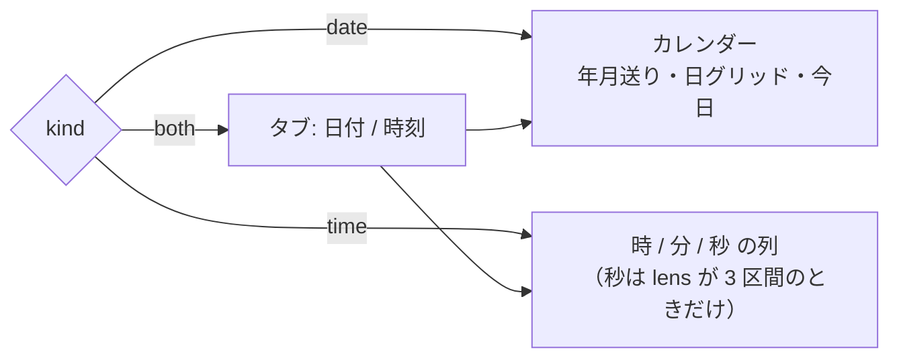

# 仕様: EDTMSK 分割欄の日付・時刻ピッカー

## 概要

`Field.continued`（EDTMSK 分割＝継続入力フィールド）の並びを**区間の桁数**で分類し、
日付欄・時刻欄と分かるものに小さなピッカーを出す。選んだ値は**既存の貼り付け経路**
（`pasteFrom`）で欄へ書き、送信・MDT の畳み込みは core の既存実装に任せる。
既定は無効で、画面設定から有効にしたときだけ現れる。

判定材料と書き込み経路はすべて実測済み（`research.md` F1〜F8）。**core（`@ts5250/tn5250`）は変更しない。**

## 設計方針

### 方針1: 判定は「形が先・区切りが後」の 2 段（research T1・T5）

requirement F1 は「区間の間は保護された 1 文字の区切り」を前提に 1 段で判定する形だったが、
実測（research F3）で **区切り文字は欄に値があるときしか画面に届かない**ことが分かった
（空の `TMW` は `:` が消える）。逆に **`-` は日付にも SSN にも出る**（`123-45-6789`）。

したがって:

1. **常に届く「区間の桁数」で先に絞る**（`3,2,4` の SSN はここで落ちる）。
2. 残ったものを**区切り文字で確定する**（届いていれば）。
3. 届いていない（空白の）ときは、**形から言えるところまでで止める**。

**代替案を退けた理由**:

- *区切りだけで判定する* → `-`（SSN）を日付と誤る。research F4 の実測で否定された。
- *区切りが無ければ日付と決め打つ* → 空の時刻欄に日付ピッカーが出る。「推測を真実として扱う」
  ことになり、`20260730-input-assist-datetime` の decisions D1 が退けた形に戻る。**採らない。**

### 方針2: 曖昧なままでも役に立たせる（research T2 の (c) を採用）

`2,2,2` / `2,2` は区切りが空白だと日付か時刻か決まらない。**そこで諦めない**——
ピッカー側に「日付 / 時刻」の 2 つのタブを出し、**利用者が選んだほうで確定する**。

- UI は「どちらか分からない」ことを表明したまま役に立つ（嘘をつかない）。
- **空欄こそピッカーが要る場面**なので、ここで出さない設計（案 (a)）は目的を外す。
- 値が入って区切りが見えている欄では、タブは出ずに確定した種別だけを出す
  （曖昧 → 確定の**単調な絞り込み**で、機能が消えることはない）。

### 方針3: 桁順は固定し、**解釈を UI に明示する**（requirement F2・利用者合意済み）

`YYYY`→`MM`→`DD` / `HH`→`MM`→`SS` に固定する。区別できない形
（`YY/MM/DD` と `DD/MM/YY`、`MM/DD` と `YY/MM`、`HH:MM` と `MM:SS`）は解決しない。
代わりに**ピッカーの見出しに解釈中の書式を出す**（例: `YYYY/MM/DD として入力`）ので、
違えば利用者はピッカーを使わずに直接打てる（直接打鍵は従来どおり常に可能）。

システム値（`QDATFMT` 等）は引かない（requirement 対象外・decisions D2 据え置き）。

### 方針4: 書き込みは新設しない（research F6）

`pasteFrom()` が既に区間分配と区切りの読み飛ばしを持つ。`optHints` の `chooseOption()`
（`ScreenGrid.vue:1098`）と**同じ形**でフォーカス文脈を渡して呼ぶ。

### 方針5: 画面に重ねる部品の規律は `optHints` に揃える（research F7）

`mousedown.stop.prevent` / **グリッドへ新しい `keydown` を足さない** / フォーカスだけでは開かない /
タブ順に入れるのは開いている間だけ。ポップオーバー**自身**の `@keydown`（リスト内移動）は
`optHints` が既に採っている作法なので踏襲する。

### 方針6: ポップオーバーの見た目は共通の土台を作って共有する

`.opt-hints` の意匠（面・枠・端末調）を `.crt-pop` という**共通クラス**へ括り出し、
`optHints` とピッカーの両方が着る。`.opt-hints` のクラス名は**残す**ので既存の
セレクタ・テストは壊れない。

## 対象範囲

| 種別 | ファイル | 内容 |
|---|---|---|
| 追加 | `packages/web-ui/src/composables/dateTimeField.ts` | 判定（純関数）。`optHints` の `detectOptionHints` に倣う |
| 追加 | `packages/web-ui/src/components/DateTimePicker.vue` | カレンダー／時刻リストの本体 |
| 変更 | `packages/web-ui/src/components/ScreenGrid.vue` | 判定 computed・ボタン・配置・書き込み・`defineExpose`・`.crt-pop` の括り出し |
| 変更 | `packages/web-ui/src/components/EmulatorPane.vue` | props 受け渡し・`Alt+↓`・開いている間のキー優先 |
| 変更 | `packages/web-ui/src/stores/viewSettings.ts` | `dtPicker` を interface / `VIEW_ITEMS` / `FALLBACK` へ |
| 変更 | `packages/web-ui/src/composables/opMessages.ts` | 文言定数 |
| 追加 | `packages/web-ui/test/datetime-field.test.ts` | 判定の正例・負例（AC3 / AC4） |
| 追加 | `packages/web-ui/test/datetime-picker-ui.test.ts` | UI・既定 OFF・矩形選択を壊さない（AC5 / AC6） |
| 変更 | `scripts/verify-browser-edtmsk-edit.mjs` | 実機 E2E に日付・時刻の項目を追加（AC7） |
| 変更 | `scripts/research-edtmsk.mjs` | 接続先を env 優先へ（research N1。再現性の修理） |
| 変更 | `.aidev/backlog/input-assist.md` | deliver で消し込み（AC9） |

**変更しない**: `packages/tn5250/`・サーバー・MCP・3270 / VT。

## インターフェース / データ構造

### `composables/dateTimeField.ts`

```ts
/** ピッカーが扱う種別。`both` = 形は合うが日付か時刻か決まらない（区切りが画面に出ていない） */
export type DateTimeKind = "date" | "time" | "both";

/** 区間の桁数から決まる書式。UI の見出しと、値の組み立て・分解に使う */
export interface DateTimeShape {
  /** 区間の桁数（先頭→最終）。例 [4,2,2] */
  lens: readonly number[];
  /** 日付として解釈したときの並び。lens と 1:1。`null` = 日付としては解釈しない */
  dateParts: readonly ("y4" | "y2" | "m" | "d")[] | null;
  /** 時刻として解釈したときの並び。lens と 1:1。`null` = 時刻としては解釈しない */
  timeParts: readonly ("h" | "mi" | "s")[] | null;
}

export interface DateTimeTarget {
  /** 区間の並び（先頭→最終）。`continuedRunOf` の結果をそのまま持つ */
  run: readonly Field[];
  kind: DateTimeKind;
  shape: DateTimeShape;
  /** 区間の間の桁に載っていた文字（区間数 - 1 個）。空白なら " " */
  seps: readonly string[];
  /** ボタンを置く桁（最終区間の右隣 1 桁） */
  btn: { row: number; col: number };
}

/** 画面から日付・時刻とみなせる分割欄をすべて取り出す。設定が none のとき呼ばない */
export function detectDateTimeFields(
  snap: ScreenSnapshot,
  charOf?: (c: Cell) => string
): DateTimeTarget[];

/** 欄の現在値（区間の連結）を解釈する。解釈できなければ null */
export function parseValue(t: DateTimeTarget, as: "date" | "time"): DateValue | TimeValue | null;

/** 選んだ値を「区間の連結桁数ぶんの数字列」に組み立てる（区切りは含めない） */
export function formatValue(t: DateTimeTarget, as: "date" | "time", v: DateValue | TimeValue): string;
```

### 判定表（方針1 の実装）

**入口**: `f.continued !== undefined` の欄から `continuedRunOf` で並びを作り、次をすべて満たすこと。

- 区間数が **2 または 3**。
- 全区間が **非保護**かつ **`numeric`**（requirement F5）。
- 全区間が**同一行**にある。
- 隣り合う区間の間が**ちょうど 1 桁**あき、その桁が**どの欄にも属さない**（＝静的・保護。research F2）。

**分類**（`lens` = 区間の桁数、`sep` = 隙間の文字。複数あるときは**すべて同一**であること）:

| `lens` | `sep` | 結果 | 解釈 |
|---|---|---|---|
| `4,2,2` | `/` `-` `.` または空白 | `date` | `YYYY`/`MM`/`DD` |
| `4,2,2` | `:` | **出さない**（形と区切りが矛盾） | — |
| `2,2,2` | `/` `-` `.` | `date` | `YY`/`MM`/`DD` |
| `2,2,2` | `:` | `time` | `HH`:`MM`:`SS` |
| `2,2,2` | 空白 | **`both`** | 上の 2 つを利用者が選ぶ |
| `2,2` | `/` `-` `.` | `date` | `MM`/`DD` |
| `2,2` | `:` | `time` | `HH`:`MM` |
| `2,2` | 空白 | **`both`** | 上の 2 つを利用者が選ぶ |
| 上記以外（`3,2,4` / `2,2,4` / `4,2` …） | — | **出さない** | — |

- **`3,2,4`（SSN）は形で落ちる**——区切りが `-` でも日付にしない（research F4 の実測）。
- **`2,2,4`（`DD/MM/YYYY` 等）は扱わない。** 先頭 2 区間が日か月かを決める材料が無く、
  requirement F2 が固定した `YMD` 順にも当てはまらない。**推測しないほうを採る。**
- 区切りの許容集合は `/` `-` `.` `:`。**実測で届いたのは `/`（日付）・`:`（時刻）・`-`（SSN）**で、
  **`.` は未実測**（形で絞ったうえでの受け入れ。コードに未実測と明記する）。

### `ViewSettings` への追加

```ts
export type DtPickerStyle = "none" | "panel" | "outline" | "crt"; // optHints と同じ 4 値
interface ViewSettings { /* … */ dtPicker: DtPickerStyle; }
```

- `VIEW_ITEMS`: `{ key: "dtPicker", label: "日付・時刻の選択", wide: true, expandable: true, opts: […] }`
  を `optHints` の直後に置く（**メニューとキー設定の単一の出どころ**。2 か所に書かない）。
- `FALLBACK`: `dtPicker: "none"`（**推測を含むので既定 OFF**。requirement AC5）。

### `ScreenGrid` の `defineExpose` 追加

```ts
dtPickerOpen: () => boolean;      // 開いているか（EmulatorPane のキー優先判定）
openDateTimePicker: () => boolean; // Alt+↓ で開く。開けたら true
```

## 振る舞いの詳細

### 導線

- 設定が `none` 以外のとき、判定した並びの**最終区間の右隣 1 桁**に `▾` ボタン（`.dtp-btn`）を出す。
  桁割りには影響しない（絶対配置。`.opt-btn` と同じ）。
- **フォーカスしただけでは開かない**（利用者指摘・`optHints` と同じ）。開くのは
  **ボタンのクリック**か、欄にフォーカスがある状態の **`Alt+↓`**。
- `Alt+↓` は `EmulatorPane` の既存ハンドラを**拡張**する（新しいリスナーを足さない）:
  `openOptHints() || openDateTimePicker()`。Opt 欄は長さ 1〜2 の単独欄、こちらは継続欄なので
  同じ欄で両方が成立することは無い。
- 閉じる: 外側クリック（`closest(".dtp, .dtp-btn")` で除外）／`Esc`（ポップオーバー自身の `keydown`）／
  日付を選んだとき／画面が変わったとき（`watch`）。

### ピッカーの中身



- 見出しに**解釈中の書式**を出す（`YYYY/MM/DD` / `YY/MM/DD` / `MM/DD` / `HH:MM:SS` / `HH:MM`）。
- `both` は既定タブ **日付**。タブを切り替えると書式表示も切り替わる。
- **日付**: 日をクリック → 書き込んで**閉じる**（`optHints` の即時確定と同じ）。
- **時刻**: 時 / 分 / 秒の列を選ぶたびに**その時点の下書き全体を書き込む**（開いたまま）。
  一部しか選んでいない間は、未選択の桁は初期値（下記）のまま。

### 初期値

1. 欄の現在値（区間の連結）が**その種別として解釈できれば**それを初期選択にする。
2. 解釈できない（空・`000000`・範囲外）なら**今日 / 現在時刻**を初期選択にする。
   **初期選択は書き込まない**——利用者が選ぶまで欄は 1 桁も変わらない
   （「ホストが送る情報を UI 側で上書きしない」）。

### 2 桁年の窓

`YY` は `00–69` → `20xx` / `70–99` → `19xx`（広く使われる窓）。
**書き込むのは 2 桁だけ**で、ホストへ渡る情報は増えない。コードに根拠を明記する。

### 書き込み

```ts
const digits = formatValue(t, as, v);            // 例 "20260826" / "123456"（区切りを含まない）
const first = t.run[0]!;
const el = inputForSlice(first, 0);
pasteFrom({ row: first.row, col: first.col }, digits, el ? { f: first, el, startOffset: 0 } : undefined);
el?.focus();
```

- `digits` は**区切りを含まない桁数ちょうどの数字列**（research N3）。骨組みの有無に左右されない。
- MDT は core が先頭区間へ畳む。送信も先頭区間へ連結される（`read-response.ts`）。**UI 側は何もしない。**

## ドメイン固有の考慮

- **区切りの桁には触らない**（research N2）。ホストが刷った静的文字で、色・下線の引き継ぎは
  PR #377 で実装済み。ピッカーは値だけを書く。
- **`Field.numeric` は digits-only とは限らない**（`field-inputmode` の訂正）。ここでは
  `numeric` だけを条件にし、`digitsOnly` は要求しない——実測した日付欄は `ffw=4300`（digits-only）
  だが、`numeric` の別種別で来る日付欄を排除する根拠が無い。書き込む文字は数字だけなので、
  `pasteFrom` の型検査（`acceptsChar`）を通らないことは無い。
- **利用者に見えるメッセージは日本語・です／ます調・句点なし**で `opMessages.ts` に置き、
  テストは文言リテラルではなく**定数を参照**する（AGENTS.md「UI デザインガイド」）。
- **web-ui のテストはパッケージ dir から実行**する（`cd packages/web-ui && npx vitest run`。
  ルートから実行すると偽陽性が出る。AGENTS.md「ビルド・テスト」）。
- **`vue-tsc` を通す**（`npm run build -w @ts5250/web-ui`）。root の `tsc -b` は web-ui を検査しない。

## エラー処理 / 異常系

| 状況 | 扱い |
|---|---|
| 並びに保護区間・非数値区間が混ざる | 判定しない（ボタンを出さない） |
| 区間が同一行に無い／隙間が 1 桁でない | 判定しない |
| 隙間の文字が区間ごとに不揃い（`/` と `:` が混在） | 判定しない |
| 現在値が解釈できない | 今日 / 現在時刻を初期選択（**書き込まない**） |
| 選んだ日付が欄の桁に入らない | 起こらない（`formatValue` が `lens` の合計桁ちょうどを返す）。 |
| `pasteFrom` が拒否（`MSG_NO_ROOM` 等） | 既存経路の `emit("notice", …)` に任せる。ピッカーは独自の失敗表示を持たない |
| 通信中（`busy`） | ボタンを出さない（`optHints` と同じ扱い） |
| 画面が変わった | 開いていれば閉じる（`watch`） |

## 受け入れ基準との対応

- **AC1**（実機の日付欄で書き込める）: 方針4 の `pasteFrom` 経路。`D8U`（行 23・`4,2,2`・`/`）と
  `DMA`（行 3・`2,2,2`・`/`）が判定表の 1 行目・3 行目に当たる。E2E で確認（AC7 と同じ経路）。
- **AC2**（実機の時刻欄）: `TMW`（行 11・`2,2,2`）。空欄では `both`、値が入ると `time` に確定する
  ——**どちらでも時刻を書き込める**ことを E2E で確認する。
- **AC3**（判定表の 5 パターン）: `datetime-field.test.ts` に `4,2,2 /`・`2,2,2 /`・`2,2,2 :`・
  `2,2 /`・`2,2 :` を置く。加えて `both`（空白）2 件も置く。
- **AC4**（負例）: 同ファイルに `3,2,4 -`（SSN）／単独欄（`continued` 無し）／普通の数値欄／
  隙間が数字・2 桁以上／保護区間・非数値区間の混在／区切り不揃い／`4,2,2` ＋ `:`／`2,2,4` を置く。
- **AC5**（既定 OFF・設定に出る）: `FALLBACK.dtPicker = "none"`。`datetime-picker-ui.test.ts` で
  既定マウント時にボタンが 0 件、`VIEW_ITEMS` に `dtPicker` が含まれることを確認する
  （メニューとキー設定は `VIEW_ITEMS` から自動生成なので、この 1 点で両方を担保する）。
- **AC6**（矩形選択・コピペ・キー）: 方針5。`opt-hints-ui.test.ts` と同じ観点で
  `mousedown.stop.prevent` が付いていること・**グリッドに新しい `keydown` を足していないこと**を確認する。
- **AC7**（実機 E2E）: `scripts/verify-browser-edtmsk-edit.mjs` に日付（`D8U`）と時刻（`TMW`）の項目を追加。
- **AC8**（既存テスト・lint・build）: coding / test 工程で実行する。
- **AC9**（backlog 消し込み）: deliver 工程で `input-assist.md` を書き直す（D1 を覆した経緯つき）。
