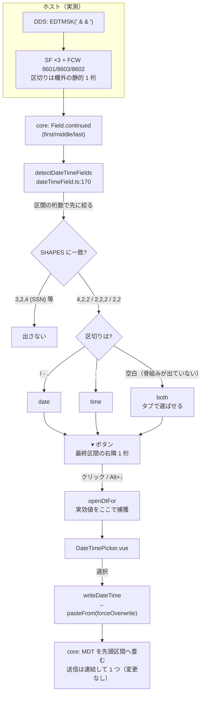

# レビューガイド: EDTMSK 分割欄の日付・時刻ピッカー

## 変更概要 / 目的

5250 の入力欄に **DatePicker / TimePicker** を出す。判定材料は `EDTMSK`（編集マスク）で
**分割されて届く欄の形**。既定は無効で、画面設定で有効にしたときだけ現れる。

**この PR は 2026-07-30 の「datepicker は作らない」という判断（`20260730-input-assist-datetime`
の decisions D1）を覆すもの**なので、まずそこを読んでほしい。

- 当時の結論「`EDTMSK` は欄を分解しない」は、**検証用 DDS の書き方が誤っていた**ために出た。
  `EDTMSK` の `&` は「保護する桁」＝**区切りの桁**に置くのが正しく、当時は 8 通りとも
  **数字の桁**に置いていたため `CRTDSPF` が `CPD7494` / `CPD7520` で**キーワードごと無視**していた。
- 正しく書き直した実機測定では**分解して届く**（2026-08-25 に判明・PR #371 で継続入力フィールドを実装）。
- **D1 の推論（材料が無ければ作らない）は正しく、誤っていたのは前提の実測のほう。**
  今回は同じ原則のまま、材料が本当にあることを確認して作っている。

利用者合意のうえで、**桁順の曖昧さは解決しない**（`YY/MM/DD` と `DD/MM/YY`、`MM/DD` と `YY/MM`、
`HH:MM` と `MM:SS` は区別しない）。代わりに**解釈中の書式を UI に必ず表示**する。

## 重要ポイント（特に見てほしい所）

### ① 判定は「形が先・区切りが後」（`decisions.md` D2）

実機実測で分かった 2 つの事実が、この順序を決めている。

1. **区切り文字は、欄に値があるときしか画面に届かない。**
   空の時刻欄（`EDTWRD('  :  :  ')`）は編集ワードごとゼロ抑制され、`:` が 1 桁も刷られない。
   編集ワードの適用はホスト側なので、**ローカルで打っても現れない＝空欄の間ずっと届かない**。
2. **`-` は日付にも SSN にも出る。** `EDTWRD('   -  -    ')` の欄に値を入れると `123-45-6789`。

→ **常に届く「区間の桁数」で先に絞る**（`3,2,4` の SSN はここで落ちる）。区切りは後段の確定にだけ使う。
`packages/web-ui/src/composables/dateTimeField.ts:110` の `SHAPES` が表、`:204` 以降が分類。

### ② 決められないときは「決めない」——`both`（`decisions.md` D3）

`2,2,2` / `2,2` で区切りが空白だと、日付か時刻かは**届く情報だけでは割れない**（`DMA` と `TMW` は
区切りを除くと完全に同形で届く）。

- **日付と決め打たない。** 空の時刻欄に日付ピッカーが出て嘘をつく——D1 が退けた「推測を真実として扱う」形。
- **出さない、でもない。** 空欄こそピッカーが要る場面で機能が消える。
- **両方のタブを出して利用者に選ばせる。** 値が入って区切りが見えたらタブが消えて確定種別だけになる
  ——**曖昧 → 確定の単調な絞り込み**で、機能が消えることはない（実機 E2E ⑦ で往復確認）。

### ③ 判定を**欄の値に依存させない**（`decisions.md` D14 — 一度踏んだ落とし穴）

レビュー指摘（未送信の編集を見ていない）を直すとき、**判定関数に実効値を渡してしまい回帰を生んだ**。

判定の computed が `props.edits` に依存 → 編集のたびに作り直される →
それを監視して「画面が変わったら閉じる」watch が走る → **ピッカーが自分の書き込みで閉じる**
（時刻の列を 1 つ選ぶと閉じて使えない）。**実機 E2E が捕まえた**（単体テストは通っていた）。

- 是正: 判定は **snapshot だけに依存**（`ScreenGrid.vue:1113`）。実効値は**開くときに 1 度だけ捕まえる**
  （`:1146` `dtOpenValues` / `:1149` `openDtFor`）。
- 教訓: 「何が日付欄か」は画面の構造で決まり**欄の値とは無関係**。混ぜたのが誤りだった。
- **テストの教訓**: この回帰を最初 単体テストで再現できなかった。原因はテストの `edits` が
  **素の `Map`** だったこと（アプリ側は `sessionsStore` = `reactive` 配下）。
  `reactive(new Map())` に直して初めて再現した。

### ④ 書き込み経路は新設していない

`pasteFrom()` が**既に**区間への分配と区切りの読み飛ばしを持つ（PR #377 の資産）。
ピッカーはそこへ**区切りを含まない桁数ちょうどの数字列**を流すだけ（`ScreenGrid.vue:1213`）。
MDT の畳み込み・送信の連結は core が行う——**`packages/tn5250/` に差分は 1 行も無い。**

唯一の追加は `pasteFrom` の `forceOverwrite`（`:2867`）。挿入モードのまま欄長ちょうどの文字列を
offset 0 へ挿すと入り切らず `MSG_NO_ROOM` で弾かれるため（**既に値の入った欄**で起きる）。
ピッカーはカーソル位置への貼り付けではなく**欄の値の置き換え**なので、挿入・上書きの区別が意味を持たない。

## 処理フロー

## 主要な変更箇所

**新規**

- `packages/web-ui/src/composables/dateTimeField.ts` — 判定・値の解釈・組み立て（純関数）。
  `:110` `SHAPES`（判定表）／`:127` `runsOf`（画面を 1 度走査して並びを作る）／
  `:170` `detectDateTimeFields`（入口条件と分類）／`:86` `YEAR_PIVOT`（2 桁年の窓）。
- `packages/web-ui/src/components/DateTimePicker.vue` — カレンダー / 時刻の列 / `both` のタブ。
  見出しに**解釈中の書式**を出す。`mousedown.stop.prevent`、`Esc` は自身の `keydown` のみ。
- `packages/web-ui/test/datetime-field.test.ts` — 正例 6・`both` 3・**負例 11**・値の解釈・閏年（35 件）。
- `packages/web-ui/test/datetime-picker-ui.test.ts` — 既定 OFF・導線・書式の表示・書き込み・
  **矩形選択とコピペを妨げない 5 件**（20 件）。

**変更**

- `packages/web-ui/src/components/ScreenGrid.vue:1104〜1252` — 判定 computed・ボタン・開閉・書き込み・
  配置（**画面下部では上向きに開く** `:1246`）。`:2867` `pasteFrom` に `forceOverwrite`。
  CSS は `.opt-hints` から共通の「面」を `.crt-pop` へ括り出し（クラス名は残したので既存テストは無回帰）。
- `packages/web-ui/src/components/EmulatorPane.vue:865` `:877` `:908` — **既存の 1 つの keydown ハンドラ**に
  分岐を足しただけ（`Alt+↓` で開く / 開いている間のキー優先 / `Esc` で閉じる）。
  **グリッドに新しいリスナーは足していない。**
- `packages/web-ui/src/stores/viewSettings.ts` — `dtPicker`（既定 `none`）。`VIEW_ITEMS` へ足したので
  **画面設定メニューとキー設定の両方に自動で出る**。
- `packages/web-ui/src/styles.css` — `.crt-pop`（ポップオーバーの共通意匠・`data-pop` で切替）。
- `scripts/verify-browser-edtmsk-edit.mjs` — 実機 E2E に ⑥⑦ を追加（14 → **30 項目**）。
- `scripts/research-edtmsk.mjs` — **本題とは独立の修理**。接続先を env 優先へ
  （`connections.json` に実機が載っておらず、今回の調査で実際に踏んだ）。

## リスク / 確認してほしい点

- **R1 誤検出**: 形が `4,2,2` / `2,2,2` / `2,2` で区切りが数値欄の間に 1 桁ある並びは、
  日付・時刻でなくてもピッカーが出る（`3,2,4` は落ちるが、あらゆる非日付を弾けるわけではない）。
  **既定 OFF** と **`both` で断定しない**ことで実害を抑えている。
  実機 `DTMDSPF` の 15 欄では狙いどおり 4 件だけに出た（SSN には出ない）。
- **R2 未実測の区切り `.`**: 判定表に含めたが**この実機の DDS には無い**（`decisions.md` D5）。
  外すなら `dateTimeField.ts:99` の `DATE_SEPS` から 1 文字消せば済む。
- **R3 扱わない形**: `2,2,4`（`DD/MM/YYYY` 系）は**意図的に対象外**（D4）。先頭 2 区間が日か月かを
  決める材料が届かず、固定した `YMD` 順にも当てはまらない。欧州式の欄ではピッカーが出ない。
- **R4 2 桁年の窓**: `00–69`→`20xx` / `70–99`→`19xx`（D6）。**書き込むのは下 2 桁だけ**なので
  ホストへ渡る情報は変わらないが、1970 年より前を扱う画面では表示上の年が合わない。
- **R5 実機資材に無い形**: `2,2` の 2 区間欄と `-` 区切りの日付欄は単体テストのみで検証。
  `-` が届くこと自体は SSN で実測済み。
- **確認してほしい判断**: 「**曖昧なときは両方のタブを出す**」（D3）で良いか。
  「出さない」ほうが保守的だが、**空欄＝ピッカーが最も要る場面**で機能しなくなる。
