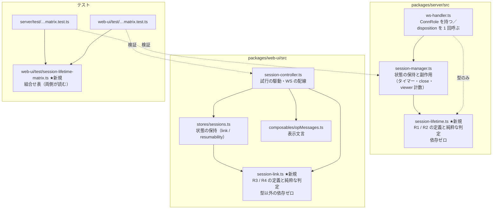
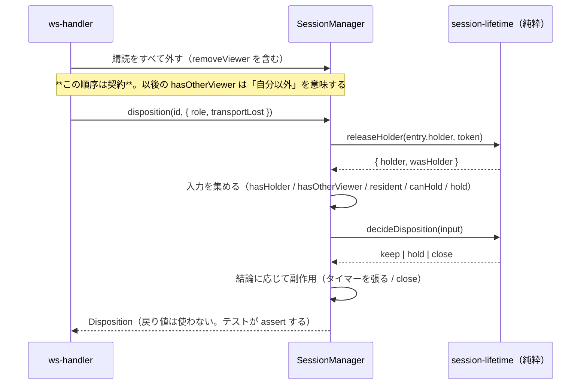
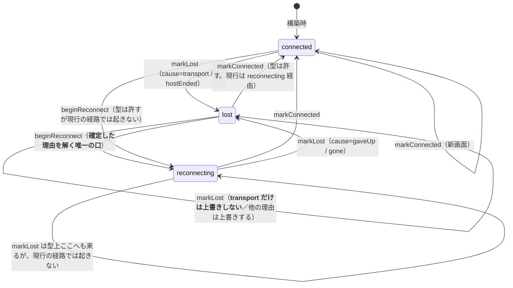

# 設計: 規則を「純粋な定義モジュール」へ切り出し、状態と副作用から分離する

> **この文書で使う記号**: `R1`〜`R4` は `requirements.md` が定めた 4 規則
> （R1 持ち主が居るか / R2 猶予中か / R3 繋ぎ直しの対象か / R4 この試行はまだ有効か）、
> `AC1`〜`AC8` は同じく `requirements.md` の受け入れ基準。ここでは再定義しない。

design が決めていないのは **置き場所**である（置き場所を決めた結果、
インターフェースが 3 点変わった。「design からの改訂」節）。受け入れ先の 4 ファイルは既に大きく
（`session-manager.ts` 1720 行 / `ws-handler.ts` 1187 行 / `session-controller.ts` 1163 行 /
`stores/sessions.ts` 343 行。design 工程で実測）、そこへ union 8 つと関数 8 つを足すだけでは
**「1 か所を読めば答えが分かる」というゴールが達成されない**——1720 行の中の 1 か所は、
探す手間の点で 12 か所と大差ない。

## アーキテクチャ概要

**規則（純粋）／状態の保持（可変）／副作用（I/O・タイマー）の 3 層に割る。**
規則の層は依存を持たず、単体で読める・テストできる・変異を注入できる。



**新規の実装モジュールは 2 つだけ**（`session-lifetime.ts` / `session-link.ts`）。
これに加えてテストデータが 1 つ（`session-lifetime-matrix.ts`）——実装ではないので数に入れない。
既存ファイルは**減る**——判定が出ていくので、行数は増えない見込み。

## コンポーネント / モジュール

| モジュール | 責務 | 依存 | 状態を持つか |
|---|---|---|---|
| `server/src/session-lifetime.ts`（新規） | **R1 / R2 の定義**（`HolderState` / `HoldState` / `ConnRole` / `Disposition` / `IdleLimit`）と**純粋な判定**（`decideDisposition` / `lifetimeOf` / `isHeldAt` / 持ち主・猶予の遷移）と、その入力の型（`DispositionInput`） | **なし**（`IdleLimit` は現行 `session-manager.ts` からここへ**移す**。移さないと「依存ゼロ」を名乗れない） | 持たない（引数と戻り値だけ） |
| `server/src/session-manager.ts` | エントリに `holder` / `hold` と**タイマー本体 `holdTimer`** を持ち、判定に必要な入力を集めて `decideDisposition` を呼び、**結論に応じた副作用**（座を返す・タイマーを張る・`close`）を実行する。公開メソッドは AC6 のため全部残す | `session-lifetime.ts` | 持つ |
| `server/src/ws-handler.ts` | `link`（`id` ＋ `ConnRole`）を持ち、後始末で `sessions.disposition()` を 1 回呼ぶ。**寿命の判断は持たない** | `session-manager.ts` ＋ `session-lifetime.ts` の**型のみ**（`ConnRole`。`import type`） | 持つ（接続ローカル） |
| `web-ui/src/session-link.ts`（新規） | **R3 / R4 の定義**（`SessionLink` / `LostCause` / `Resumability` / `Attempt`）と**純粋な判定**（`nextLink` / `isResumable` / `canSendToHost` / `isCurrentAttempt`）と、遷移の入力の型（`LinkEvent`） | `WsClient` の**型のみ**（`import type`。実行時依存なし） | 持たない |
| `web-ui/src/stores/sessions.ts` | `SessionState` に `link` / `resumability` を持ち、遷移関数（`markConnected` / `markLost` / `beginReconnect`）で `nextLink` を適用する。互換アクセサ（`connected` / `reconnect` / `reconnectFailed`）を提供する。**`resumability` は構築時に決まり、以後変わらない**（遷移規則を持たない） | `session-link.ts` | 持つ |
| `web-ui/src/session-controller.ts` | 試行の駆動（タイマー・WS の張り替え）と、`attempts` Map の保持。判定は `session-link.ts` を**直接呼ぶ**（薄いラッパを作らない）。**判定の結果を表示文言へ写す**のもここ（A3） | `stores/sessions.ts` / `session-link.ts` / `composables/opMessages.ts`（文言） | 持つ（モジュールローカル） |
| `web-ui/test/session-lifetime-matrix.ts`（新規） | 組合せ表のデータ。**振る舞いの期待値の単一の真実** | なし | — |

### design からの改訂

- design は `resumable()` / `sendToHost()` を `session-controller.ts` に置くとしたが、
  **`session-link.ts` の `isResumable()` / `canSendToHost()` として純粋側に置き、
  `session-controller` は直接呼ぶ**。薄いラッパを挟むと「規則を読む場所」が 2 段になり、
  探す手間が減らない（この work のゴールそのもの）。
- design の `disposition()` は「判断も副作用も」だったが、**判断は `decideDisposition`（純粋）、
  副作用は `SessionManager.disposition()`** に割る。**呼び出し側（`ws-handler`）から見た
  インターフェースは design のまま**——`disposition(id, ctx)` を 1 回呼ぶだけで分岐しない。
- design の `sendToHost()` は `{ ok: false; notice: string }` を返す形だったが、
  **`canSendToHost()` は理由の区分だけを返し、文言は返さない**（A3）。置き場所を純粋側に
  移した結果、**表示文言への依存が許されなくなった**ための改訂。

## インターフェース / データモデル

### `session-lifetime.ts`（サーバー・純粋）

```ts
export type HolderState =
  | { readonly held: false; readonly ever: boolean }
  | { readonly held: true; readonly ever: true; readonly token: number };

export type HoldState =
  | { readonly holding: false }
  | { readonly holding: true; readonly until: number };   // タイマー本体は manager 側

/** アイドル上限。現行 `session-manager.ts` の同名型を**ここへ移す** */
export type IdleLimit = number | "never";

export type ConnRole =
  | { readonly kind: "owner"; readonly token: number }
  | { readonly kind: "viewer" };

export type Disposition =
  | { readonly act: "keep"; readonly why: "viewer" | "otherViewers" | "resident" | "handedOver" }
  | { readonly act: "hold" }
  | { readonly act: "close" };

/** `disposition` が見る入力。**集めるのは manager、判断はここ** */
export interface DispositionInput {
  readonly role: ConnRole;
  readonly transportLost: boolean;
  readonly wasHolder: boolean;      // 座を返した結果（先に releaseHolder を通す）
  readonly hasHolder: boolean;      // 返したあとで持ち主が居るか
  readonly hasOtherViewer: boolean; // 自分の購読を外したあとの viewer 数 > 0
  readonly resident: boolean;
  readonly canHold: boolean;        // 猶予に入れられる（表示セッション かつ 猶予有効）
  readonly hold: HoldState;         // いまの猶予の状態（`holding` が「既に猶予中」）
}

export function decideDisposition(i: DispositionInput): Disposition;
export function claimHolder(prev: HolderState, token: number): HolderState;
export function releaseHolder(prev: HolderState, token: number | undefined):
  { readonly holder: HolderState; readonly wasHolder: boolean };
export function beginHold(until: number): HoldState;   // { holding: true, until }
export function endHold(): HoldState;                  // { holding: false }
/** 猶予中か。**期限切れは false**。呼ぶのは `SessionManager.isHeld(id)`（公開メソッド）だけ */
export function isHeldAt(hold: HoldState, now: number): boolean;
export function lifetimeOf(holder: HolderState, configured: IdleLimit, orphanMs: number): IdleLimit;
```

`SessionManager` 側が公開する口（design のまま。**`ws-handler` はこれを 1 回呼ぶだけ**）:

```ts
disposition(id: string, ctx: { readonly role: ConnRole; readonly transportLost: boolean }): Disposition;
```

> **`HoldState` からタイマーを外した**のは、サーバー側の `ReturnType<typeof setTimeout>` が
> **Node の型**（`packages/server/tsconfig.json` の `types: ["node"]`）で、依存ゼロを
> 名乗る層に持ち込めないため。タイマーはエントリ側に `holdTimer` として残るが、
> **判定には使わない**（`hold.holding` だけが判定に効く）。
>
> **クライアント側（`session-link.ts` の `Attempt.timer`）は同じ式を書いてよい。**
> `packages/web-ui/tsconfig.json` は `types: ["vite/client"]` で Node の型を入れないので、
> そこでの `ReturnType<typeof setTimeout>` は **DOM の `number`** に解決される
> （design 工程で確認）。**同じ式でも指す型が違う**ので、線は揃っている。

### `session-link.ts`（クライアント・純粋）

```ts
export type Resumability = "resumable" | "not-resumable";
export type LostCause = "transport" | "hostEnded" | "gaveUp" | "gone";
export type SessionLink =
  | { readonly state: "connected" }
  | { readonly state: "reconnecting"; readonly attempt: number; readonly max: number }
  | { readonly state: "lost"; readonly cause: LostCause };

/**
 * 遷移の規則。**弱いのは `transport` だけ**——`lost` が既に
 * `hostEnded` / `gone` / `gaveUp` のとき、`transport` は上書きしない。
 * それ以外の遷移は**前の状態に関わらずそのまま置き換える**——`hostEnded` / `gaveUp` / `gone` は
 * 既存の `lost` を上書きし、`{ to: "connected" }` / `{ to: "reconnecting" }` も無条件。
 * （現行の `endedByHost = true` が `connected` の値に関わらず立つのと同値）
 * design「切断理由の上書き規則」
 */
export type LinkEvent =
  | { readonly to: "connected" }
  | { readonly to: "lost"; readonly cause: LostCause }
  | { readonly to: "reconnecting"; readonly attempt: number; readonly max: number };
export function nextLink(prev: SessionLink, ev: LinkEvent): SessionLink;

export function isResumable(link: SessionLink, r: Resumability): boolean;
/**
 * ホストへ送ってよいか。**現行の 2 分岐と 1:1**——`hostEnded` なら「終了しています」、
 * それ以外の未接続（`lost` の他の理由・`reconnecting`）は「繋がっていません」。
 * `LostCause` をそのまま返さないのは、`reconnecting` に対応する理由が無いため。
 */
export function canSendToHost(link: SessionLink):
  { ok: true } | { ok: false; reason: "disconnected" | "hostEnded" };

export interface Attempt {
  readonly seq: number;
  readonly client: WsClient;      // import type のみ
  readonly index: number;
  timer: ReturnType<typeof setTimeout> | undefined;
  settled: boolean;
}
export function isCurrentAttempt(current: Attempt | undefined, a: Attempt): boolean;
```

> **`canSendToHost` は文言ではなく理由の区分（`"disconnected" | "hostEnded"`）を返す。**
> 文言（`MSG_SESSION_ENDED` / `MSG_NOT_CONNECTED`）は `composables/opMessages.ts` にあり、
> 純粋な層から表示文言を参照すると依存が逆向きになる。design の
> 「`{ ok: false; notice: string }`」からここだけ変える——**出し分けの規則は同じ**で、
> 文言への写像を `session-controller` 側に置く。
> **`LostCause` をそのまま返さない**のは、`reconnecting` に対応する理由が `LostCause` に
> 無いため（現行も再接続中は `MSG_NOT_CONNECTED` を出す）。

## 処理フロー / シーケンス



**`ws-handler` は戻り値で分岐しない。** 返すのはテストのため。

### `link` の状態遷移（R3）



## 設計判断

### A1: 規則を別モジュールへ切り出す（採用）

- **理由**: この work のゴールは「1 か所を読めば答えが分かる」。1720 行のファイルの中に
  置いても、探す手間はほとんど減らない。切り出すと、規則が**依存ゼロで単体で読める**。
- **副次的な効き目**: AC5 の変異注入の対象が**ファイル単位で自明**になる
  （`session-lifetime.ts` の 1 行を書き換える）。AC2 の走査も「このファイル以外に出ない」で
  素直に書ける。
- **退けた代替案**: 既存ファイルに足すだけ。差分は小さいが、**ゴールを満たさない**。

### A2: 判断（純粋）と副作用（manager）を割る（採用）

- **理由**: `decideDisposition` が純粋なら、**役割 4 通り（現在の持ち主／交代済み・後任在席／
  交代済み・持ち主不在／見に来ただけ）× viewer の有無 2 通り ＝ 8 行を、引数だけで網羅できる**。
  **サーバーが区別する切れ方は 2 値**（`transportLost`）——転送断と心拍死は `dispose` に
  同じ引数で入り、ホスト終了は `dispose` を通らないため。組合せ表が持つ切れ方 4 通りのうち、
  ここに掛かるのは 2 通りだけである。
  タイマーもソケットも要らないので、組合せ表の期待値が読みやすい。
- **退けた代替案**: design どおり `disposition()` に全部入れる。呼び出し側から見た形は
  同じだが、判断のテストに manager の生成が要る。
- **注意**: **組合せ表（AC4）は純粋関数ではなく実経路で回す**——「振る舞いを変えない」の
  対象は利用者から見た振る舞いであって、純粋関数の戻り値ではない。
  **純粋関数だけを別に網羅するテストは作らない**（`session-lifetime.test.ts` のような
  ファイルは増やさない）——同じ表を 2 通りの粒度で回すと、片方だけ更新される。

### A3: クライアントの純粋層は文言を知らない（採用）

- **理由**: 依存の向き。`session-link.ts` → `opMessages.ts` を引くと、規則が表示に依存する。
- **影響**: design の `sendToHost()` の戻り値が `notice: string` から
  `reason: "disconnected" | "hostEnded"` に変わる。**`LostCause` ではない**——
  `reconnecting` に対応する理由が `LostCause` に無く、現行もそこは「繋がっていません」だから。
  出し分けの規則（`hostEnded` なら「終了しています」、他は「繋がっていません」）は同じ。

### A4: 組合せ表は `web-ui/test` に置き、サーバーが読む（design 方針5 を追認）

- design 工程で**実地に確かめた**（`npx vitest run --root packages/server` が緑）。
  向きが逆にできないのは web-ui の `tsconfig.test.json` が `composite: true` で
  `include` の外を取り込めないため。
- **依存の向きとしては歓迎しない形**（プロダクトコードなら通さない）。テスト専用の
  データファイルに限る、という線をファイル冒頭に書いて閉じる。
- **退けた代替案**: 両側に複製して行キーの一致を assert する。複製は
  「片方だけ更新される」を必ず生む——この harness の `protocol.md` が
  「3箇所に写して1箇所だけ更新される」事故を繰り返し記録しているのと同じ形。

## tasks への申し送り

- **順序が重要**: ①組合せ表を書き、**現行実装のまま緑にする**（characterization）→
  ②サーバーを畳む → ③クライアントを畳む → ④走査テスト → ⑤変異注入で表を確かめる。
  **①を飛ばすと、この work の唯一の安全網が畳み込み後のコードに合わせて書かれる。**
- **②と③は独立**（サーバーとクライアントで共有する実装が無い）。順に進めても並行でもよい。
- **表は 1 タスクで書き切る**。サーバー分だけ先に書くと、クライアント分を足すときに
  軸の形を変えたくなり、①の意味が薄れる。
- 走査テスト（④）は**畳み込みが済んでから**書く。先に書くと赤いテストを抱えて②③を進めることになる。
- 変異注入（⑤）は**作業ツリーに残さない**（design「対象範囲」）。結果は `test-result.md` へ。
- **既存テストの追随は②③の中で行う**（別タスクにしない）。畳んだ本人が、
  期待値を変えていないことを差分で示せる状態のうちに直すのが安全。
