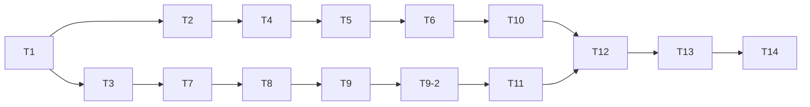

# タスク: セッション寿命の 4 規則を定義 1 つ＋導出関数に畳む

## 実装方針

`architecture.md`「tasks への申し送り」の順序に従う。**組合せ表を先に書き、現行実装のまま
緑にしてから畳む**（characterization）。これがこの work の唯一の安全網で、後に書くと
畳み込み後のコードに合わせた期待値になり、安全網として機能しない。

サーバー（T4〜T6）とクライアント（T7〜T9-2）は**共有する実装が無いので独立**。
それぞれ「純粋モジュールを作る → 状態の持ち主を差し替える → 呼び出し側を畳む」の
3 段で進む（クライアントは最後の段が R3 側と R4 側の 2 つに割れて T9 / T9-2 になる）。走査テスト（T10 / T11）は畳み終わってから書く——先に書くと赤いテストを
抱えたまま畳むことになる。

**subtask には分割しない。** `aidev-docs/DESIGN.md`「5.」の決定木で、振る舞い不変な変更は
分割対象外と明示されている。1 PR に収まる規模でもある。

## 作業順序と依存関係

下の `依存:` に従う。`依存:` だけでは表せない理由をここに書く。

- **表を先に置いているのは、順序そのものが安全網だから。** 依存は側ごとに掛かる——
  サーバーの畳み込み（T4〜T6）は **T2** が、クライアントの畳み込み（T7〜T9-2）は **T3** が先行する。
  技術的には表が無くても畳めるが、**畳めることと畳んでよいことは別**。
- **既存テストの追随は T5 / T6 / T9 / T9-2 の中で行う**（別タスクにしない）。畳んだ本人が
  「期待値を変えていない」ことを差分で示せる状態のうちに直すのが安全。
- **T13 は test 工程で、T14 は deliver 工程で消化する**（coding の承認時は未チェックで残る。
  `decisions.md` D6）。

## リスク / 留意点

- **サーバーのテストは型検査されない**（`research.md` F19。`packages/server/tsconfig.json` の
  `include` が `["src"]`）。T5 / T6 で公開シグネチャを変えると**実行時にしか壊れない**。
  AC6（公開メソッドを消さない・変えない）はこのリスクへの対策そのもの。
- **`ws-printer-report-history.test.ts:94,141` が `private dispose()` を外から呼んでいる**
  （同 F19）。T6 で `dispose` の名前・引数を変えない。
- **R4 の 5 系統（うち 4 つを T9-2 で畳み、`:450` の `s.client === client` は畳まない）のうち、
  `pendingResumes` の `:440`**（全メッセージで「代表している試行か」を見る）
  が抜けると、打ち切った試行の `screen` が `connected` を戻す。既存テスト
  `session-reconnect.test.ts:453-464` がその退行を捕まえる唯一の網（`research.md` design への申し送り）。
- **AC6（公開 API・WS プロトコルの不変）はクライアント側にも掛かる**——T9 / T9-2 が触る
  繋ぎ直しは `{ type: "open", sessionId, resume: true }` を送る側で、**メッセージの形を変えると
  サーバーと版がずれたときに黙って繋がらなくなる**。サーバー側の理由（テストが型検査されない）
  とは別の理由で同じ制約が掛かる。
- **`notice` の扱いは 3 通り混在している**（空のときだけ書く / 無条件上書き / 無条件削除。
  `research.md` 実現性・リスク）。T9 で一様化したくなるが、**それは振る舞いの変更**なので触らない。
- **バグに見えるものを見つけても直さない**（`requirements.md` 非機能要件）。記録して backlog へ回す。

## テスト方針

- **AC4 の組合せ表が主軸**。端末種別（5250 / 3270 / VT / プリンター）× 切れ方（利用者が閉じた /
  転送断 / 心拍死 / ホスト終了）× viewer の有無 × 持ち主の役割 4 通りを 1 つの表にし、
  サーバー・クライアント双方がそこから回る。期待値は `research.md` Q4 をそのまま使う。
- **起こり得ない組合せは「到達しない」として表に明記する**（`research.md` F8）。
  「網羅した」と「到達しない」を区別する。
- **既存テストの期待値は変えない**。呼び出しの形だけを直した箇所は `test-result.md` に列挙する。
- **AC5 の変異注入は 4 定義の読み取りに 1 つずつ**。確かめたら戻す（作業ツリーに残さない）。
- ベースラインは **5560 passed / 0 failed / 41 skipped**（本 work の design 工程で実測）。
  test 工程はこの数と突き合わせる。
- **`packages/web-ui/test/tab-visibility.test.ts` は AC3 の判定から除く**——並列実行時に
  5 秒タイムアウトで落ちる既存フレークで、本 work の対象範囲に触れない
  （`requirements.md` スコープ対象外）。**除外の事実と再現条件は落ちたかどうかに関わらず
  `test-result.md` に残す**（黙って再実行で通さない）。なおベースラインの 2 回の実行では
  落ちていない。

## タスク

- [x] T1: 組合せ表のデータを書く（表だけ。テストはまだ書かない）。`research.md` Q4 の全組合せを
      軸ごとに構造化し、**到達しない組合せは理由つきで明示**する。ファイル冒頭に
      「両側から読む・なぜ web-ui/test に置くか」を書く
      対象: `packages/web-ui/test/session-lifetime-matrix.ts` （新規作成） / 根拠: architecture「tasks への申し送り」, research Q4
      依存: なし
      AC: AC4
- [x] T2: サーバー側を表から回すテストを書き、**現行実装のまま緑にする**
      対象: `packages/server/test/session-lifetime-matrix.test.ts` （新規作成） / 参照: `packages/server/test/ws-reconnect-resume.test.ts` `session-reconnect-grace.test.ts` / 根拠: research A13
      依存: T1
      AC: AC4
- [x] T3: クライアント側を表から回すテストを書き、**現行実装のまま緑にする**
      対象: `packages/web-ui/test/session-lifetime-matrix.test.ts` （新規作成） / 参照: `packages/web-ui/test/session-reconnect.test.ts:27-46,76-78`（WsClient のモックと fake timers の型） / 根拠: research A13
      依存: T1
      AC: AC4
- [x] T4: 純粋モジュール `session-lifetime.ts` を作る（R1 / R2 の定義と判定）。`IdleLimit` を
      `session-manager.ts` からここへ移す。各定義の docstring に前 work の D4 / D5 / D7 / D10 / D12 を書く
      対象: `packages/server/src/session-lifetime.ts` （新規作成） / 移す型: `packages/server/src/session-manager.ts` の `IdleLimit` / 根拠: architecture「session-lifetime.ts」
      依存: T2
      AC: AC1, AC7
- [x] T5: `SessionManager` を新定義へ差し替える。`holderToken`/`hadHolder` → `holder`、
      `heldUntil`/`holdTimer` → `hold`＋タイマー、`idleLimitOf` → `lifetimeOf`、`disposition()` を追加。
      **既存の公開メソッドは全部残して導出に降格**。既存テストの呼び出しの形だけ追随させる
      対象: `packages/server/src/session-manager.ts:1342-1452`（claim/hold 系）, `:1665-1718`（lifetime/sweep）, `:155,273,445`（型） / 根拠: research A3, A4, A5
      依存: T4
      AC: AC1, AC3, AC6, AC7
- [x] T6: `ws-handler` の `sessionId`/`attached`/`holderToken` を `link` 1 つに畳み、`dispose` の
      処分の判断を `disposition()` 呼び出しに置換する。**`dispose` の名前と引数は変えない**
      **既存テストの呼び出しの形だけ追随させる**（`ws-handler.test.ts` / `ws-lifetime.test.ts` /
      `session-attach.test.ts`。期待値は変えない）
      対象: `packages/server/src/ws-handler.ts:1084-1155`（dispose）, `:142,153`（フィールド）, `:498,785,914,916`（claim/attached） / 根拠: research A1, A2, A6
      依存: T5
      AC: AC1, AC3, AC6, AC7
- [x] T7: 純粋モジュール `session-link.ts` を作る（R3 / R4 の定義と判定）。docstring に
      前 work の D4 / D11 / D13 を書く
      対象: `packages/web-ui/src/session-link.ts` （新規作成） / 根拠: architecture「session-link.ts」
      依存: T3
      AC: AC1, AC7
- [x] T8: `SessionState` に `link` / `resumability` を持たせ、遷移関数（`markConnected` /
      `markLost` / `beginReconnect`）と**読み取り専用アクセサ**（`connected` / `reconnect` /
      `reconnectFailed`）を用意する。`attachedOnly` / `endedByHost` は**捨てる**（読み手が全部畳まれる）
      対象: `packages/web-ui/src/stores/sessions.ts:102-193`（SessionState）, `:318`（updateScreen） / 根拠: research A9
      依存: T7
      AC: AC1, AC3, AC7
- [x] T9: **R3 側**——`session-controller` の 4 門を `isResumable()` に、送信可否を
      `canSendToHost()`＋文言の写像に畳み、書き込みを遷移関数へ寄せる。あわせて
      **`startReconnect` の docstring の誤り（打ちかけの入力が残る）を訂正する**（前 work D11。
      同じ関数を触るついでで、振る舞いは変わらない）。**既存テストの呼び出しの形だけ追随させる**
      （`session-reconnect.test.ts` / `disconnect-clears-busy.test.ts`。期待値は変えない）
      対象: `packages/web-ui/src/session-controller.ts:143-155`（送信可否）, `:270-316`（門と docstring）, `:475-485`（手動） / 根拠: research A7, A10, 実装時の注意
      依存: T8
      AC: AC1, AC3, AC6, AC7
- [x] T9-2: **R4 側**——試行の新旧 4 系統（`settled` / `pendingResumes` / `reconnectTimers` /
      `s.reconnect`）を `Attempt` レコード＋`isCurrentAttempt()` に畳む。**`:450` の
      `s.client === client`（口の同一性）は畳まない**。**既存テストの呼び出しの形だけ追随させる**
      （`session-reconnect.test.ts`。とくに `:453-464` が `pendingResumes` の退行を捕まえる唯一の網。
      期待値は変えない）
      対象: `packages/web-ui/src/session-controller.ts:319-467`（試行の駆動）, `:224-263`（タイマーと中止） / 根拠: research A8, architecture「session-link.ts」
      依存: T9
      AC: AC1, AC3, AC6, AC7
- [x] T10: サーバーの走査テストを書く。消えるもの（`holderToken`/`hadHolder`/`heldUntil`/`holdTimer`）は
      全ファイル 0 件、残るもの（`.holder`/`.hold`/`.viewers`/`.resident`）は `session-manager.ts` 以外 0 件、
      `attached` は `ws-handler.ts` で 0 件
      対象: `packages/server/test/lifetime-flag-containment.test.ts` （新規作成） / 雛形: `packages/server/test/log-independence.test.ts` / 根拠: research A12, F20
      依存: T6
      AC: AC2
- [x] T11: クライアントの走査テストを書く。`attachedOnly`/`endedByHost`/`settled`/`pendingResumes`/
      `reconnectTimers` が `src` に 0 件、`.link =` が `stores/sessions.ts` 以外に無い、
      `resumability` が `session-controller.ts` の外で読まれない
      対象: `packages/web-ui/test/lifetime-flag-containment.test.ts` （新規作成） / 根拠: design「AC2 の詳細」, research F18
      依存: T9-2
      AC: AC2
- [x] T12: 変異注入で表が空振りでないことを確かめる。**4 定義の読み取りに 1 つずつ**
      （`holder.held` を常に真 / `hold.holding` を反転 / `link.state` を常に `lost`＋`resumability` を
      常に `resumable` / `Attempt.settled` を常に偽）。**確かめたら戻す**（作業ツリーに残さない）。
      何を入れて何件落ちたかを `test-result.md` に書く
      対象: `packages/server/src/session-lifetime.ts`, `packages/web-ui/src/session-link.ts` / 根拠: design「AC5」, architecture A2
      依存: T10, T11
      AC: AC5
- [x] T13: 全数テスト・lint・build・smoke を通し、ベースライン
      （**5560 passed / 0 failed / 41 skipped**）と突き合わせる。あわせて `test-result.md` に
      **(a) 呼び出しの形だけを直した既存テストの一覧と「期待値は変えていない」根拠**、
      **(b) `tab-visibility.test.ts` を AC3 の判定から除いた事実と再現条件**を書く。
      **消化は test 工程**（coding の承認時は未チェックで残る。`decisions.md` D6）
      対象: `npm test` / `npm run lint` / `npm run build` / `node launcher/smoke.mjs` / 根拠: `.aidev/config.yml` の `smokeCommand`, テスト方針のベースライン
      依存: T12
      AC: AC3
- [x] T14: backlog の 1・2 件目を消し込み根拠つきで `[x]` にする。**畳み込み中に見つけた
      「バグに見えるもの」があれば、同じ台帳に起票する**（リスク節の「記録して backlog へ回す」の
      落とし先。無ければ「無し」と `test-result.md` に書く）。**消化は deliver 工程**
      （同 D6。`aidev verify` が検査する）
      対象: `.aidev/backlog/session-lifecycle.md:3-12`（1・2 件目） / 根拠: state.yml の `backlog:`
      依存: T13
      AC: AC8
