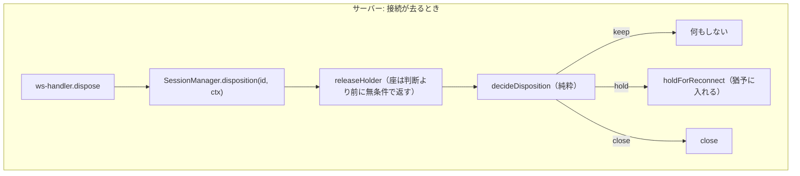
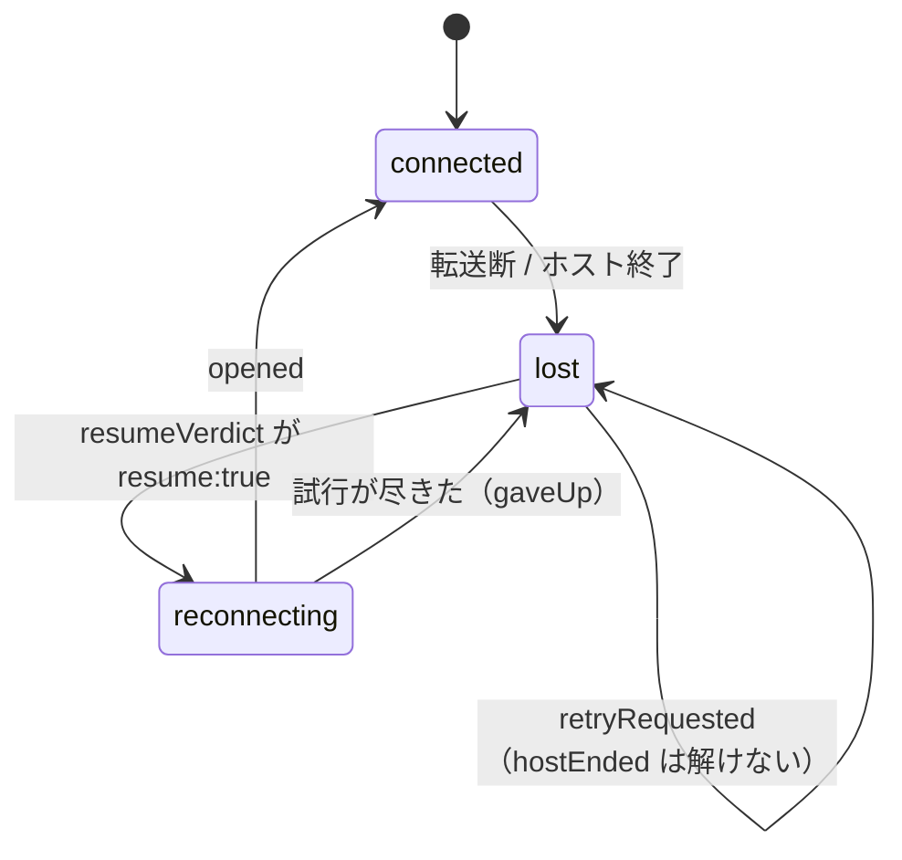

# レビューガイド: セッション寿命の 4 規則を 1 か所ずつに畳む

## 変更概要 / 目的

**振る舞いを 1 つも変えずに、判定の置き場所だけを変える**リファクタです。読むときは
「何が変わったか」ではなく「**同じ答えを別の場所から出しているか**」を見てください。

前身の PR #391 で、review が **3 ラウンド続けて「直した項の隣が壊れる」**を出し差し戻し上限に達しました。
原因究明の診断は個別の欠陥ではなく**規則の置き場所**——セッションの寿命を決める 4 つの規則が、
どれも単一の判定関数を持たず**独立フラグの暗黙の連言**として 12〜15 か所に散っていた、というものです。

| 規則 | 問い | 畳んだ先 |
|---|---|---|
| R1 | 持ち主が居るか | `HolderState`（server） |
| R2 | 猶予中か | `HoldState`（server） |
| R3 | 繋ぎ直しの対象か | `SessionLink` ＋ `Resumability`（client） |
| R4 | この試行はまだ有効か | `Attempt`（client） |

規則は**依存ゼロの純粋モジュール 2 本**に出しました。単体で読め、テストでき、変異を注入できます。

- `packages/server/src/session-lifetime.ts` — R1 / R2
- `packages/web-ui/src/session-link.ts` — R3 / R4

## 重要ポイント

**1. 安全網を先に作ってから畳んでいます。**
`packages/web-ui/test/session-lifetime-matrix.ts` の組合せ表（端末種別 × 切れ方 × viewer × 役割、86 行）は
**畳み込みの前に HEAD `90f5636f` の実装から期待値を採取**しました。後から書くと畳み込み後のコードに
合わせた期待値になり、安全網として機能しません。**サーバーとクライアントの両方がこの 1 つの表から回ります**
（射影 `clientViewOf()` で両向きに突き合わせ、片側にしか無い行が生まれたら落ちる）。

**2. 表が空振りでないことを変異注入で確かめました**（AC5）。ここに読みどころがあります——
**設計が指定した「項ごとの変異」が R1 と R4 で等価変異**でした（`decisions.md` D17）。
0 件を「テストの穴」と読んで存在しない穴を埋めるテストを書きかけ、独立点検に指摘されて測り直しています。
`releaseHolder` は門を丸ごと壊すと 22 件落ちるので、表がその経路を通っていないわけではありません。

**3. 読む形は変えず、書く形だけ畳みました**（client）。`connected` / `reconnect` / `reconnectFailed` は
`link` からの**読み取り専用アクセサ**にしたので、表示側 9 箇所は 1 行も変わりません。
一方で `s.connected = true` は**型エラーになります**——web-ui はテストまで型検査されるので、
これが最も強い封じ込めです。

**4. 公開 API は 1 つも消していません**（AC6）。`SessionManager` の公開面の変更は
`disposition()` の**追加 1 件のみ**。WS プロトコル定義（`ws-messages.ts`）は未変更です。

**5. 振る舞いが変わった箇所が 1 つだけあります**（`decisions.md` D9）。旧 `dispose` は `attached` を
リセットしないため、同じ WS を使い回すと 2 本目のセッションが孤児になりました。畳み込みで自然に直っています
——**旧に戻すには「役割をスティッキーにする」コードを書き足す必要がある**ので受け入れ、回帰テストで固定しました。
製品の web-ui からは到達しません。

## 処理フロー

**畳み込み前は、この 2 つの状態機械が独立した真偽値の組として書かれていました。**
`nextLink` が唯一の遷移で、`link` への代入は `stores/sessions.ts` の外に出ると CI が落ちます。

## 主要な変更箇所

**規則の定義（新規・ここだけ読めば規則が分かる）**
- `packages/server/src/session-lifetime.ts:174` — `decideDisposition`。旧 `dispose` の 3 段ゲートと 1:1
- `packages/server/src/session-lifetime.ts:237` — `lifetimeOf`。持ち主不在の寿命
- `packages/web-ui/src/session-link.ts:95` — `nextLink`。`link` の唯一の遷移
- `packages/web-ui/src/session-link.ts:142` — `resumeVerdict`。旧 `startReconnect` の 4 門と 1:1
- `packages/web-ui/src/session-link.ts:215` — `isCurrentAttempt`。**2 項のうち効いているのは第 1 項だけ**（D17）

**呼び出し側（判断が消えた側）**
- `packages/server/src/session-manager.ts:1482` — `disposition()`。判断も副作用もここに寄せた
- `packages/server/src/ws-handler.ts:130` — 3 フィールド（`sessionId`/`attached`/`holderToken`）→ `link` 1 つ
- `packages/web-ui/src/session-controller.ts:316` — `startReconnect`。4 門 → `resumeVerdict` 1 つ
- `packages/web-ui/src/session-controller.ts:248` — `attempts`。2 つの Map ＋ローカル `settled` → `Attempt` 1 つ
- `packages/web-ui/src/stores/sessions.ts:301` — `defineDerivedLink`。旧 4 フラグを読み取り専用アクセサに

**安全網**
- `packages/web-ui/test/session-lifetime-matrix.ts` — 組合せ表（両側が読む唯一の表）
- `packages/*/test/lifetime-flag-containment.test.ts` — 走査。旧フラグが定義の外に出たら落ちる
- `packages/web-ui/test/source-scan.ts` — 走査が使うコメント除去（**両側で共有**。複製すると片方だけ直る）

## リスク / 確認したい点

**1. 既存バグを 1 つ、直さずに残しています**（`decisions.md` D13）。
繋ぎ直しに成功したあと、`session-controller.ts` のメッセージ共通ガードが**以後の全フレームを落とします**。
利用者から見ると「再接続したのに画面が固まり、応答待ちの覆いが消えない」。
**HEAD でも同じ**（本 work 由来ではない）ため、requirements の非機能要件
（バグは直さず記録して backlog へ）に従いました——直すと「振る舞いを変えていない」ことを
テストで示せなくなり、この work の唯一の安全網を自分で外すことになります。
**直す人へ**: ガードを緩めると `updateScreen` の遷移が広がった件（`stores/sessions.ts`）の
「到達しない」根拠を検査し直す必要があります。

**2. 走査が守らない範囲が 3 つあります**（design「AC2 の詳細」）。とくに
**同一ファイル内の再計算は構造的に見えません**——実際 `session-manager.ts` に残っていた
R1 / R2 の写し 2 件を見つけたのは CI ではなく `cross` 点検でした（D19）。
US3「写しが増えたら CI が落ちる」がここだけ成立していません。follow-up を backlog へ回します。

**3. 畳めなかった写しが 1 つ残ります**（D19）。`holdForReconnect` の 3 条件と `disposition` の
`holdable` 式が同じことを別の形で持っています。`holdForReconnect` は公開メソッドで自前の門が要る（AC6）ため
畳めませんでした。**`disposition` が戻り値を捨てている**ので、両者がずれると
「`hold` を返したまま何も保持しない」——前 work が繰り返した孤児化と同じ形になります。

**4. 実機で確認していません。** 単体テストと型のみです（backlog に前 work から積み残っている項目）。

**5. `idleLimitOf` → `lifetimeOf` の改名を見送りました**（D20-3）。純粋側に同名の関数を import しており、
同じ名前が「規則」と「その薄い呼び出し層」の両方に付きます。どちらを正とするかは設計判断なので
判断を仰ぎたい点です。
