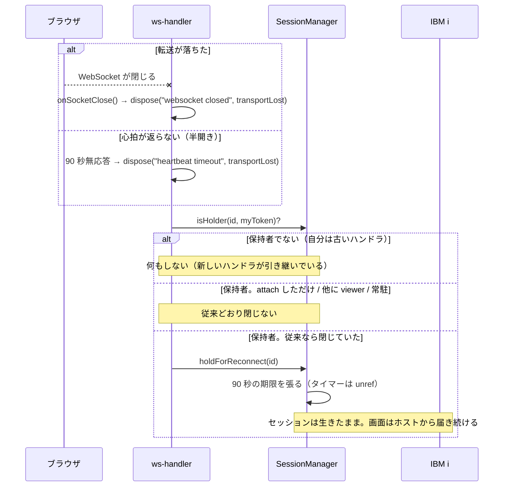
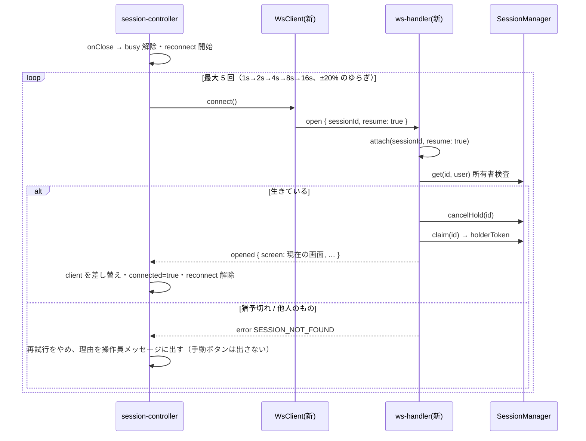

# 設計: 転送断でセッションを失わない（猶予保持と再接続）

## 設計方針

1. **「回線が落ちた」と「利用者が閉じた」を区別する。** 今はどちらも同じ `dispose` に
   合流している（research F2）。猶予を掛けてよいのは前者だけ。
2. **猶予はサーバーが持ち、必ず期限で畳む。** ブラウザ経路の既定アイドル上限は `"never"` で、
   掃除役は当てにできない（research F5 / `decisions.md` D5）。
3. **復帰は「持ち主として戻る」。** 既存の attach（見に来た人）とは閉じる責任が逆なので、
   `resume` で意味を分ける（D4）。
4. **クライアントは自分で死を判定して繋ぎ直す。** サーバーの `ping` が途絶えたら
   `ws-client` の層で畳み、`session-controller` が再アタッチを駆動する（D6）。
5. **表示は OIA に置き、画面を覆わない。** 覆いは応答待ち専用。再接続中も打鍵内容は保つ。
6. **古いハンドラに新しいセッションを殺させない。** 保持者トークンで判定する（D7）。

## 対象範囲

- **対象**: 5250 表示セッションのブラウザ経路（`SessionManager` が持つセッション）。
- **対象外**: 3270 / VT / プリンター / 監視 / MCP・HLLAPI 経路。
  これらの `dispose` の振る舞いは**変えない**ことが不変条件（AC8）。

## 依拠する既存の事実

（`F<n>` は `research.md` の同番号。一次の出所はそちらの `file:line` にある。
research に無いものは、この節で直接 `file:line` を挙げる）

- 閉じる条件は `!attached && !otherViewers && !isResident` の連言（F1）。
- 転送断とクライアントの `close` は同じ `dispose` に合流する（F2）。
- `attach` は現在の画面スナップショットを返す（F3）→ **AC3 は既存機構で満たせる**。
- `attach` は `attached = true` を立て、以後閉じなくなる（F4）。
- 既定アイドル上限は `"never"`、その根拠は「WS 切断と心拍が孤児を回収する」（F5）。
- 表示セッションの上限は既定 8（F6）。
- 心拍は 30 秒間隔（`HEARTBEAT_INTERVAL_MS`）・90 秒で死判定（`HEARTBEAT_DEAD_MS`）。
  **クライアント側に見張りは無い**（F7）。
- 所有者検査は `SessionManager.get(id, user)` が持つ（F10）→ **AC11 は既存機構で満たせる**。
- 打鍵途中の入力は `edits: Map` としてクライアント側だけにある（F11）。
  **繋ぎ直しでは捨てる**——反映する画面が打っていた画面とは限らないため（`decisions.md` D11）。
- 接続状態は OIA（`StatusBar`）に出す。状態の通知に `role="status"` を使う前例がある（F13）。
- **応急修正が作業ツリーに入っている**（F14）——`WsClientHandlers.onClose` を足し、
  `session-controller` が `connected=false` + `setBusy(false)` + 操作員メッセージを出す。
  回帰テストは `disconnect-clears-busy.test.ts` / `ws-close-notify.test.ts`。
- **`WsClient.send` は OPEN でなければ黙って捨てる**
  （`packages/web-ui/src/ws-client.ts:75`。research に項目が無いのでここで直接挙げる）。
- **サーバー応答のエラーを操作員メッセージへ変える口が既にある**——`wsErrorNotice`
  （`packages/web-ui/src/composables/opMessages.ts`。`session-controller` の `error` 分岐が使っている）。

## I/F・データ構造

### サーバー

```ts
// ws-messages.ts — 1 フィールド追加（D4）
interface WsOpen {
  sessionId?: string;
  /**
   * **持ち主として戻る**（`sessionId` と併用時のみ意味を持つ）。
   * 猶予中のセッションを引き取り、閉じる責任も引き継ぐ。
   * 既定 false ＝従来の attach（見に来ただけ。セッションを閉じない）。
   */
  resume?: boolean;
  // …既存フィールドは変更なし
}
```

```ts
// session-manager.ts — 猶予と保持者（D5 / D7）
interface SessionManagerOptions {
  /**
   * 転送断で保持する猶予（ms）。既定 90_000（`DEFAULT_RECONNECT_GRACE_MS`）。**0 で無効**。
   *
   * **テストのための注入口で、CLI オプションにも設定ファイルにも出さない**（D5）。
   * 利用者から見える設定面は増やさない。
   */
  reconnectGraceMs?: number;
}

class SessionManager {
  /** 保持者トークンを発行して記録する。open / resume で呼ぶ */
  claim(id: string): number;
  /** 自分がまだ保持者か。古いハンドラの後始末を弾く */
  isHolder(id: string, token: number): boolean;
  /** 猶予に入れる（期限で自動 close）。既に猶予中なら期限を延ばさない */
  holdForReconnect(id: string): void;
  /** 猶予を解除する（resume 成功時）。猶予中でなければ何もしない */
  cancelHold(id: string): void;
  /** 猶予中か（テストと診断用） */
  isHeld(id: string): boolean;
}
```

```ts
// ws-handler.ts
private holderToken: number | undefined;
private dispose(reason: string, opts?: { transportLost?: boolean }): void;
private attach(sessionId: string, resume: boolean): void;
```

### クライアント

```ts
// ws-client.ts — 半開き検出（D6）
/** `ping` がこの時間来なければ死んだとみなす（サーバーの HEARTBEAT_DEAD_MS と同値） */
const PING_DEAD_MS = 90_000;
// 最初の ping を受け取ってから見張りを始める（ping を送らないサーバーとは後方互換）
```

```ts
// stores/sessions.ts — 再接続の状態
interface SessionState {
  /** 再接続中（未設定＝再接続していない）。`attempt` は 1 始まり、`max` は試行の総数 */
  reconnect?: { attempt: number; max: number };
  /** 諦めた理由。`"retry"`＝転送が尽きた（手動ボタンを出す）／`"gone"`＝もう無い（出さない） */
  reconnectFailed?: "retry" | "gone";
  /** 見に来ただけのタブ（`WsOpen.sessionId` 指定で開いた）。繋ぎ直しに行かない */
  attachedOnly?: boolean;
  /** ホスト側のセッションが終わった（サーバー発 `closed`）。繋ぎ直しに行かない */
  endedByHost?: boolean;
}
```

## 振る舞いの詳細

### 0. 保持者トークン（サーバー・全経路の前提）

`ws-handler` はセッションを持ったとき（`open` で新規に開いたとき、`resume` で引き取ったとき）に
`sessions.claim(id)` を呼び、返ったトークンを自分の `holderToken` に持つ。**後から `claim` した者が
現在の保持者**で、前の保持者のトークンは以後 `isHolder` を通らない。`dispose` はこの照合を
**既存の 3 判断より前**に置く（自分が既に交代済みなら、そもそも何も判断しない）。

従来の attach（`resume` なし）は `claim` しない——見に来ただけで、閉じる責任を持たないため。

### 1. 転送断 → 猶予（サーバー）



- `transportLost` を立てるのは **`onSocketClose()` と心拍の死判定**の 2 つだけ（図の 2 本の入口）。
  クライアントの `close` メッセージは立てない（利用者が閉じたのだから猶予は要らない）。
- **`reconnectGraceMs` が 0 なら猶予に入れず、従来どおり即座に閉じる**
  （既存の挙動へ戻す逃げ道。テストでも使う）。
- 猶予に入れるのは、**従来なら `sessions.close(id)` を呼んでいたその一点**。
  既存の 3 判断（F1）はそのまま前段に残す。
- 猶予タイマーは `unref()` する（心拍と同じ。プロセスを引き止めない）。
- **猶予中のセッションは `maxSessions`（既定 8。F6）の枠を占め続ける**。常駐プリンターのように
  枠から外すことはしない——猶予は「まだ利用者のもの」であって、席を空けたことにはならないため。
  占有は最大 90 秒に限られる（D5 / D12）。ホスト側の装置記述も同じ間だけ掴んだままになるが、
  同じ設定で新しく開いた場合は既存の装置名の繰り上げ（`retryWithNextDeviceName`）が働く。

### 2. 復帰（クライアント → サーバー）



- **再試行の間隔**: 1s → 2s → 4s → 8s → 16s（累計 31 秒）に **±20% のゆらぎ**を掛ける。
  サーバー再起動で全タブが同時に叩くのを防ぐ（要件の「再接続が嵐にならない」）。
- **再試行の予算が猶予の内側に収まる根拠**（coding 中に足し直した。`decisions.md` D12）:
  - 最悪ケースの壁時計は **(1+2+4+8+16) × 1.2 ＝ 37.2 秒（ゆらぎ込みの待ち）＋
    5 × 10 秒（試行ごとの上限 `RESUME_ATTEMPT_TIMEOUT_MS`）＝ 87.2 秒**。
    猶予はこれを覆う **90 秒**にしてある。
  - **起点のずれ**: `close` が飛ぶ切れ方では両者が同時に気づく。半開きでは
    クライアントが `ping` の途絶（最後の `ping` から 90 秒＝実測 60〜90 秒）で先に気づき、
    サーバーは 30 秒周期のティックで判定するので 90〜120 秒。**クライアントが先**なので
    安全側だが、最大 60 秒ずれる。90 秒の猶予はこのずれも覆う。
  - 試行が猶予より先に届いた場合は**そもそも猶予に入る前**で、セッションは生きているので成功する。
- **繋ぎ直しに行かない相手**（coding 中に足した門。`decisions.md` D13）:
  プリンター / 3270（対象外）／**見に来ただけのタブ**（`attachedOnly`。座を引き取ると
  相手の作業を畳むことになる）／**ホストが終わったセッション**（`endedByHost`。
  戻る先が無く、はしごを回すと嘘の理由が出る）。
- **セッションは作り直さない**: 差し替えるのは `SessionState.client` だけ。
  **打ちかけの入力（`edits`）は捨てる**——`updateScreen` が新画面で捨てる既存の規則に乗せる。
  留守中にホストが別の画面を書いていることがあり、残すと**違う欄に打鍵が載る**（`decisions.md` D11）。
- **復帰したら**: `opened` の画面をそのまま反映する（AC3）。`busy` は解けたままにする
  ——待っていた要求はもう返らないので、押し直しは利用者に委ねる。
- **`resume` の失敗は再試行しない**。`SESSION_NOT_FOUND` は時間が経っても回復しない。
  この場合は**手動の繋ぎ直しも出さない**——押しても同じ理由で失敗するボタンを出さない。
  手動ボタンを出すのは「**転送が繋がらないまま試行が尽きた**」ときだけで、
  そちらは時間が経てば回復しうる。この 2 つを `SessionState` で分ける
  （`reconnectFailed` を立てるのは後者だけ）。

### 3. 半開き（クライアント）

- `WsClient` は `ping` を受けるたびに見張りを張り直す。90 秒来なければ
  `ws.close()` → 既存の `close` 経路（`onClose`）に合流する。**新しい経路は作らない**。
- 見張りは**最初の `ping` を受け取ってから**張る。`ping` を送らないサーバーに対しては
  一度も張られない（後方互換）。

### 4. 表示（AC-I）

- **OIA（`StatusBar`）**: `StatusBar` の `inputState`（接続状態から表示ラベルを決める算出値。
  いまは `state.connected === false` で「切断」を返す）が `SessionState.reconnect` も見て、
  再接続中は「再接続中 (2/5)」を返す。**新しい表示要素を足すのではなく、既にある
  1 か所の分岐を増やす**（接続状態の表示が 2 か所に散らない）。
  `role="status"` を付ける（マクロ状態の前例に倣う。F13）。**画面は覆わない**。
- **操作員メッセージ**（`EmulatorPane` の `.msgline`）: 切断の通知（既投入。F14）と、
  諦めたときの理由（AC10）。
- **手動の繋ぎ直し**（AC-I2）: 諦めたとき（`reconnectFailed`）だけ OIA に `<button>` を出す。
  素の `<button>` なのでフォーカス移動＋Enter で押せる（AC-I3）。
- **フォーカスを奪わない**（AC-I4）: 再接続の表示は `role="status"` の受動的な通知にとどめ、
  `focus()` を呼ばない。復帰後のフォーカスは既存のペインの仕組みに任せる。
- **打鍵は保つが送らない**: 再接続中は欄の編集を止めない（入力が消えない）。AID の送信だけ
  操作員メッセージで断る——`WsClient.send` が黙って捨てるのに任せると
  「押したのに何も起きない」になる（F: `ws-client.ts:75`）。

## エラー処理

| 状況 | サーバー | クライアント |
|---|---|---|
| 猶予切れ後に `resume` | `SESSION_NOT_FOUND`（`get` が投げる） | 再試行をやめ、理由を出して切断状態（AC10） |
| 他人のセッションを `resume` | 所有者検査（`SessionManager.get(id, user)`）が弾く（F10） | 同上（AC11） |
| 再試行が尽きた | — | 切断状態＋手動の繋ぎ直しを出す（AC-I2） |
| 古いハンドラの `dispose` | `isHolder(id, myToken)` が false → **閉じも猶予もしない** | — |
| 猶予中に猶予をもう一度 | 期限を**延ばさない**（掴みっぱなしを防ぐ） | — |

## 受け入れ基準との対応

- AC1: `dispose(transportLost)` → `holdForReconnect`。サーバー単体テストで `isHeld` を確認する。
- AC2: `open { sessionId, resume: true }` → `cancelHold` + `claim`（「2. 復帰」）。
- AC3: `attach` が現在のスナップショットを返す既存挙動（F3）をそのまま使う。
- AC4: 既投入の応急修正（`onClose` → `setBusy(false)` + 通知。F14）。
- AC5: `SessionState.reconnect` を OIA の `inputState` に出す。成功したら `delete` して消す
  （`exactOptionalPropertyTypes` 下なので `undefined` 代入では消えない）。
- AC6: 猶予タイマーが期限で `sessions.close` を呼ぶ。テストは `now` を進めて確認する。
- AC7: `WsClient` の `ping` 見張り（「3. 半開き」）。
- AC8: 猶予は 5250 の `sessionId` 経路だけ。`dispose` の 3270 / VT / プリンター / 監視の分岐は
  素通しで、`attached` の意味も変えない。**MCP・HLLAPI が開いたセッションは猶予に入らない**
  ——猶予は `ws-handler` の転送断からしか始まらず、あちらは `ws-handler` を通らない。
- AC9: 下記「テストで固定すること」。
- AC10: `error` の理由を操作員メッセージへ（既存の `wsErrorNotice` を使う）。
- AC11: `sessions.get(id, user)` の既存検査（F10）。経路がそこを通ることをテストで固定する。
- AC-I1: OIA に出す。覆いは `busy` のときだけという既存挙動を変えない。
- AC-I2: `reconnectFailed`（転送が繋がらないまま試行が尽きた）のときだけ手動ボタンを出す。
- AC-I3: 素の `<button>` なのでフォーカス移動＋Enter で押せる。
- AC-I4: 再接続の表示は `role="status"` の受動的な通知にとどめ、`focus()` を呼ばない。
- AC-I5: 覆いは `busy` のときだけ出る既存挙動を変えない。切断・再接続中は `busy` が解けている
  ので覆いが無く、操作ログの開閉など画面上の操作はこれまでどおり通る。

## テストで固定すること（AC9）

- **サーバー**: 転送断で閉じない／猶予切れで閉じる／`close` メッセージでは猶予に入らない／
  `resume` で猶予が解け、以後そのハンドラが閉じる責任を持つ／古いハンドラの `dispose` が
  復帰済みセッションを閉じない／attach しただけのタブ・他に viewer が居る場合の既存挙動が不変。
- **クライアント**: `ping` 途絶で自分から閉じる／最初の `ping` 前は見張らない／
  再接続が `resume: true` を送る／成功で `client` が差し替わり `edits` が残る／
  `SESSION_NOT_FOUND` で再試行をやめて理由を出す／試行が尽きたら手動ボタンが出る。
- **既投入分**: `disconnect-clears-busy.test.ts` / `ws-close-notify.test.ts` はそのまま活かす。

## 未確定のまま design を出るもの

- 実機の瞬断からの復帰は単体テストでは確かめられない。**test 工程の「未検証の穴」**として残す。
- **利用者から見える**猶予時間・再試行回数の設定は足さない（D5）。
  `reconnectGraceMs` はテストのための注入口で、CLI にも設定ファイルにも出さない。
  実地の様子を見てから、外に出すかを判断する。
