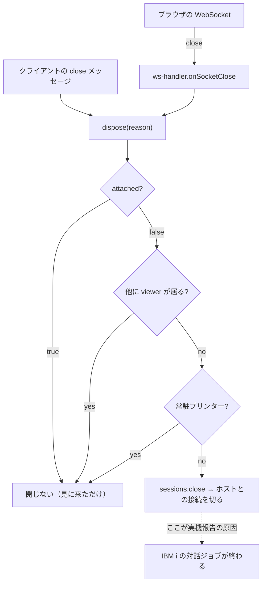

# 調査: 転送断でセッションを失わないための既存挙動

## 調査の問い

- Q1: WebSocket が閉じたとき、サーバーは**どういう条件で**ホストセッションを閉じるか。
- Q2: 既存の attach（`WsOpen.sessionId`）で、再接続に必要なものは揃うか（最新画面・所有者検査）。
- Q3: attach で繋ぎ直すと**孤児**にならないか（`attached` の意味）。
- Q4: 猶予保持を足したとき、**誰が回収する**のか（既定のアイドル上限は何か）。
- Q5: クライアント側の半開き検出のしきい値は何を根拠に決められるか。
- Q6: web-ui 側で再接続に必要な状態（`sessionId`・打鍵途中の入力）はどこにあるか。
- Q7: 「再接続中」をどこにどう出すのが、この PJ の既存の作法に合うか。

## 判明した事実

- **F1（Q1）**: 閉じる条件は 3 つの否定の連言。`!this.attached && !otherViewers && !isResident(id)`
  のときだけ `sessions.close(id)` を呼ぶ（`packages/server/src/ws-handler.ts:1089-1092`）。
  通常のブラウザ 1 タブ（自分で開いた・他に見ている人が居ない・常駐でない）はここに当たる。
- **F2（Q1）**: 入口は 2 つあり**どちらも同じ `dispose`** に合流する。
  WebSocket 切断＝`onSocketClose()`（`ws-handler.ts:245-247`）と、
  クライアントの明示的な `close` メッセージ（`ws-handler.ts:217-218`）。
  つまり**「回線が落ちた」と「利用者がタブを閉じた」を今は区別していない**。
- **F3（Q2）**: `attach(sessionId)` は `opened` に **`entry.session.snapshot()`（現在の画面）**を
  載せて返す（`ws-handler.ts:882-903`）。留守中の PC コマンド履歴・予約状態・ジョブ識別子も
  同時に返る。→ **AC3（再アタッチ後に最新画面）は既存機構だけで満たせる**。
- **F4（Q3）**: `attach` は `this.attached = true` を立てる（`ws-handler.ts:885`）。
  F1 の条件により、**そのハンドラは以後どうやってもセッションを閉じない**——
  利用者が明示的にタブを閉じても（F2 の `close` メッセージ経路でも）閉じない。
  素朴に「再接続＝attach」で実装すると、**復帰したタブは二度とセッションを畳めなくなる**。
  これは既存仕様であって欠陥ではない（「見に来た人が去っただけで相手の作業を殺さない」
  ——`ws-handler.ts:1084-1088` のコメント）。**再接続は「見に来た人」ではなく
  「元の持ち主が戻ってきた」なので、attach とは別の意味づけが要る**。
- **F5（Q4）**: ブラウザ経路の既定アイドル上限は **`"never"`**
  （`session-manager.ts:571` の `this.idleTimeoutMs = opts.idleTimeoutMs ?? "never"`）。
  そう決められる根拠は「**ブラウザ経路は WS の切断とハートビートが孤児を回収するので永続でも安全**」
  というもの（`session-manager.ts:88-95` の `orphanSafeIdleTimeoutMs` のコメント。research F2 由来）。
  → **猶予保持はこの前提そのものを外す**。掃除役（`session-manager.ts:1450-1467`）は
  `idleTimeoutMs` が `"never"` なら何もしないので、**猶予は自前の有限タイマーで畳むしかない**。
- **F6（Q4）**: 表示セッションの上限は既定 **8**（`session-manager.ts:570`）。
  超えると `SESSION_LIMIT`（`session-manager.ts:612-615`）。掴んだままの猶予セッションは
  この枠と、ホスト側の装置記述の両方を占有する。
- **F7（Q5）**: サーバーの心拍は **30 秒間隔**（`HEARTBEAT_INTERVAL_MS`＝`ws-handler.ts:82`）、
  **90 秒無応答で死**（`HEARTBEAT_DEAD_MS`＝`ws-handler.ts:87`）。サーバーは半開きを
  自分で畳む（`ws-handler.ts:441-450`「TCP は死んでいるのに close イベントが来ない」）。
  **クライアント側には対応する見張りが無い**（`ws-client.ts` は `ping` に `pong` を返すだけ
  ——`ws-client.ts:99-102`）。つまり**非対称**で、ブラウザ側の半開きは誰も検知しない。
- **F8（Q1）**: 「他に見ている人」は `viewers` の数で判定する
  （`addViewer` / `removeViewer`＝`session-manager.ts:1263-1272`、`hasViewer`＝`:1225-1227`）。
  購読の登録・解除と対で増減する（`ws-handler.ts:862-869`）。
- **F9（Q2）**: `WsOpen.sessionId` は既存の口で、「**既存のセッションへ繋ぐ（新規に開かない）**。
  自分のものだけ」と定義されている（`packages/server/src/ws-messages.ts:14-23`）。
- **F10（Q2）**: 所有者検査は `SessionManager.get(id, user)` が持つ——存在しなければ
  `SESSION_NOT_FOUND`、他人のものなら `assertOwner` が弾く（認証 OFF なら全通過）
  （`session-manager.ts:757-763`）。→ **AC11 は既存機構で満たせる**（新規実装は不要、
  経路がそこを通ることを確かめればよい）。
- **F11（Q6）**: web-ui の `SessionState` は `client`（`WsClient`）を**フィールドとして持つ**
  （`packages/web-ui/src/stores/sessions.ts:131`）。打鍵途中の入力は `edits: Map`
  （同 `:119`）で**クライアント側だけに存在する**（AID キーまで送らない約束）。
  → `WsClient` だけ差し替えれば**セッションは続く**。
  **ただし打ちかけの入力は残らない**——`updateScreen` が新画面で `edits` を捨てるため
  （coding 中に判明。`decisions.md` D11 で「捨てる側を正」と決めた）。
  `sessionId` も同じ state に載っているので、再接続に必要な材料は既にメモリ上にある。
- **F12（Q6）**: 明示的に閉じる経路は `closeSession()`（`packages/web-ui/src/session-controller.ts:738-752`）。
  `close` を送ってから `client.close()` し、store とワークスペースから消す。
- **F13（Q7）**: 接続状態を出す場所は **OIA（`StatusBar.vue`）**。`state.connected === false` で
  「切断」を出す（`StatusBar.vue:46`）。**状態の通知には `role="status"` を使う前例がある**
  （マクロの状態表示＝`StatusBar.vue:202`）。操作員メッセージは OIA ではなく
  `EmulatorPane` の `.msgline` に出す規約（`StatusBar.vue` のコメント、`20260802-message-line`）。
- **F14（現状）**: 応急修正が作業ツリーに入っている（`decisions.md` D2）。
  `WsClientHandlers.onClose` を足し、`session-controller` の 3 経路（5250 / VT / プリンター）で
  `connected=false`＋`setBusy(false)`＋操作員メッセージ、`connect()` は開く前の切断で reject する。
  回帰テストは `packages/web-ui/test/disconnect-clears-busy.test.ts` と `ws-close-notify.test.ts`。

## 影響範囲

- **サーバー**: `ws-handler.ts`（`dispose` / `onSocketClose` / `attach` / heartbeat）、
  `session-manager.ts`（保持と回収）、`ws-messages.ts`（`open` の意味づけを増やすなら）。
- **クライアント**: `ws-client.ts`（半開き検出・再接続）、`session-controller.ts`（再アタッチと状態）、
  `stores/sessions.ts`（再接続中の状態を持つなら）、`StatusBar.vue` / `EmulatorPane.vue`（表示）。
- **触るが挙動を変えてはいけない**: VT・3270・プリンター・監視も `dispose` を通る（F1 の 3 判断）。

## 実現性 / リスク

- **実現性は高い**。再アタッチに必要な口（`WsOpen.sessionId`）・最新画面の返却・所有者検査は
  **既にある**（F3 / F9 / F10）。新規に要るのは「猶予保持」「所有権の引き継ぎ」「再接続の駆動」。
- **最大のリスクは孤児**（F4 + F5 + F6）。`attached` の意味をそのまま流用すると、
  復帰したタブがセッションを畳めなくなり、`maxSessions=8` と装置記述を握り続ける。
  猶予タイマーと所有権の引き継ぎは**セットで**設計しないと、片方だけでは穴が残る。
- **区別が要る**: 今は「回線が落ちた」と「利用者が閉じた」が同じ `dispose` に入る（F2）。
  猶予を掛けてよいのは前者だけ——後者に猶予を掛けると、閉じたはずのセッションが残る。
- **再接続の嵐**: サーバー再起動時に全タブが同時に叩くと復帰を妨げる。試行間隔を空ける必要。
- **実機での確認は限定的**: 猶予切れ・半開きは実機がなくても単体テストで確かめられるが、
  実際の瞬断からの復帰は実機（`.env.verify` の環境）でしか最終確認できない。

## 実装アンカー

- A1: 閉じる判断（猶予を掛ける場所）— `packages/server/src/ws-handler.ts:1051-1096` `dispose()`
  — 3 判断と `sessions.close` の呼び出し。
- A2: 転送断の入口 — `packages/server/src/ws-handler.ts:245-247` `onSocketClose()`
  — ここだけが「意図しない切断」。`close` メッセージ（`:217-218`）と区別する分岐点。
- A3: 再アタッチ — `packages/server/src/ws-handler.ts:882-903` `attach()`
  — 現在画面を返す。所有権の引き継ぎを足すならここ。
- A4: 保持と回収 — `packages/server/src/session-manager.ts:1450-1467`（掃除）/
  `:557-575`（`maxSessions` / `idleTimeoutMs` の既定）/ `:1263-1272`（viewers）。
- A5: `open` メッセージの型 — `packages/server/src/ws-messages.ts:14-23` `WsOpen.sessionId`。
- A6: 心拍 — `packages/server/src/ws-handler.ts:81-87`（定数）/ `:439-453`（`startHeartbeat`）。
- A7: クライアントの WebSocket — `packages/web-ui/src/ws-client.ts:51` `connect()` / `:74` `send()`
  — `ping` の受信は `:99-102`。半開き検出と再接続を足すならここ。
- A8: クライアントのセッション状態 — `packages/web-ui/src/session-controller.ts:155`
  （`openSession` のハンドラ）/ `:738-752`（`closeSession`）。
- A9: 状態表示 — `packages/web-ui/src/components/StatusBar.vue:45-59`（`inputState`）/
  `:202`（`role="status"` の前例）。
- A10: 猶予時間・再接続間隔の設定の置き場 — **未特定**（`.aidev/config.yml` ではなくサーバーの
  起動オプション側。`SessionManagerOptions` か `ws-handler` の `hb` と同じ形が候補。design で決める）。

## 実装時の注意

- **`dispose` は 5 種類（5250 / 3270 / VT / プリンター / 監視）の合流点**。ここに分岐を足すときは、
  既存の 3 判断（F1）を**すり抜けさせない**こと。コメントが「⚠ セッションの置き場を増やしたら
  ここも増やす」と警告している箇所と同じ性質（`ws-handler.ts:236-239`）。
- **`attached` を再接続の意味に流用しない**（F4）。名前は同じ「繋ぐ」でも、
  「見に来た第三者」と「戻ってきた持ち主」では**セッションを畳む責任が逆**。
- **既定 `"never"` の理由を壊さない**（F5）。猶予を入れるなら、その猶予自身が期限を持つこと。
  「アイドル上限に任せる」は**この PJ では効かない**（既定が無期限だから）。
- **`WsClient.send` は OPEN でなければ黙って捨てる**（`ws-client.ts:75`）。
  再接続中に送った打鍵は消える——送信の口を止めるか、繋がるまで待たせるかを決める必要がある。
- **心拍は `ws-client` の層で完結している**（`ping` を上へ渡さない。`ws-client.ts:97-102`）。
  半開き検出もこの層に置けば、`session-controller` からは「閉じた」としてだけ見える。
- **テストの置き場**: サーバーは `packages/server/test/ws-lifetime.test.ts` /
  `session-attach.test.ts` が近い。web-ui は `cd packages/web-ui && npx vitest run`
  （リポジトリルートから実行すると偽陽性が出る。AGENTS.md）。

## design への申し送り

- **猶予を掛ける対象を「意図しない切断」に限る**（A2 で区別する）。利用者の明示的な close には掛けない。
- **所有権の引き継ぎ方を決める**（F4）。`attach` に「持ち主として戻る」意味を足すか、
  別の口を立てるか。どちらでも、**戻ったタブが最後にセッションを畳める**ことを満たすこと。
- **猶予の期限は自前で持つ**（F5）。既定値は「復帰しやすさ」対「装置と枠の占有」の釣り合いで決める。
  サーバーの死判定（90 秒）と揃えるか、別に取るかも判断材料。
- **半開き検出のしきい値**（AC7 の未確定事項）は F7 の 30 秒 / 90 秒から導ける。
  **サーバーの `ping` が来なくなったことを基準にする**のが素直で、クライアント独自の周期を作らずに済む。
- **表示は OIA に置き、覆わない**（F13・AC-I1）。`role="status"` の前例がある。
  操作員メッセージは `.msgline` 側（AC4 / AC10 の「理由」はこちら）。
- **未確定のまま残すもの**: 猶予時間と再接続間隔を設定可能にするか（A10 が未特定）。
  実機での瞬断復帰の確認は test 工程の「未検証の穴」として明示する。
