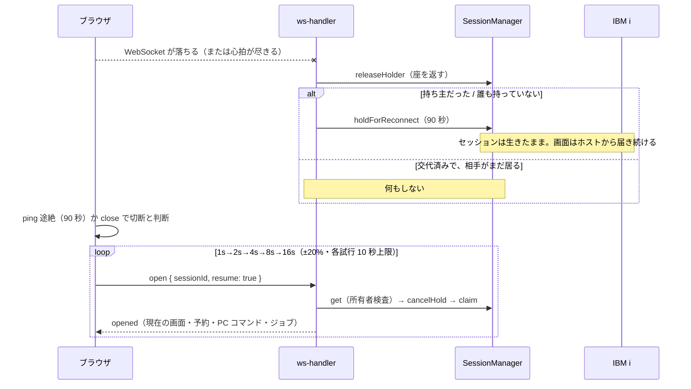

# レビューガイド: 転送が落ちてもセッションを失わない

## 変更概要 / 目的

**実機報告**: 応答待ちのローディングが解除されず、開き直すと「前回のセッションが閉じられた
（こちらから切断した）」警告が出る。

原因は 2 つが重なっていた。

1. **ブラウザ側**: WebSocket が閉じても `session-controller` に伝わらず、`busy` / `loading` が
   立ったまま残っていた（覆いが Attn / SysReq の逃げ道まで塞ぐ）。
2. **サーバー側**: WebSocket が閉じた時点で `ws-handler.dispose` が**その場でホストセッションを
   閉じていた**。つまり操作ログに「切断」が出た時点で IBM i 側の対話ジョブは既に終わっており、
   利用者がタブを閉じたことが原因ではなかった。

この PR は、**転送が一瞬落ちただけでホストの対話ジョブを道連れにしない**ようにする。
サーバーは 90 秒の猶予でセッションを保持し、クライアントは自動で繋ぎ直す。

## 重要ポイント

判断の背景は `decisions.md`（D1〜D13 ＋ デバッグ D1）に全部ある。読むならこの 5 つ。

- **D4 見に来た人と持ち主を分ける**: 既存の attach（MCP が開いた画面を覗く）は
  「去ってもセッションを閉じない」約束。繋ぎ直しは逆に**閉じる責任を引き継ぐ**ので、
  `WsOpen.resume` で意味を分けた。ここを混ぜると、覗いただけのタブが瞬断 1 回で
  持ち主に昇格し、次に閉じたときに相手の作業ごと畳む。
- **D5 / D12 猶予は必ず期限で畳む**: ブラウザ経路の既定アイドル上限は `"never"` で、
  その根拠は「WS の切断と心拍が孤児を回収する」こと。猶予はその前提を外すので、
  掃除役に任せず自分で畳む。90 秒はクライアントの再試行予算（最悪 87.2 秒）から導いた。
- **D7 / D10 保持者の座**: 半開きではクライアントが先に見切って繋ぎ直すので、
  サーバーの古いハンドラが後から後始末に来る。**復帰済みを殺さない**と
  **誰も閉じない状態を作らない**の両立が要る。
- **D11 打ちかけの入力は捨てる**（当初は「残る」としていた）: 繋ぎ直しで返るのは
  留守中にホストが書いた「いまの画面」で、打っていた画面とは限らない。残すと
  **別の画面の欄に打鍵が載る**——業務システムに違う値を送ることになる。
- **デバッグ D1**: レビューが 3 ラウンド続けて「前の修正に由来する再発」を出した原因は、
  判定が 12〜15 か所に散っていること。**判定の畳み込みは別 work**（`.aidev/backlog`）。

## 処理フロー

## 主要な変更箇所

**サーバー**

- `packages/server/src/ws-handler.ts:254` / `:457` — 転送断（`onSocketClose` / 心拍の死判定）だけが
  `transportLost` を立てる。クライアントの `close` メッセージは立てない
- `packages/server/src/ws-handler.ts:1125` `dispose` — 座を**無条件に返してから**判断する。
  既存の 3 判断（attach しただけ / 他に viewer / 常駐）はそのまま前段に残っている
- `packages/server/src/ws-handler.ts:908` `attach` — `resume: true` だけが状態を変える
  （`cancelHold` ＋ `claim`、`attached` を立てない）
- `packages/server/src/session-manager.ts:1392` `holdForReconnect` / `:1425` `reapHold` —
  **`false` は「閉じてよい」ではない**（3 通りを兼ねる）。`reapHold` は見ている人が居れば閉じない
- `packages/server/src/session-manager.ts:1665` `idleLimitOf` — **持ち主が去ったセッションの寿命**。
  設定値を書き換えず規則として重ねるので、持ち主が戻れば自然に元へ戻る
- `packages/server/src/ws-messages.ts:351` `WsClosed.ended` — `closed` は 2 つの出所から飛ぶ。
  **ホストが本当に終わった側だけ** `ended` を立てる（区別しないと繋ぎ直しが死ぬ）

**クライアント**

- `packages/web-ui/src/ws-client.ts:44` — `ping` が 90 秒来なければ自分から畳む。
  **最初の `ping` を受け取るまで張らない**（送らないサーバーと繋いだとき勝手に切らない）
- `packages/web-ui/src/session-controller.ts:268` `startReconnect` — 繋ぎ直しの門。
  対象外（プリンター / 3270 / 見に来ただけのタブ）・諦め済み・走行中を弾く。
  **待ちの解除と切断表示は門より前**（弾かれる経路でもスピナーが残らない）
- `packages/web-ui/src/session-controller.ts:137` `refuseIfDisconnected` — 繋がっていない相手へ
  送ろうとしたら理由を出して止める（`WsClient.send` は OPEN でなければ黙って捨てるため）
- `packages/web-ui/src/components/StatusBar.vue:49` — OIA が「再接続中 (n/5)」を「切断」より
  優先して出す。**画面は覆わない・フォーカスは奪わない**

## リスク / 確認したい点

- **判定が散っている**（デバッグ D1）。この PR で持ち込んだ判定は約 20 箇所。振る舞いは
  テストで固定してあるが、**次に触る人が「隣の項」を踏みやすい**。畳み込みの follow-up を
  `.aidev/backlog/session-lifecycle.md` に起こしてある。
- **実機の瞬断からの復帰は未検証**。単体テストで確かめたのは「猶予に入る／期限で閉じる／
  `resume` で戻る」まで。
- **猶予中は `maxSessions`（既定 8）の枠と装置記述を最大 90 秒占める**（design で認識のうえ受容）。
  同じ設定で新規に開いた場合は既存の装置名の繰り上げが働く。
- 見てほしい判断: **90 秒という値**（`DEFAULT_RECONNECT_GRACE_MS`）と、
  **打ちかけの入力を捨てる判断**（D11）。どちらも運用の感覚が要る。
