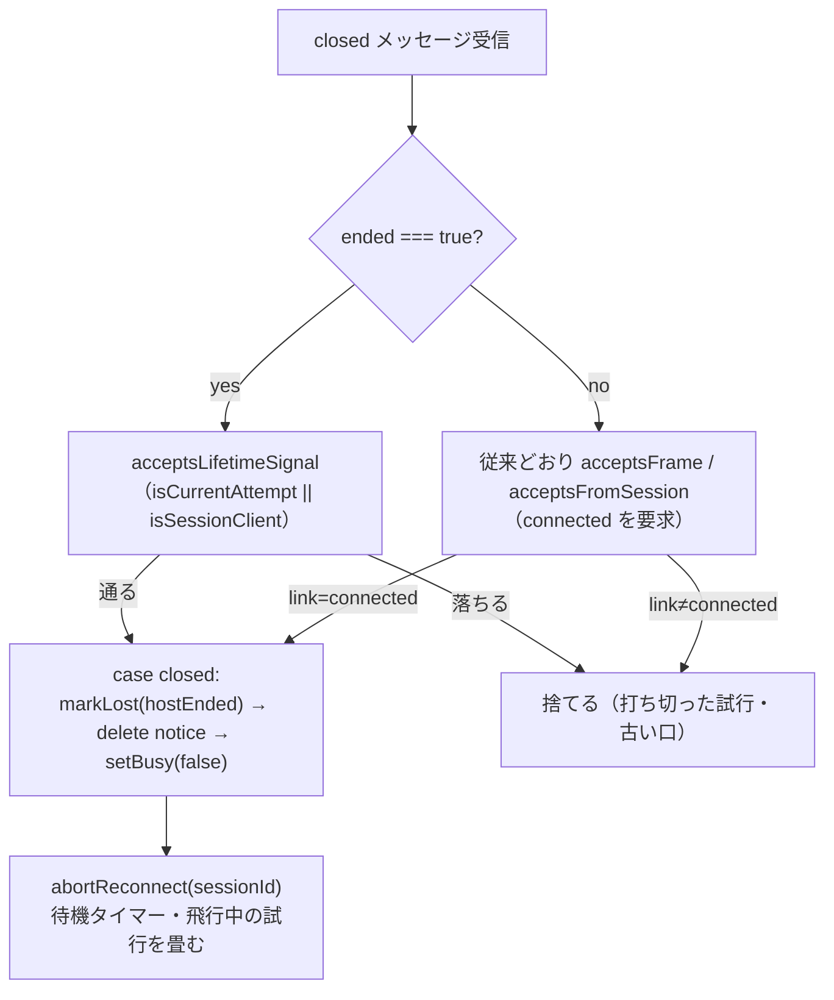

# レビューガイド: ホスト終了がはしごの最中に届くと取りこぼすのを直す

## 変更概要 / 目的

**症状**: 転送が半開きになって自動繋ぎ直しのはしごが走り始めたあと、ホストが本当に終了した
（`closed{ended:true}`）ことが届いても、**待機タイマーが誰にも止められず**、無駄なはしごが
最後まで回ってしまう。利用者は最大 37 秒待たされた末に、具体性の落ちた理由や押しても無駄な
「再接続」ボタンを見る。

前 work `20260910-session-reconnect-freeze` が繋ぎ直しの共通ガードに `link.state === "connected"`
の門を足した副作用で、`closed`（寿命の信号）もこの門に巻き込まれていた。

**直し方**: `closed{ended:true}` だけ `connected` の要求から外して通し（口の同一性は引き続き見る）、
通った先で確定した `hostEnded` に対して**待機タイマー・飛行中の試行を畳む**
（`abortReconnect` を呼ぶ）。片方だけでは無効——「通す」だけでは走り出しているはしごが
誰にも止められず、「畳む」だけでは `closed` 自体が届かない。

## 重要ポイント

- **`ended` の有無で扱いを分けた**（review ラウンド2 で判明）。当初は `closed`（`ended` の
  有無を問わず）を丸ごと `connected` の門から外していたが、これは退行を生んだ——
  はしごを使い切って `MSG_RECONNECT_GAVE_UP`（諦めの文言）が確定したあとも、**同じ口**から
  遅れて届く transport 起因の `closed{ended:false}`（心拍の死判定・サーバーの後始末）が
  緩めた門をそのまま通り、`case "closed"` の `delete s.notice` が無条件だったため、
  **確定済みの文言を黙って消していた**。`nextLink` が `link` の上書きを防ぐのに、
  `notice` の削除は防いでいなかったのが原因。修正は条件を `msg.ended === true` に狭めるだけ
  ——`ended` 無しの `closed` は従来どおり `connected` を要求する厳しいガードを通る。
- **再入的な `abortReconnect` が安全か検証した**。飛行中の代表の試行自身の口から
  `closed{ended:true}` が届く経路（`opened` の代わりに `closed` が来る）では、
  自分自身の `onServerMessage` の処理中に自分自身へ `close()` を呼ぶ形になる。
  クラッシュせず、以後の `onClose` も二重処理しないことを統合テストで固定した。
- **`isCurrentAttempt` 単体（第 1 項）に対応するテストを最初から入れた**。前 work の
  `acceptsFrame` で cross 点検が「片項に縮めても回帰が緑のまま」を見つけた反省を踏まえ、
  今回も同じ形の欠落が起きた（新設述語 `acceptsLifetimeSignal` で再発）が、cross 点検で
  すぐに捕まえて `test/session-link.test.ts` に真理値表を追加した。

## 処理フロー

## 主要な変更箇所

- `packages/web-ui/src/session-link.ts:289` `acceptsLifetimeSignal` — `acceptsFrame` から
  `connected` の要求だけ外した合成。
- `packages/web-ui/src/session-controller.ts:509` `tryResume` の共通ガード —
  `msg.type === "closed" && msg.ended === true` の先行分岐（D-a）。
- `packages/web-ui/src/session-controller.ts:674` `applyFromSessionClient` — 同じ形（D-b）。
- `packages/web-ui/src/session-controller.ts:644` `case "closed"` — `abortReconnect` の呼び出し
  1 行（D-c。`ended === true` のときだけ）。
- `packages/web-ui/test/session-reconnect.test.ts` — characterization 4 件（D-a・D-b の経路、
  打ち切った試行、notice 保持の退行再現、再入経路の確認）。
- `packages/web-ui/test/session-link.test.ts` — `acceptsLifetimeSignal` の真理値表 3 件。

## リスク / 確認したい点

- **実機で確かめていない**（単体テストと型のみ）。「CLOSING のソケットでも配送される」は
  前 work の読解で裏を取っただけ。
- **試行の見張りタイムアウト（`RESUME_ATTEMPT_TIMEOUT_MS`）後に届く `closed{ended:true}` は
  1 回分遅れうる**（組み込みレビューが検討し、正確性の問題ではないと判断——次の試行の
  `error`/`closed` が最終的に正しい状態を出す。`acceptsFrame` が他の全種別に対して
  既に負っているのと同じトレードオフ）。
- **意図的に残した欠陥**（前 work から引き継ぎ・backlog 起票済み）: VT・プリンターの
  `onClose` に同じ門が無い／`openSession` の Promise が settle しない経路。本 work は解消していない。
