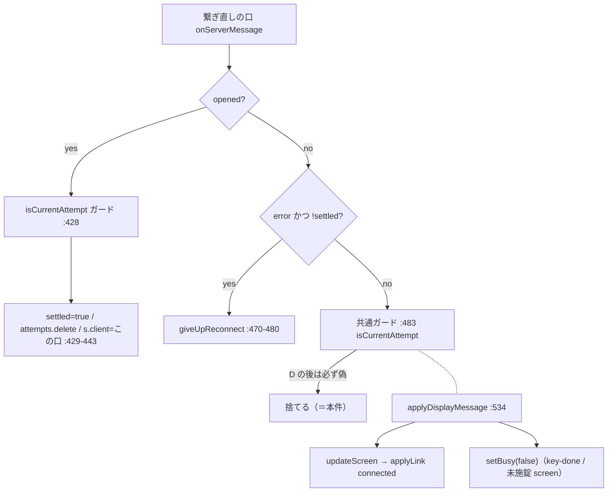

# 調査: 繋ぎ直し成功後のフレーム遮断と、緩めたときの到達可能性

## 調査の問い

- **Q1**: 共通ガードは実際に何を落としているか。落ちる範囲は requirements の主張どおりか。
- **Q2**（requirements U1）: 「この口がいま現役か」を足す場合、それを R4 の内側（`session-link.ts`）に
  置けるか。あのモジュールは依存ゼロの純粋モジュールで、store を import できない。
- **Q3**（requirements U2）: 緩めたあと、**繋ぎ直し成功 → 再切断 → はしご**の区間で、
  store に残った口から遅延フレームが届いて `updateScreen` が `connected` へ戻す組合せに到達しうるか。
  `stores/sessions.ts:436` の「到達しない」根拠は保てるか。
- **Q4**（requirements U3）: 現状の壊れ方を既存のテスト土台で characterization として固定できるか。
- **Q5**: 判定の封じ込め（`lifetime-flag-containment.test.ts`）が、新しい述語をどこに置くことを許すか。

## 判明した事実

- **F1（Q1）**: 繋ぎ直し経路の口は `WsClient` を 1 つ作り、その `onServerMessage` に
  **3 つの枝**を持つ（`packages/web-ui/src/session-controller.ts:425-485`）。
  1. `opened` 枝（`:426-469`）— 先頭に `isCurrentAttempt` のガード（`:428`）。成功時に
     `a.settled = true`（`:429`）と `attempts.delete(sessionId)`（`:432`）を行い、`cur.client = client`（`:443`）で
     store の口を差し替える。
  2. `error` かつ `!a.settled` 枝（`:470-480`）— 引き取り失敗。`giveUpReconnect` へ。
  3. **それ以外すべて**（`:481-484`）— `isCurrentAttempt` のガードの直後に `applyDisplayMessage`。
  `isCurrentAttempt` は `current === a && !a.settled`（`packages/web-ui/src/session-link.ts:215-217`）なので、
  1 で `settled` と `delete` の**両方**が起きた後は 3 のガードが**恒真で偽**になる。
  → **requirements の主張は正しい。** 落ちるのは `applyDisplayMessage` が扱う全種
  （`reserved` / `screen` / `key-done` / `jobinfo` / `pc-command` / `closed` / `error`。`:534-600`）。
- **F2（Q1 の影響の裏取り）**: `key-done` と `screen`(未施錠) だけが `setBusy(id,false)` を呼ぶ
  （`:555` / `:570`）。この 2 つが落ちる＝**応答待ちが二度と解けない**。`closed` も落ちるので
  ホスト終了の記録（`markLost`）もこの口からは届かない。
- **F3**: **初回接続の経路にはガードが無い**（`session-controller.ts:678-679` の `default:` が
  そのまま `applyDisplayMessage` を呼ぶ）。つまり「ガード」は繋ぎ直し経路にしか無く、
  本件を直すと**両経路の扱いが揃う**方向になる。
- **F4（Q2）**: `session-link.ts` の import は `import type { WsClient } from "./ws-client.js";`
  ただ 1 行（`:21`）。**store も Vue も知らない**。したがって新しい述語は「現役の口」を
  **引数で受け取る**形なら R4 の内側に置ける（`Attempt.client` は既に持っている＝`:193`）。
- **F5（Q3・核心）**: **`s.client` は一度も clear されない。** 代入は 2 か所だけ——
  初回の `sessionsStore.add(state)` と、繋ぎ直し成功時の `session-controller.ts:443`
  （`grep '\.client = '` で全数確認）。`startReconnect`（`:316-344`）は `setBusy(false)` と
  `markLost(id,"transport")` を呼ぶだけで口には触れず、`markLost` も
  `applyLink(s,{to:"lost",cause})` のみ（`stores/sessions.ts` の `markLost`）。
  → **はしごが回っている最中、`sessionsStore.get(id)?.client` は「最後に成功した（もう閉じた）口」を指したまま**。
- **F6（Q3）**: よって「現役の口か」を OR で足すと、**その閉じた口から遅延フレームが届けば通る**。
  ただしこれは `session-controller.ts:426-427` が既に自覚している依存と同じもの——
  「いま到達しないのは**閉じたソケットには message が配送されない**というブラウザ仕様に
  依っているだけで、コードからは読めない」。
  **一方、はしごの各試行の口は通らない**（`attempts` の代表でなく、`s.client` でもない）。
  `stores/sessions.ts:436` の「到達しない」根拠が名指ししているのは
  「**打ち切った試行の `screen`**」（`session-controller` の `tryResume` が弾く）であり、
  そちらは OR を足しても弾かれ続ける。
  → **根拠の本体は保てる。崩れるのは、根拠が言及していない「退役した現役口」の側**で、
  そこは初回接続の経路が最初から負っているのと同じリスク（F3）。
- **F7（Q4）**: 既存の土台で固定できる。`packages/web-ui/test/session-reconnect.test.ts` は
  `WsClient` をモックして `clients[]` に捕まえ（`:28-47`）、
  `clients[0]!.handlers.onClose?.()` → `await runAttempt(1_000)` → `clients[1]!` で
  繋ぎ直しの口を取る形が既にある（`:455-466` の打ち切りテストがこの形）。
  `clients[1]` に `opened` を通したあと、同じ `clients[1]` へ `screen` / `key-done` を送れば
  本件を直接叩ける。**フェイクは閉じたかどうかを見ない**（`close` は `vi.fn()`。`:31`）ので、
  F6 の「閉じた口からは届かない」というブラウザ仕様はテストでは効かない
  ——**Q3 の退行もテストで書ける**（現物の危険は低くても、機械で固定できる）。
- **F8（Q4）**: **成功した口の後続フレームを送るテストは 1 件も無い。**
  HEAD `657ad59b` の `session-reconnect.test.ts` 全 576 行で `type: "screen"` は `:463`
  （打ち切った試行＝弾く側）の 1 か所、`type: "key-done"` は `:441`（初回の口）の 1 か所だけ
  （本 work の T1 がここに足すので、数は HEAD 時点のもの）。
  繋ぎ直しの `opened` を送るテストは 8 件あるが、いずれも `opened` の取り込み内容を見て終わる。
- **F9（Q5）**: `packages/web-ui/test/lifetime-flag-containment.test.ts` が固定しているのは 5 つ。
  (a) 旧フラグ・旧 Map が src に無い、(b) `.link =` は `stores/sessions.ts` だけ、
  (c) `resumability` を読むのは `session-controller.ts` / `stores/sessions.ts` だけ、
  (d) **`attempts` を触るのは `session-controller.ts` だけ**、
  (e) **`settled` は `session-link.ts` / `session-controller.ts` だけ**。
  → 新しい述語を `session-link.ts` に置き、`session-controller.ts` が呼ぶ形は 5 つとも通る。
  **`session-controller.ts` の中で `client === ...` を直に書く形も走査は通ってしまう**
  （この走査は識別子の出現しか見ない）ので、AC7 を守るのは型と review である。
  同じ弱点を backlog の D19 が別項目として起票している。

## 影響範囲

- 直接触る: `packages/web-ui/src/session-controller.ts`（共通ガード 1 か所）、
  `packages/web-ui/src/session-link.ts`（述語の定義）。
- 根拠の再検査: `packages/web-ui/src/stores/sessions.ts:436-452`（`updateScreen` のコメント）。
- テスト: `packages/web-ui/test/session-reconnect.test.ts`（追加）、
  `packages/web-ui/test/lifetime-flag-containment.test.ts`（緑のまま）。
- **サーバー側は無関係**（`packages/server/` に本件の判定は無い。R1/R2 は別ファイル）。

## 実現性 / リスク

- **実現可能**。変更は述語 1 つの追加とガード 1 行の差し替えに収まる見込み。
- **リスク1**: OR を足すと `updateScreen` の「到達しない」注記が**現状のままでは不正確になる**（F6）。
  注記が名指ししている打ち切り試行の側は保てるが、「退役した現役口」の側は
  ブラウザ仕様頼みになる。**注記を書き直さずに済ませると、次に読む人が誤った保証を信じる。**
- **リスク2**: `session-controller.ts` の中で判定を直書きしても走査テストは通る（F9）。
  AC7 は機械では守られない。
- **リスク3**: `opened` 枝のガード（`:428`）も同じ述語に差し替えるかどうかで、
  「いま到達しない」と注記された経路（`:426-427`）の意味が変わる。**触らない判断も選択肢**。

## 実装アンカー

- **A1**: 直す共通ガード — `packages/web-ui/src/session-controller.ts:483`
  （`if (!isCurrentAttempt(attempts.get(sessionId), a)) return;` の直後が `applyDisplayMessage`）。
- **A2**: 述語の置き場所 — `packages/web-ui/src/session-link.ts:203-217`
  （`isCurrentAttempt` の docstring と本体。`Attempt.client` は `:193`）。
- **A3**: 欠落を記した docstring — `packages/web-ui/src/session-link.ts:176-183`
  （直したらこの記述も現在形でなくなる）。
- **A4**: 再検査する注記 — `packages/web-ui/src/stores/sessions.ts:436-452`
  （`updateScreen` 内の「到達しない」5 行コメント）。
- **A5**: テストの土台 — `packages/web-ui/test/session-reconnect.test.ts:103-108`（`open()` ヘルパ）、
  `:81-83`（`runAttempt`）、`:455-466`（打ち切り試行のテスト＝AC4 の現物）。
- **A6**: 封じ込めの走査 — `packages/web-ui/test/lifetime-flag-containment.test.ts`（(d)(e) が本件に効く）。
- **A7**: 成功時に口を差し替える箇所 — `packages/web-ui/src/session-controller.ts:443`（`cur.client = client`）。
- **A8**: `s.client` を持つ型 — `packages/web-ui/src/stores/sessions.ts:153`（`client: WsClient`。**optional ではない**）。

## 実装時の注意

- **`s.client` は clear されない**（F5）。「store に口がある＝繋がっている」ではない。
  繋がっているかは `link` が答える（`session-link.ts` の `SessionLink`）。
- **`onClose`（`:486-494`）は既に `sessionsStore.get(sessionId)?.client === client` を見ている。**
  同じ式が 2 か所に並ぶことになるので、述語を作るならこちらも呼び替える候補
  ——ただし向きが逆（あちらは「自分が現役のときだけ回し直す」）。**写しを作らないこと**が AC7 の本体。
- **`packages/web-ui/**` は eslint の対象外**（`lifetime-flag-containment.test.ts` の冒頭 docstring）。
  このモジュールを守るのは走査テストと型だけで、lint は当てにできない。
- テストのフェイク `WsClient` は `close()` を記録するだけで**閉じた後もメッセージを配送できる**（F7）。
  実機より緩いので、**実機で起きない退行もテストでは書ける**——逆に言えば
  「テストが緑」は「閉じた口からは来ない」の証明にはならない。
- `vi.useFakeTimers()` 前提。`runAttempt(1_000)` の 1 段目は待ち時間表の先頭（`scheduleReconnect(...,0)`）。

## design への申し送り

- **U1 の答え（F4）**: 述語は `session-link.ts` に置ける。ただし store を import できないので
  **現役の口を引数で受け取る**（例: `(current, a, liveClient)`）。`Attempt.client` が既にあるので
  比較対象は attempt 側に揃う。
- **U2 の答え（F6）**: `updateScreen` の「到達しない」根拠は、**名指ししている打ち切り試行については保てる**。
  崩れるのは「退役した現役口からの遅延」で、これは初回接続の経路が最初から負っているのと同じ性質。
  → **AC6 は「注記を新しいガードに合わせて書き直す」で満たすのが筋**で、実装を直す分岐（D3 の例外）は
  発動しない見込み。**ただしこれは design が決める**——「ブラウザ仕様頼みを増やしてよいか」の判断が残る。
- **U3 の答え（F7 / F8）**: characterization は書ける。土台は既存。現状の穴は F8 のとおり。
- **残った判断（design で決める）**:
  1. `opened` 枝のガード（`:428`）を触るか（リスク3）。
  2. `onClose` の同じ式（`:493`）を述語に寄せるか。寄せると写しは消えるが、意味の違う 2 つを
     1 つの関数名で呼ぶことになる。
  3. 新しい述語の名前と戻り値の形（`canSendToHost` は `{ok, reason}`、`resumeVerdict` は `{resume, why}`
     という**列挙で返す**慣習がある。真偽で返すのは `isCurrentAttempt` だけ）。
