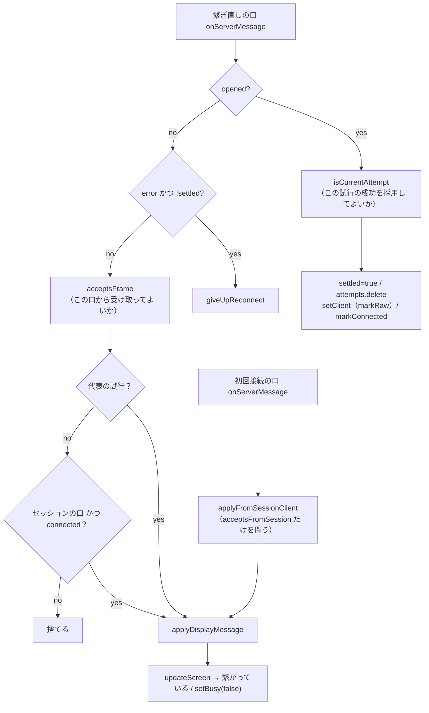

# レビューガイド: 繋ぎ直しに成功したあと画面が固まるのを直す

## 変更概要 / 目的

**症状**: 転送が切れて自動で繋ぎ直したあと、画面が更新されず、応答待ちの覆いとスピナーが消えない。
タブを開き直す以外に復帰の手が無い（打ちかけの入力はどのみち失われる仕様）。

**原因**: 繋ぎ直し経路のメッセージ共通ガードが「**この試行が代表か**」だけを見ていた。
`opened` の成功処理はその場で試行を退役させる（`a.settled = true` ＋ `attempts.delete`）ので、
**成功した瞬間からこの判定は必ず偽**になり、以後の全フレーム（`screen` / `key-done` / `reserved` /
`pc-command` / `jobinfo` / `closed` / `error`）が捨てられていた。

**直し方**: 共通ガードが問う問いを「**この口から届いたフレームを受け取ってよいか**」に変え、
その合成（選言）を**規則の側**（`session-link.ts` ＝ セッション寿命の規則 R4 の置き場所）に置いた。
呼び出し側で `||` を書くと、前 work `20260908-session-lifetime-rules-fold` が畳んだ形
（独立した述語を呼ぶ側で組み立てる）にそのまま戻るため。

**この 1 本の PR で 3 つの欠陥が閉じている**（2 つは調査の途中で見つかったもの）:

| # | 欠陥 | 見つけ方 |
|---|---|---|
| 1 | 繋ぎ直し成功後、全フレームが落ちる | backlog（前 work の `decisions.md` D13） |
| 2 | 口が Vue のプロキシになり、**再切断ではしごが二度と回らない** | T1 の独立点検（`decisions.md` D7） |
| 3 | はしごの最中に死にかけの口から「繋がっている」へ戻る | review ラウンド1・2（同 D12・D13） |

## 重要ポイント

- **問いを 2 つに割った**。`isCurrentAttempt`（この試行が代表か）と `isSessionClient`
  （セッションがいま抱えている口か）。後者は前 work が R4 に**畳まなかった 5 つ目**の判定で、
  名前が無いまま呼び出し側に `=== client` と書かれ、**必要な場所で書き漏らされていた**のが本件の出発点。
- **第 2 項には `connected` の門が要る**（`decisions.md` D12）。`SessionState.client` は繋ぎ直しが
  成功するまで差し替わらないので、門が無いと**はしごの最中ずっと第 2 項が真**になり、
  死にかけの口からのフレームが `updateScreen` を通って「繋がっている」へ戻す。
  そこから先は打鍵が非 OPEN のソケットへ落ちて黙殺され、待ちが張り付く——**直しに来た症状と同じもの**。
- **`opened` の枝は変えていない**（`decisions.md` の design D-b）。あちらが問うのは
  「この試行の**成功を採用**してよいか」で、寄せると現役の口からの 2 度目の `opened` で
  成功処理が二重に走る。**問いが違うので述語も別**。
- **`markRaw` は store に閉じた**（同 D8）。「外部オブジェクトを Vue のリアクティブ化から外す」は
  store が `add()` で既に宣言している不変条件で、呼び出し側にも書けば同じ判断が 2 か所になる
  ——`.aidev/conventions/paired-artifact-sync.md` 1 が警告する形であり、**現に片方だけ忘れられて
  欠陥 2 が起きていた**。
- **走査テストを 2 件足した**。口の**比較**（`.client === 口`）と**代入**の両方を `src` 全体で禁じる。
  `packages/web-ui` は eslint の対象外なので、この形を守れるのは走査テストと型だけ。

## 処理フロー

## 主要な変更箇所

- `packages/web-ui/src/session-link.ts:240` `isSessionClient` — 名前の無かった判定に名前を与えた。
  **繋がっているかではない**（`s.client` は切れても差し替わるまで残る）。
- `packages/web-ui/src/session-link.ts:266` `acceptsFrame` — 選言と `connected` の門。**ここが本体**。
- `packages/web-ui/src/session-link.ts:285` `acceptsFromSession` — 第 2 項だけ。試行を持たない初回接続の口用。
- `packages/web-ui/src/stores/sessions.ts:374` `setClient` — `markRaw` をここに閉じた。
- `packages/web-ui/src/session-controller.ts:504` — 共通ガードの差し替え。
- `packages/web-ui/src/session-controller.ts:651` `applyFromSessionClient` — 初回接続の口の門。
- `packages/web-ui/src/session-controller.ts:522` / `:748` — 2 つの `onClose` を同じ述語で門番。
- `packages/web-ui/test/session-link.test.ts` — R4 の述語の**真理値表**（新規）。
  経路のテストは第 2 項の両側しか叩けず、**片項へ縮めても回帰が緑のままだった**ため。

## リスク / 確認したい点

- **実機で確かめていない**。単体テストと型のみ（`.env.verify` は未実施）。テストのフェイク `WsClient` は
  `close()` を記録するだけで**閉じた後も配送できる**ので、「CLOSING でも配送される」というブラウザの
  実挙動は**読解で裏を取っただけ**（`ws-client.ts` の `closeFallback` と、`message` の受け口に
  `readyState` の検査が無いこと）。
- **意図的に残した欠陥が 3 つある**。いずれも backlog へ起票済みで、判断は `decisions.md` に:
  - `closed{ended:true}` がはしごの最中に届くと落ちる（D16）。**単独で直しても利用者から見た結果が
    変わらない**ことを実測で確かめたうえで、「はしごを畳む」修正と対にして起票した。
  - VT とプリンターの `onClose` に同じ門が無い（D15）。同型だが**本 work の門を通らず悪化していない**。
  - `openSession` の Promise が settle しない経路（本 work と独立の既存欠陥）。
- **スコープを 1 段広げた**（D13）。`requirements.md` は初回接続の経路を対象外にしていたが、
  その理由（「現に正しく動いている」）が調査で覆ったため取り消した。**元に戻すなら**
  `applyFromSessionClient` の門とテスト 2 件を外すだけで済む。
- **`tryResume` の `onClose` の門はテストで固定できていない**——その門だけを外しても全件が緑のまま
  （実測）。先の `resumeVerdict` が `running` を返して弾くためで、**保険**として置いてある。
  作り話のテストは足さず、コードとテストの注記に事実として残した。
