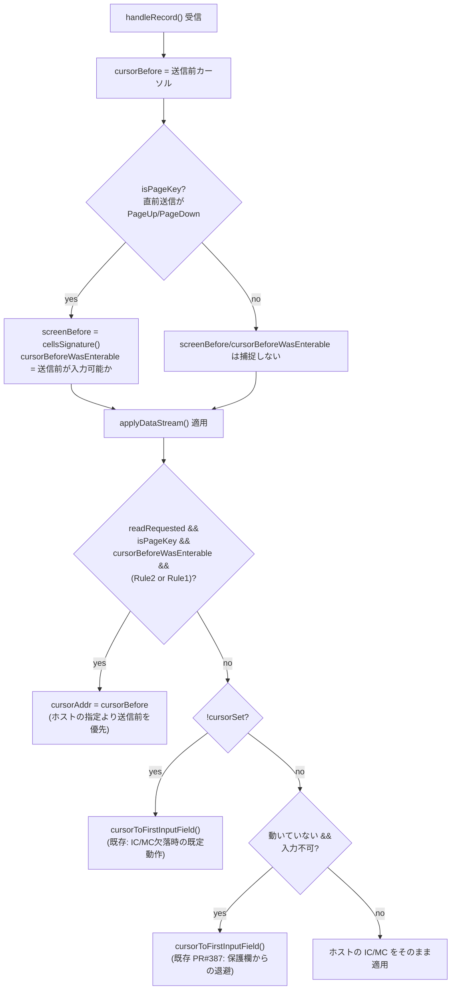

# レビューガイド: SEU の PageUp/PageDown で境界ページに到達したときカーソル位置を保持する

## 変更概要 / 目的

SEU でソースを表示中、PageUp/PageDown で境界ページ（それ以上進めない先頭/最終ページ）に
到達すると、カーソルが `SEU==>` コマンド行など先頭の入力欄へ強制的に移動してしまう不具合を直す。
実機トレースの結果、ホストは境界ページでも**明示的に**カーソル位置を IC/MC で指定してきており
（IC/MC の欠落ではない）、当初疑っていた「IC/MC が無ければ先頭欄へ」という既存ロジック
（`session.ts:613-616` 相当）はこの不具合の原因ではなかった（`research.md`）。
そのため、PageUp/PageDown 直後に限り、ホストの指定より送信直前のカーソル位置を
優先する新しい仕組みを追加した。

## 重要ポイント

- **当初仮説が実機トレースで覆った**（`decisions.md` D1）。ACS との実機同時比較はできておらず、
  requirements.md に明記されたユーザーの要望（見た目の挙動）を正として実装している。
- **新分岐は2つのパターン（Rule1・Rule2）のいずれかで発火する**:
  - **Rule2（画面無変化）**: PageUp/PageDown 送信前後で画面内容が完全一致すれば、
    「実質何も進んでいない」とみなす。
  - **Rule1（着地先が入力不可）**: カーソルが送信前と異なる位置へ移動し、かつ移動先が
    入力不可（保護欄／欄外）なら、境界の1つ手前とみなす。
- **`cursorBeforeWasEnterable` が両ルール共通の必須ガード**（coding 中の独立点検で発見した
  `must` 指摘への対応）。送信**前**の時点でカーソルが既に保護欄／欄外にいた場合は、
  新分岐は発火させず、既存の「保護欄からの退避」分岐（`PR#387`）に判定を譲る。
  これが無いと、両分岐の発火条件が構造的に重なり、常に新分岐が先に評価されて
  `PR#387` の退避を握りつぶしてしまう（`cursor-page-boundary.test.ts`「AC6 回帰」ケースが
  この点を検証する）。
- **既存の2分岐はコードを一切変更していない**。新分岐は `isPageKey`（直前の送信 AID が
  PageUp/PageDown か）で完全に排他されるため、F1ヘルプ/27x132切替・SEU走査検索といった
  他のシナリオとは干渉しない。
- **2件の既知の残存リスクを、この work のスコープでは対応しないと確定した**
  （`decisions.md` D4）。実機では未観測。
  1. `cellsSignature()` は FFW（保護ビット）を比較に含まないため、表示は変えずに
     保護状態だけが変わるケースでは Rule2 が誤判定しうる。
  2. `lastSentAid` が Attn/SysReq を除外する副作用として、応答待ち中に Attn/SysReq を
     挟むと後続の無関係なレコードで `isPageKey` が誤って true になりうる。

## 処理フロー

## 主要な変更箇所

- `packages/tn5250/src/session/session.ts:157-161` — `lastSentAid` フィールド追加。
- `packages/tn5250/src/session/session.ts:339-350` — `sendAid()` 内での更新
  （Attn/SysReq は除外、`buildAidRecord` 成功後に更新）。
- `packages/tn5250/src/session/session.ts:544-556` — `isPageKey` / `screenBefore` /
  `cursorBeforeWasEnterable` の捕捉（`applyDataStream` 適用**前**）。
- `packages/tn5250/src/session/session.ts:635-672` — 新分岐本体とその設計判断の
  詳細コメント（既知の残存リスクへの言及を含む）。
- `packages/tn5250/src/screen/buffer.ts:833-857` — `cellsSignature()`
  （画面内容の軽量比較。NUL 区切りでトークン衝突を回避）。
- `packages/tn5250/test/cursor-page-boundary.test.ts` — Rule1/Rule2/AC3非境界/
  AID排他/AC6回帰の7ケース。
- `packages/tn5250/test/cells-signature.test.ts` — `cellsSignature()` 自体の
  順序依存性・決定性の回帰テスト。

## リスク / 確認したい点

- ACS との実機同時比較ができていない（`decisions.md` D1）。この設計・実装は
  ユーザーが求める見た目の挙動を正として進めており、ACS の内部実装の完全な
  再現を目的にしていない。
- PageUp/PageDown 以外のロールキーで同様の境界挙動を持つホストプログラムがあれば、
  今回の分岐がその意図したフォーカス変更を妨げる可能性がある（`decisions.md` D2）。
  今回は SEU の PageUp/PageDown に限定してスコープを閉じている。
- 上記「既知の残存リスク」2件（`decisions.md` D4）は実機で観測された場合、
  別 work として切り出す方針。
