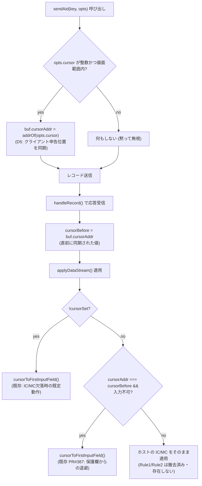

# レビューガイド: SEU の PageUp/PageDown で境界ページに到達したときカーソル位置を保持する

## 変更概要 / 目的

**この PR は実質的に「撤去 + 1件の独立したバグ修正」です**（新機能の追加ではありません）。

経緯:
1. SEU で PageUp/PageDown を境界ページ（先頭/最終）まで繰り返すと、カーソルが先頭入力欄へ
   強制移動してしまう不具合を修正するため、「PageUp/PageDown 直後に限り、ホストの IC/MC
   より送信前のカーソル位置を優先する」専用ロジック（以下 Rule1/Rule2）を実装し、
   PR #395 として着地・マージ済み。
2. マージ後、利用者から「改善していない」との報告（実機で PageUp 後もカーソルが移動する）。
   調査の結果、Rule1/Rule2 とは**別の独立したバグ**（`sendAid()` の `opts.cursor` が
   `buf.cursorAddr` に同期されていなかった）を発見・修正（`decisions.md` D5）。
3. その修正作業と並行して、利用者から ACS（IBM i Access Client Solutions）の実体
   （`acsbundle.jar`）が提供され、コア実装（`DS5250`/`PS5250`）をデコンパイルして
   確認したところ、Rule1/Rule2 に相当する専用ロジックが ACS のコアには見当たらなかった
   （`decisions.md` D6）。
4. 利用者から「専用ロジックが ACS に無かったのであれば削除してください」との明示的な
   指示を受け、**Rule1/Rule2 を完全に撤去し、既存の2分岐（ホストの IC/MC を常に信用する
   元の設計）へ戻した**（`decisions.md` D7）。手順2の独立したバグ修正だけは、Rule1/Rule2の
   有無に関係なく正しい修正なので維持している。

**つまり `main`（PR #395 マージ後の状態）と比べた本 PR の正味の差分は、
`sendAid()` の `opts.cursor` → `buf.cursorAddr` 同期修正だけ**です
（`git diff main -- packages/tn5250/src/session/session.ts packages/tn5250/src/screen/buffer.ts`
で確認済み）。それ以外の変更（`lastSentAid` フィールド・`cellsSignature()`・
Rule1/Rule2 分岐・専用テスト2ファイル）は、PR #395 で追加されたものをそのまま削除しているだけです。

## 重要ポイント

- **境界ページでのカーソル維持という当初の目標（AC1/AC2/AC8）は、この PR では達成されません**
  （requirements.md で取り消し済み）。ACS のコアに無い独自ヒューリスティックを持ち続けない、
  という利用者の判断による意図的な後退です。目標自体は
  `.aidev/backlog/acs-parity.md` へ引き継ぎ、ACS の UI 描画層調査・実機同時比較を経てから
  再挑戦する方針（`decisions.md` D7）。
- **生き残る唯一の実装差分**: `Session5250.sendAid(key, opts)` で `opts.cursor` が渡された時点
  （かつ `Number.isInteger` を満たし画面範囲内）で `this.buf.cursorAddr` をその位置へ同期する。
  従来は送信レコードの値を一時的に上書きするだけで `buf.cursorAddr` 自体は更新しておらず、
  クリックで別の欄へ移してから（別の AID を挟まず）次のキーを送ると、
  カーソル確定ロジックが古い位置のまま判断してしまっていた（`decisions.md` D5）。
- **範囲外・非整数の値は例外を投げず黙って無視する**。`ScreenBuffer.addrOf()` の範囲チェックは
  非数値（`NaN` 等）に対して比較が常に `false` になり例外を投げずに通過してしまうため、
  代入前に `Number.isInteger` と範囲を自前で検証している（タスク単位の独立点検の `must` 指摘）。
- **既存の2分岐（`!cursorSet` → 先頭入力欄／`cursorAddr === cursorBefore && cursorIsUnenterable()`
  → 先頭入力欄＝`PR#387`）はコード上、変更前の状態に完全に戻っている**。F1ヘルプ/27x132切替・
  保護欄退避・SEU走査検索の3シナリオは「壊れようがない」（新ルールが存在しないため）。

## 処理フロー

## 主要な変更箇所

- `packages/tn5250/src/session/session.ts`: `lastSentAid` フィールド削除、`sendAid()` 内は
  `opts.cursor` → `buf.cursorAddr` 同期ロジックのみ残す、`handleRecord()` の Rule1/Rule2 分岐を
  削除し元の2分岐構造に復元。
- `packages/tn5250/src/screen/buffer.ts`: `cellsSignature()` 削除（Rule1/Rule2 専用の
  画面内容比較ヘルパーで、他から参照されていないことを確認済み）。
- `packages/tn5250/test/cursor-page-boundary.test.ts`,
  `packages/tn5250/test/cells-signature.test.ts`: 削除（撤去した機構の専用テスト）。
- `packages/tn5250/test/sendaid-cursor-sync.test.ts`（新規）: 生き残る唯一の回帰テスト。
  PageDown/PageUp 双方向のクリック後カーソル同期、および不正な cursor 値（非整数）が
  `sendAid` 呼び出し直後・応答到着前の内部状態を壊さないことを、応答を明示的に止めておける
  `DeferredTransport`（`ReplayTransport` では検出できない一瞬を観測するための専用実装）で検証する。
- `.aidev/backlog/acs-parity.md`（新規）・`.aidev/backlog/session-lifecycle.md`（追記）:
  この work のスコープ外と判断した別件（元の境界カーソル目標の引き継ぎ、DSPFMT
  描画不安定化の報告、接続関連の待ち時間不安定化の報告）を新規 backlog 項目として起票。

## リスク / 確認したい点

- **「不具合を修正した PR」ではなく「独自ヒューリスティックを撤去し、副産物で見つかった
  別のバグだけを直した PR」であることに注意**——境界ページでのカーソル移動という
  当初の症状は、この PR のマージ後も**再現し続けます**（意図的。目標は backlog へ引き継ぎ済み）。
- ACS との実機同時比較・UI 描画層の調査はまだ行っていない（`decisions.md` D6「解釈 / 未解決」）。
  `.aidev/backlog/acs-parity.md` に次の調査の出発点を記録済み。
- `opts.cursor` を使う全ての呼び出し経路のうち、直接検証したのは PageUp/PageDown 境界の
  ケースのみ（`decisions.md` D5「影響」）。非ページキー×`opts.cursor` の組み合わせは
  既存テストが green であることの確認に留まる。
