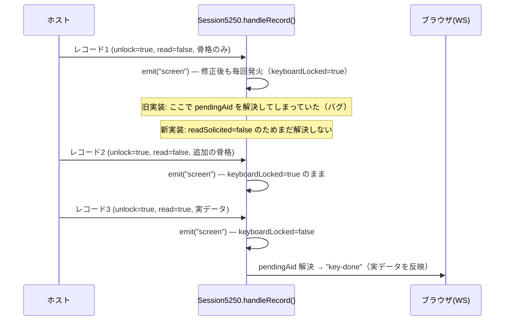

# レビューガイド: `pendingAid` の解決条件を「Read 要求」に一本化する

## 変更概要 / 目的

DSPFMT のように、1回の AID キー送信に対する応答が複数の5250レコードに分かれ、かつ
先行レコードが「Read を伴わないキーボード解放」だけを行うホストプログラムに対して、
`sendAid()` が返す Promise（→ web-ui の `key-done` メッセージ）が骨格だけの中間レコードで
早期解決され、利用者に見える最終画面が「罫線のみ」で固まる不具合を修正する。

## 重要ポイント

- **`unlockKeyboard`（WCC の CC2_UNLOCK ビット）と `readRequested`（実際に Read コマンドが
  来たか）は独立したビット**。旧実装は前者だけで「この応答は完結した」と判定していたが、
  DSPFMT の応答は実際には3レコードに分かれ、1・2番目は unlock のみ・read 無し、3番目
  だけが read 付き（実データ）だった（`research.md` F3、実機トレースで確認）。
- **この欠陥はコア層（`packages/tn5250`）単体で100%決定的に再現する**——「まれに正常」
  という利用者の申告は、コアの欠陥自体の頻度ではなく、それが**利用者に見える形で
  顕在化するかどうか**を左右する別のタイミング競合（TCPセグメントの分かれ方次第で
  `"key-done"`（古い画面）と `"screen"`（正しい画面）の到達順が入れ替わる、
  `research.md` F7）による（`decisions.md` D1 参照——この切り分けに気づくまでの経緯も
  含めて非自明なので先に読むと早い）。
- 修正は `handleRecord()` 内のローカル変数を1つ改名（`unlocked`→`readSolicited`）し、
  立つ条件を `unlockKeyboard` から `readRequested` に変えるだけ（`design.md`「振る舞いの
  詳細」）。`pendingAid` の解決だけでなく `this.state`/`onceReady` の遷移も同じ条件に
  揃えている——揃えないと、複数レコード応答の途中でも新しい AID キーを送れてしまう
  レースが残る（`design.md`「設計方針」）。

## 処理フロー

## 主要な変更箇所

- `packages/tn5250/src/session/session.ts:568-583` — `readSolicited` の宣言とコメント
  （バグの経緯を要約、詳細は research.md/decisions.md への参照）。
- `packages/tn5250/src/session/session.ts:684` — 判定条件を `unlockKeyboard` から
  `readRequested` へ。
- `packages/tn5250/src/session/session.ts:692-710` — `this.state`/`pendingAid` の
  両方を `readSolicited` で制御（コメントに `assertReady()` レースの理由を明記）。
- `packages/tn5250/test/pending-aid-multi-record.test.ts` — 新規回帰テスト（3ケース）。
  `DeferredTransport` でレコードの到着タイミングを制御し、骨格レコードだけでは
  未解決・"screen" イベントの `keyboardLocked` も保たれることを検証する。

## リスク / 確認したい点

- **実際のブラウザでの目視確認はできていない**（この開発環境に対象ブラウザが無いため）。
  `packages/server` の WS プロトコル層（`scripts/diag-dspfmt-ws-e2e.mjs`、8/8 で解消を
  確認）までの検証に留まる（`test-result.md`「未検証の穴」）。
- Read が一度も来ない経路（ホストが接続を切る／`sendAndWait()` のタイムアウト）は
  `design.md`「エラー処理 / 異常系」で確認済みで、ハングしない（既存のフォールバックを
  変更していない）。
- `packages/web-ui`（`test/tab-visibility.test.ts`）で monorepo 全体実行時に1件
  timeout があったが、単体実行では green——本 work と無関係な環境要因と判断した
  （`test-result.md` 参照）。
