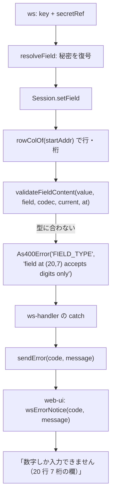

# 仕様: 欄の検証エラーが値をブラウザへ返さないようにする

## 概要

例外の `message` から**利用者の入力そのもの**を外し、代わりに**どの欄か（行・桁）**と
**なぜ弾かれたか**を入れる。塞ぐのは **core**（`@ts5250/tn5250`）——ws だけを絞ると
core の例外に値が残り、ログや将来の利用側で再発するため（利用者の判断、2026-09-20）。

直す面は 2 つ。

1. **値の漏れ**（秘密が返る）——`field-validate.ts` の 3 か所
2. **入力の反射**（クライアントが送った文字列がそのまま返る）——4 か所

## 設計方針

- **「値を出さない」を、注記ではなく型と関数の形で担保する。**
  直前の work（`20260920-restore-screen-parity`）で同じ性質を 2 回壊しており、
  注記だけでは守られないと分かっている（同 retro）。
- **既にある安全な形に揃える。** `field-validate.ts:89-92` は同じ検証層で**値を埋めていない**
  （`value contains characters not representable in CCSID ${codec.ccsid}`）。これが手本。
- **位置の出し方は `FIELD_PROTECTED` に合わせる**（`buffer.ts:1054-1055` の `field at (${row},${col})`）。
  新しい書式を作らない。
- **英語の `message` は診断の言葉、日本語は web-ui が作る。** `As400Error.message` を
  日本語にはしない——MCP・ログ・テストが読む共通の面なので、`AGENTS.md`
  「利用者に見えるメッセージは日本語で」は **web-ui 側（`opMessages.ts`）で満たす**。
- **推測で「この経路は安全」と書かない**（`AGENTS.md` 判断の原則 2）。
  安全と判断した例外は、**何を埋めているかを読んだ根拠**を `decisions.md` に残す。

## 対象範囲

| ファイル | 変更内容 |
|---|---|
| `packages/tn5250/src/screen/field-validate.ts` | 値を埋めるのをやめ、位置と理由を入れる。位置を受け取る |
| `packages/tn5250/src/session/session.ts` | `validateFieldContent` へ行・桁を渡す。AID キーの反射をやめる |
| `packages/server/src/session-manager.ts` | 読み取り専用のキー拒否で反射をやめる |
| `packages/server/src/ws-handler.ts` | `invalid secretRef` で zod の message を出さない |
| `packages/web-ui/src/composables/opMessages.ts` | `wsErrorNotice` と `NOTICE_BY_ERROR` |
| 各テスト | 文言依存を定数参照へ。値が出ないことを固定 |

## 依拠する既存の事実

- 値を埋めるのは 3 か所だけ（`packages/tn5250/src/screen/field-validate.ts:58` `:69` `:78`。
  research F2 の一覧）。同ファイル `:89-92` は**値を埋めない安全な形**。
- `validateFieldContent` が受け取る `InternalField`（`buffer.ts:113-128`）は
  **`row` / `col` を持たない**（`startAddr` のみ）。変換に要る `cols` も渡っていない（research F3）。
- **`Session.setField` は `this.buf` を持つ**（`session.ts:136`）ので
  `this.buf.rowColOf(field.startAddr)` で行・桁を作れる（`buffer.ts:528-530`）。
- `FIELD_PROTECTED` は既に位置を出している（`buffer.ts:1054-1055`）。
- `wsErrorNotice`（`opMessages.ts:196-199`）は `${見出し}（${サーバー message}）` を作り、
  **サーバーの message を捨てていない**。`:178` の JSDoc が
  「元のメッセージも残す——どの欄のどの値かは元の文にしかない」と**意図を明記**している。
- `NOTICE_BY_ERROR`（`:181-193`）に `PROTOCOL_ERROR` / `CONFIG_ERROR` / `SESSION_CLOSED` /
  `INTERNAL_ERROR` の見出しは**無い**。
- `packages/web-ui/test/field-keystroke-rules.test.ts:148-152` が
  **「打鍵値が画面に出ること」を固定**している。
- `resolveSecret` は **ws 経路だけが呼ぶ**（`macro-store.ts:14`）。
- **未確認**: VT core（`packages/vt`）が投げる例外に打鍵内容が入るか。
  非 `As400Error`（ソケット errno）が実際にブラウザへ届くこと（コード上は通る）。

## インターフェース / データ構造

### 1. `validateFieldContent` が位置を受け取る

```ts
export function validateFieldContent(
  value: string,
  field: InternalField,
  codec: Codec,
  current = "",
  /**
   * 欄の位置（1 起点の行・桁）。**例外の文言に「どの欄か」を入れるためだけに使う。**
   * `InternalField` は線形アドレスしか持たず、変換に要る `cols` もここには無いので、
   * 呼び出し側（`Session.setField`）が `ScreenBuffer.rowColOf()` で作って渡す。
   */
  at?: { row: number; col: number }
): void
```

**任意にする**のは、既存の呼び出し（テスト・将来の利用側）を壊さないため。
渡されなければ位置を省いた文言になる。

### 2. 文言の形（`As400Error.message`）

**値は入れない。位置と理由だけ。** `FIELD_PROTECTED` の `field at (${row},${col})` に合わせる。

| 現在 | 変更後 |
|---|---|
| `numeric field accepts digits only: "<値>"` | `field at (20,7) accepts digits only` |
| `alphabetic-only field rejects: "<値>"` | `field at (20,7) accepts alphabetic characters only` |
| `DBCS-only (only) field rejects SBCS char: "<文字>"` | `field at (20,7) accepts double-byte characters only` |

位置が渡されないときは `field accepts digits only`（`at (…)` を省く）。

### 3. 反射をやめる 4 か所

| 場所 | 現在 | 変更後 |
|---|---|---|
| `session.ts:420` | `unsupported AID key: ${key}` | `unsupported AID key`（**キー名を出さない**） |
| `session.ts:405` | `sysReqText is only valid with SysReq (got ${key})` | `sysReqText is only valid with SysReq` |
| `session-manager.ts:1635` | `key ${key} not allowed on read-only session` | `key not allowed on read-only session` |
| `ws-handler.ts:1199` | `invalid secretRef: ${ZodError.message}` | `invalid secretRef`（**zod の文を出さない**） |

**`key` を落としてよい根拠**: どれも `code` が既に種別を伝えており（`PROTOCOL_ERROR` /
`READ_ONLY_SESSION`）、**どのキーを押したかは押した側が知っている**。
切り分けが要るなら**ログ側**へ出す（`errShape` と同じ態度。ログは値を出さないので `code` のみ）。

### 4. web-ui の文言（`opMessages.ts`）

`wsErrorNotice` は**サーバーの message を出さなくする**。

```ts
/**
 * ws の `error` を操作員メッセージにする。
 *
 * ~~頭に日本語の要約を置き、元のメッセージも残す~~ → **元のメッセージは出さない**
 * （`20260920-field-error-no-value` decisions D2）。サーバーの message には
 * **打鍵した値が入りうる**——マクロの秘密を型の合わない欄へ再生すると、
 * 復号済みの平文がここから画面へ出ていた（同 research F1）。
 *
 * 「どの欄か」は **code 側の見出しでは伝えられない**ので、サーバーが message に入れた
 * 位置（`field at (20,7)`）だけを拾って添える。
 */
export function wsErrorNotice(code: string, message: string): string
```

- `NOTICE_BY_ERROR` に見出しの無い code（`PROTOCOL_ERROR` ほか）を足す。
  **足さないと「エラー: 」だけになる**（message を出さなくなるため）。
- 位置は `message` から `field at (行,桁)` を**正規表現で 1 か所だけ**拾う。
  拾えなければ位置なしの文言にする。

## 振る舞いの詳細



**値はどの段にも現れない。**

### MCP への波及

`mcp-tools.ts` の `errorResult` は message を無加工で返すので、**MCP の文言も変わる**
（`numeric field accepts digits only: "abc"` → `field at (20,7) accepts digits only`）。
**漏れではない**——MCP に返るのは呼び出し元が自分で渡した値（research F6）——が、
診断能力は下がる。**呼び出し元は自分が送った値を知っている**ので実害は無い、と判断する。

## ドメイン固有の考慮

- **利用者に見えるメッセージは日本語・です・ます調・句点なし**、定数は `opMessages.ts` に 1 か所
  （`AGENTS.md`「UI デザインガイド」）。**テストは文言リテラルではなく定数を参照する。**
- **ログは stderr のみ**・`console.*` 禁止。ピュアロジック層に `node:*` を持ち込まない。
- 位置は **1 起点**（`rowColOf` がそう返す。`FIELD_PROTECTED` も 1 起点）。

## エラー処理 / 異常系

- **位置が渡されない**（`at` 省略）: `at (…)` を省いた文言にする。例外の種別は変えない。
- **`rowColOf` が範囲外**: `setField` は `resolveField` を通った欄しか渡さないので起きない。
  起きたら例外がそのまま上がる（握りつぶさない）。
- **web-ui が位置を拾えない**: 位置なしの文言にする。`NOTICE_BY_ERROR` に見出しが無ければ
  「エラーが起きました」の既定文（新設）。

## 受け入れ基準との対応

- AC1（`message` に値が 1 文字も含まれない・3 経路）: 入力は `field-validate.ts` の 3 か所
  （research F2 の表）。インターフェース 2 の形に変える。
- AC2（ws の `error` に値が含まれない）: 入力は research F1-b / F1-c の実測。
  core で外すので ws にも届かない。**ws 経由のテストで確かめる**（`ws-macro-secret.test.ts` の基盤）。
- AC3（位置と理由が含まれ、日本語・定数 1 か所）: 入力はインターフェース 1・2・4。
- AC4（ログにも値が出ない）: 入力は `errShape`（`ws-handler.ts:68-87`）が既に `code` と
  スタックだけにしていること。**core で値を外すので、`errShape` を通らない経路でも出ない**。
- AC5（戻すと落ちるテスト）: 条項 `verify-by-mutation`。**変異注入の結果を `test-result.md` に残す**。
- AC6（例外の一覧）: research F2 の表がそれ。**「安全」と判断したものは何を埋めているかの根拠つき**。
- AC7（緑・定数参照）: 入力は research F5 の一覧（文言依存 10 ファイル以上）。
- AC8（秘密・固有名詞なし）: `git diff` の走査。
- AC9（クライアント文字列の反射なし）: 入力はインターフェース 3 の表（4 か所）。
