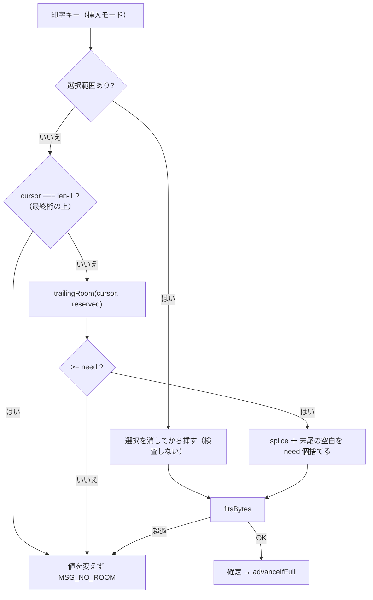

# 仕様: 挿入モードで欄が満杯のとき、黙って文字を捨てない

> **改訂 3（doccheck ラウンド 2・指摘 20 件／うち must 4 件を反映）。**
> 改訂 2 の最大の誤りは **取り置きを「結果から引いて」いた**こと——
> ACS は**走査の開始位置をずらす**。符号桁は**最終桁**にあるので、末尾から数える方式では
> 常に 0 になり、**符号付き数値欄への挿入が全部弾かれる**（`"1    -"` cursor=1 で 0 対 4）。
> あわせて**「要る桁数」（SBCS=1 / DBCS=2）の引数が無い**・**桁とバイトの混在が §5 に残っていた**
> を修正。実機測定 F11 で「最終桁の上は拒否」が決着したので AC12 を新設した。

## 概要

**達成したい状態**: 挿入モードで欄に入り切らない打鍵をしても、
**画面の値もホストへ送る値も 1 桁も変わらず、弾かれた理由が利用者に届いている**。
いまは黙って末尾を捨てるので、**符号付き数値欄では符号が落ちて値が化ける**。

実現の方針は **ACS の `PS5250.reserveRoomForInsert` に空きの数え方を合わせる**こと——
「**末尾の連続した空白だけ**を数える」「**カーソルより手前は数えない**」
「**符号桁・DBCS 桁は取り置く（＝走査の開始位置をずらす）**」（research F1〜F3）。
通知は既存の `MSG_NO_ROOM` を再利用（decisions D1）——
**実機で ACS も同じ趣旨のメッセージを出すと確かめた**ので、これは ACS への**一致**（research F9/F10）。

## 設計方針

- **「切り詰めをやめる」ではなく「末尾の空白を `need` 桁ぶん消費する」。**
  `EditState.chars` は**予算と一致していることが不変条件**（`fieldEdit.ts:9` の型コメント）。
  `chars.length = len` を単に消すと配列が伸び、
  `advanceIfFull`（`ScreenGrid.vue:2230` が `cursor < chars.length` で判定）と
  `sync` → `writeSlices` / `emit("edit")`（同 `:2167` `:2172`）が壊れ、
  **欄長を超えた値がホストへ行く**。既存テスト（`field-edit.test.ts:34-41` の `"AXB  "`）も落ちる。
  → **余地があるときは末尾の空白を `need` 個捨てる**。**余地が無いときだけ何も変えない**。
- **不変条件は「バイト予算」であって「配列長」ではない**（改訂 2 の穴。doccheck must）。
  - SBCS 欄では `chars.length` ＝ バイト数なので、**従来どおり長さが保たれる**。
  - **DBCS 欄では違う**。全角 1 文字は 2 バイトを食い、空白 1 個は 1 バイト。
    全角を挿すときは **`need=2`** ＝ **空白を 2 個捨てて全角を 1 個入れる**ので、
    **バイト数は保たれ、配列長は 1 減る**。これで正しい。
    `padDbcs`（`ScreenGrid.vue:1989-1997`）が**バイト予算**まで詰めるので、
    そもそも **DBCS 欄では `chars.length < visLen(f)`**。
- **取り置きは「走査の開始位置」で効かせる。引き算にしない**（doccheck must・最重要）。
  ACS は `reserveRoomForInsert` に**ずらした開始位置**を渡す。当 PJ も同じにする。
  **引き算だと符号付き数値欄が全滅する**——符号は**最終桁**なので末尾から数えると即 0 になり、
  取り置きを引く以前に 0 のまま。`["1"," "," "," "," ","-"]` の cursor=1 で
  **引き算 0 / 開始位置ずらし 4**（実際に走らせて確かめた）。
  → `trailingRoom(chars, { cursor, reserved })` の `reserved` は**開始位置をずらす量**。
- **「要る桁数」を引数に持つ**（doccheck must）。ACS も `reserveRoomForInsert(…, n2, …)` に
  SBCS=1 / DBCS=2 を渡している。判定は `room < need` であって `room < 1` ではない。
- **単位を 1 つに畳む。** `reservedTail` が返すのは**取り置く末尾の空白スロット数**で、
  **空白は必ず SBCS（1 バイト）なので、これは桁数でもバイト数でもある**。
  これで §5 の「桁をバイト予算から引く」混在（doccheck must）が消える。
- **空きの計算を純関数に集約する**（decisions D3）。ただし**万能関数にしない**——
  共有するのは**取り置きの量**と**末尾空白の数え方**で、
  バイト予算の判定は既存の `fitsBytes` / `dbcsByteLength` に残す（**併用**であって置換ではない）。
- **`typeChar` の取り置き・要る桁数は引数で受ける。** `Field` を知らないので自分では決められない。
  呼び出し側が `roomOptsOf(f)`（§0）で作って渡す。
- ~~**ACS と意図的に違える点（通知を出す）は、コードに理由を書く**~~
  → **違えていなかった**（research F9/F10 の実機観測）。**書くべきなのは「ACS も同じ趣旨の
  メッセージを出す・実機で確認」という出所のほう**（条項 `comment-provenance`）。
  ただし**文言は同一ではない**——ACS は `データを挿入する余地がありません。`（句点あり）、
  当 PJ の `MSG_NO_ROOM` は `挿入する余地がありません`（句点なし。
  `opMessages.ts:58`。`AGENTS.md`「です・ます調・句点なし」）。**「同じ趣旨」と書く。**
- **施錠はしない**（ACS は `inhibit=5` で施錠するが、当 PJ の操作員エラーは施錠しない作りで、
  変えると型違反・符号桁・Dup など**全ての操作員エラーに波及する**）。
  **requirements の「対象外」に書き、台帳（`acs-parity.md`）へ起票済み**。

## 対象範囲

| ファイル | 変更内容 |
|---|---|
| `packages/web-ui/src/composables/fieldEdit.ts` | `trailingRoom()` / `reservedTail()` を新設。`typeChar` が**末尾空白を `need` 個消費する**形へ。**最終桁の拒否**（AC12） |
| `packages/web-ui/src/components/ScreenGrid.vue` | `roomOptsOf()` を新設。打鍵・DBCS・IME の各経路で余地を検査し `MSG_NO_ROOM`。`insertInto` に取り置きを足す。`fitsBytes` の無言 return に通知 |
| `packages/web-ui/src/composables/opMessages.ts` | **変更なし**（`MSG_NO_ROOM` 再利用） |
| テスト | 満杯 / 中間空白 / **符号桁が空白** / **符号桁が最終桁（開始位置方式の検査）** / **最終桁の上** / 全角 / 選択置換 / **貼り付け** / IME |

### この work で扱わない

- **継続欄（`Field.continued` の並び）をまたぐ押し出し。** **決着済み**（未確定ではない）。
  **ACS が実際にまたいで押し出すことは実機で確認した**（research F8）。
  当 PJ は Backspace / Delete だけチェーンを歩き、打鍵は歩かない。
  **この work は「segment 末尾で黙って切り詰めず弾く」までとし、チェーン横断の押し出しは
  実測を添えて台帳へ**（起票済み）。値は壊れないので、分割しても害が無い。
  ※ **F8 は 1 経路の観測**（条項 `measurement-sanity` の「別経路でもう一度」は未了）。
  **この work で実装しないので確認を先送りできる**——台帳側にもその旨を書く。
- **キーボードの施錠**（ACS は `inhibit=5`。research F9/F10/F11）。横断的な挙動なので別途。
- **貼り付け経路への「最終桁の拒否」**（AC12）。ACS の貼り付けが `insertChar` を繰り返すのかを
  測っていないので、**打鍵の経路にだけ掛ける**（decisions D4。埋めずに未確認と書く）。

## 依拠する既存の事実

**すべて現物で確認した**（doccheck ラウンド 1・2 で計 6 件の誤りを訂正済み）。

- `typeChar` が `splice` 後に `chars.length = len` で切り詰める（`fieldEdit.ts:35-36`）。
- `cursor >= len` で早期 return（同 `:31`）。**research F2 とは等価でない**——
  ACS は「カーソルが最終桁**の上**」で拒否（`cursorSBA == getEndPos()`）、
  当 PJ の `cursor` は 0..len（同 `:18-20`）で最終桁上は `cursor === len-1` ＝**通る**。
  → **実機で決着した**（research F11・decisions D4）。**ACS は拒否する**ので合わせる（AC12）。
- `EditState.chars` は **SBCS 欄では**欄長パディング（同 `:212-216` `padTo`）。
  **DBCS 欄では `padDbcs`（`ScreenGrid.vue:1989-1997`）がバイト予算まで詰めるので長さは `visLen` 未満**。
- 打鍵の呼び出し側は「検査 → `emit("notice", …)` → `return`」（`ScreenGrid.vue:2726-2736`）。
  **その後に `deleteSelection` の分岐がある**（同 `:2737-2744`）——
  選択を消してから挿すので、**検査は選択を消さない側（`else`）に置く**
  （選択がある側で検査すると、選択ぶんの空きを数え落として誤って弾く）。
- `fitsBytes` の失敗は**無言で `return`**（同 `:2747`）。
  ※ research F7 の表には無い。**この design での観測**として記す。
- `isSignPosition`（`fieldValidate.ts:334-336`）は**符号桁への打ち込み**を弾く。
  取り置きは**走査開始位置**の話で役割が違う。**二重化しない。**
- 貼り付け（挿入）は既に `MSG_NO_ROOM`（`ScreenGrid.vue:3231-3251`）。
  `insertInto`（同 `:3090-3103`）は `base.replace(/\s+$/,"")` で**末尾空白を先に落としてから**
  `dbcsByteLength(out) > visLen` で測る。**取り置きが無い**うえ、
  **`trailingRoom` をそのまま流用できない**（渡す文字列の末尾空白は常に 0 になる）。
- **継続欄の対応物は `fieldSlices` ではない。** `fieldSlices` は**1 つの欄の行折返し**。
  ACS のチェーンに当たるのは `Field.continued`（`packages/tn5250/src/screen/types.ts:45,161`）＋
  `continuedRunOf`（`packages/web-ui/src/composables/continuedRun.ts:13-30`）＋
  `ScreenBuffer.continuedRun`（`packages/tn5250/src/screen/buffer.ts:993`）。
  **Backspace / Delete は既にチェーンを歩く**（`ScreenGrid.vue:2520` `:2552`）が、
  **打鍵（`:2745`）は歩かない**＝挿入は segment 末尾で止まる。
- 通知を消すのは `EmulatorPane.vue:831-834` の `onKeydownCapture`（`ScreenGrid.vue:177` は emit 宣言）。
- `MSG_NO_ROOM` は `挿入する余地がありません`（`opMessages.ts:58`。**句点なし**）。
- `DbcsFieldType` は `"only" | "pure" | "either" | "open"` の**静的な種別**
  （`packages/tn5250/src/screen/types.ts:52`。欄側は同 `:137` の `dbcsType?`）。
- `Field` は `@ts5250/tn5250` のモデル型で、composables 層が普通に受け取る
  （`fieldValidate.ts:1` `:334`）。純関数にするのは**既存の `AdjustSpec`
  （`fieldEdit.ts:93-97`「core の `Field` から必要な分だけ受け取る」）に倣う**ため。
- **未確認**: ACS の `isEitherFieldDBCSOn()`（either 欄が**いま** DBCS 側か）に当たる
  **実行時状態は当 PJ に無い**（`DbcsFieldType` は静的種別のみ。上記 `types.ts:52`）。
  → **decisions D5 で決着**: `only` / `pure` だけ取り置き、`either` は取り置かない。

## インターフェース / データ構造

### 0. 欄から取り置きの条件を作る（`ScreenGrid.vue`）

```ts
/** `Field` から取り置きの条件を作る。`either` を外す理由は decisions D5 */
function roomOptsOf(f: Field): { signedNumeric?: boolean; dbcsReserved?: boolean };
```

`dbcsReserved` は **`dbcsType === "only" || dbcsType === "pure"`**（`types.ts:52` の値）。
**`either` は false**——「いま DBCS 側か」の実行時状態が無く、**推測を実装に埋めない**（decisions D5）。

### 1. 取り置きの量（共有する事実その 1）

```ts
/**
 * 挿入のために**末尾に取り置く空白スロット数**。
 *
 * ACS `PS5250.insertChar` が `reserveRoomForInsert` へ渡す**走査開始位置をずらす**分。
 * 空白は必ず SBCS（1 バイト）なので、**この数は桁数でもバイト数でもある**（単位の混在を避ける）。
 * 内訳: 符号付き数値欄で 1、DBCS 取り置きで 2（全角 1 文字ぶん）。
 */
export function reservedTail(opts: { signedNumeric?: boolean; dbcsReserved?: boolean }): number;
```

**打鍵・貼り付け（`insertInto`）の両方がこれを使う**——`insertInto` は末尾空白を落として測るので
`trailingRoom` は流用できないが、**取り置きは同じ事実**なので共有できる（FR4 / AC4）。

### 2. 末尾の空白スロット数（共有する事実その 2）

```ts
/**
 * **末尾から連続する空白**の数（ACS `PS5250.reserveRoomForInsert` と同じ数え方）。
 * 欄の途中にある空白は数えない——`["A","B"," "," ","C"," "]` の答えは **1**。
 *
 * @param cursor   これより手前は数えない（ACS はカーソルの手前で走査を打ち切る）
 * @param reserved **走査の開始位置を末尾から何桁ずらすか**（`reservedTail` の値）。
 *                 **結果から引いてはいけない**——符号桁は最終桁にあるため、
 *                 末尾から数えると常に 0 になり、引き算では符号付き数値欄が全部弾かれる。
 */
export function trailingRoom(
  chars: readonly string[],
  opts: { cursor: number; reserved?: number }
): number;
```

**`cursor` は必須**。ACS は開始位置からカーソルの手前まで戻りながら数える（research F1）ので、
これを落とすと**複数文字を続けて挿すとき（IME 確定・Dup 展開）に過大に数える**
（`"AB    "` の cursor=4 で ACS は 2、落とすと 4）。
※ **貼り付けはここを通らない**（`insertInto` は先に trim するため。§5）。

### 3. `typeChar` は末尾空白を `need` 個消費する

```ts
export function typeChar(
  state: EditState,
  ch: string,
  opts?: { need?: number; reserved?: number }  // 既定 need=1 / reserved=0（SBCS・取り置き無し）
): EditState;
```

挿入モードのとき:

1. **`cursor === chars.length - 1`（最終桁の上）なら `state` をそのまま返す**
   （ACS `cursorSBA == getEndPos()`。research F2＋F11 の実機観測。AC12）
2. `trailingRoom(state.chars, { cursor, reserved })` が **`need` 未満なら `state` をそのまま返す**
3. 足りるなら `splice` で挿入し、**末尾の空白を `need` 個 `pop` する**
   - SBCS（`need=1`）: 1 個捨てる → **配列長が保たれる**（従来と同じ結果）
   - DBCS（`need=2`）: 2 個捨てて全角を 1 個入れる → **バイト数が保たれ、配列長は 1 減る**

**上書きモードは一切変えない**（1 も 2 も挿入モードだけ。ACS 側も `insertChar` の話）。
`typeChar` 単体は「**非空白を捨てない**」までを保証する防御の二層目。

> **この §1〜§3 の意味論は、捨てる試作を書いて 12 形すべてで確かめた**（design の自己検査。
> 実装ではない）。要点:
> - **AC11c が実際に割れる**——`["1"," "," "," "," ","-"]` cursor=1 で
>   開始位置ずらし **4** / 引き算 **0**。
> - **DBCS の数が合う**——`"AB    "`（6 バイト）に `need=2` で全角を挿すと `"A全B  "`。
>   **バイト数は 6 のまま・配列長は 6→5**。上の「不変条件はバイト予算」がそのまま出る。
> - **「非空白を捨てようとした」検出は一度も発火しなかった**（`pop` する前に空白か検査した）。
> - AC2a / AC11b / AC12（挿入は弾く・**上書きは通る**）も想定どおり割れた。

### 4. 呼び出し側（`ScreenGrid.vue`）——**選択を消さない側（`else`）に置く**

```ts
let trial: EditState;
if (deleteSelection(f, el)) {
  // 選択を消すと空きができるので、検査せずにそのまま挿す（従来どおり）
  trial = typeChar(editAfterSelectionDelete, ch, roomArgsOf(f, ch));
} else {
  // **ACS も満杯の挿入で同じ趣旨のメッセージを出す**——実機で
  // `データを挿入する余地がありません。` を確認した（research F9/F10/F11）。
  // 当 PJ の文言は `MSG_NO_ROOM`（句点なし。`AGENTS.md` の文体規約）。**施錠までは真似しない**
  const { need, reserved } = roomArgsOf(f, ch);
  const room = trailingRoom(edit.chars, { cursor: edit.cursor, reserved });
  const atLastColumn = edit.cursor === edit.chars.length - 1;      // AC12
  if (edit.insertMode && (atLastColumn || room < need)) { emit("notice", MSG_NO_ROOM); return; }
  trial = typeChar(edit, ch, { need, reserved });
}
if (!fitsBytes(trial, f)) { emit("notice", MSG_NO_ROOM); return; } // 従来は無言 return
```

`roomArgsOf(f, ch)` は `{ need: isFullWidth(ch) ? 2 : 1, reserved: reservedTail(roomOptsOf(f)) }`。
同じ検査を **DBCS 打鍵**（`absorbDbcs` が `undefined` を返す経路。`:2844-2845`）と
**IME 確定**（`:3419-3428`）にも置く。

### 5. `insertInto` は取り置きだけを共有する

`dbcsByteLength(out) > visLen(f)` の右辺を **`visLen(f) - reservedTail(roomOptsOf(f))`** にする。
**両辺ともバイト**（§1 のとおり `reservedTail` は空白スロット＝バイト数）。
末尾空白の数え方は共有しない（`insertInto` は先に trim するため。上記「依拠する事実」）。
**最終桁の拒否（AC12）はここには掛けない**（上記「扱わない」）。

## 振る舞いの詳細



**弾いたときカーソルは動かさず `advanceIfFull` も通らない**
（実機でも ACS のカーソルは動かなかった。research F9/F10/F11）。
~~**施錠はしない**——ACS は `error_mode` に入らない（research F4・decisions D2）~~
→ **ACS は施錠する**（`inhibit=5`）。**当 PJ はこの work では施錠しない**（理由は「設計方針」）。
**この差は requirements の「対象外」に書き、台帳へ起票済み。**

## ドメイン固有の考慮

- 文言は `MSG_NO_ROOM` 再利用（**新設しない**）。日本語・です・ます調・句点なし。
  **ACS と同一文言ではなく同じ趣旨**（ACS は句点あり・「データを」付き）。
- **ACS の逐語移植をしない**。持ち帰るのは規則という事実だけ。
- **デコンパイル結果の行番号をコメントに書かない**（版で動く）。参照はクラス／メソッド名。
- 通知は `EmulatorPane.vue:831-834` の capture で次のキー操作のときに消える。

## エラー処理 / 異常系

- **欄長 0 / 取り置きが欄長を超える**: `trailingRoom` の開始位置が `cursor` より手前になるので
  **自然に 0 を返す**（負の添字で走査に入らない）。引き算をやめたので `Math.max` は要らない。
- **`dbcsReserved` の導出元が無い**（either 欄の実行時状態）: **decisions D5 で決着済み**
  （`only` / `pure` だけ取り置く）。**未確定ではない。**
- **継続欄**: **決着済み**（上記「扱わない」）。segment 末尾で弾く。値は壊れない。

## 要件との対応

**FR**: FR3→§4 の通知 / FR4→§1 の共有と §5 / FR5→§3 の取り置き / FR6→「扱わない」の継続欄 /
FR7→§4 を 4 経路に置くこと。

**AC**:

- AC1（満杯・`cursor < len` で値が変わらない）: 入力は §2 `trailingRoom` が `need` 未満を返すこと
  ＋ §3 の「足りなければ `state` をそのまま返す」。
- AC2a（符号付き数値欄で画面の値が変わらない）: 入力は §1 `reservedTail` ＋ §2 の `reserved`。
  **`"   12-"` では取り置きが無くても room=0 なので、この形だけでは取り置きを検査できない**
  ——**AC11b で符号桁が空白の形を通す**。
- AC2b（送信値が変わらない）: 修正後は値が変わらないので自明に満たす。**入力は AC8 と対**。
- AC3（通知・打鍵/DBCS/IME）: 入力は §4。**文言は `MSG_NO_ROOM` の定数で照合する**
  （ACS の文言と同一ではないので、文字列リテラルで書かない。`AGENTS.md`）。
- AC4（経路間で一致）: 入力は §1 の共有（取り置き）・§4 の配置・**§5（貼り付け）**。
  **`fieldEdit.paste()` は本番の呼び出し元が無い**（テストのみ）ので、
  対象経路は**打鍵 / `insertInto` 経由の貼り付け / DBCS 打鍵 / IME**（decisions D3）。
- AC5（入り切る場合は変わらない）: 入力は §3 の `need=1` で長さが保たれること。
  `field-edit.test.ts:34-41` が緑のままであることで確かめる。
- AC6（ACS の参照コメント）: 入力は research F1〜F3。`trailingRoom` / `reservedTail` の JSDoc。
- AC7（継続欄）: **決着済み**——segment 末尾で弾く（値は壊れない）。
  チェーン横断の押し出しは台帳へ（**F8 が 1 経路の観測である旨も併記**）。
- AC8（実機で符号桁を観測）: **修正を当てる前に 1 回取る**（当てた後では再現しない）。
  条項 `measurement-sanity` に従い**別経路でもう一度**取る。
- AC9（戻すと落ちる）: 戻す対象を 4 つ指定する——
  (1) §3 の「足りなければ返す」を消して末尾を無条件に `pop`、(2) §2 の `reserved` を
  **開始位置ずらしから引き算へ**、(3) §4 の通知を消す、(4) §3 の最終桁の拒否を消す。
  **(2) は `["1"," "," "," "," ","-"]` cursor=1 で 4→0 に変わる**（AC11c）。
- AC10（緑）: `npm test` / `npm run build` / `npm run build -w @ts5250/web-ui` / `npm run lint` /
  `aidev smoke`。**web-ui は `cd packages/web-ui && npx vitest run`**（`AGENTS.md`）。
- AC11（末尾から数える）: `["A","B"," "," ","C"," "]` で `trailingRoom` が **1**（3 ではない）。
- AC11b（取り置きの有無で採否が割れる）: 6 桁 signed-numeric の `"  123 "` に `cursor=2` で 1 文字。
  取り置き**無し**なら room=1 で通り、**有り**なら 0 で弾く。
- AC11c（新設・doccheck ラウンド 2）: **取り置きの効かせ方**で採否が割れる形を通す——
  `["1"," "," "," "," ","-"]` の `cursor=1`。**開始位置ずらし＝4（通る）／引き算＝0（弾く）**。
  **符号付き数値欄が使えなくなる退行を止める唯一の形。**
- AC12（最終桁の上を弾く）: 入力は §3 の手順 1 ＋ §4 の `atLastColumn`。
  **上書きモードでは通る**ことも同じテストで固定する（過剰に弾いていない担保）。
  根拠は research F11（実機）・decisions D4。
- AC-I1（通知がいつ消えるか）: 入力は `EmulatorPane.vue:831-834` の `onKeydownCapture`。
- AC-I2（欄に何も残さない）: 入力は §3 の「`state` をそのまま返す」。
- AC-I3（フォーカスの行き先）: 入力は「振る舞いの詳細」——弾いたら `advanceIfFull` を通らない。
- AC-I4（既存の操作を妨げない）: 入力は経路ごとに——
  **選択置換**＝§4 の `if` 側（検査を通さない）/ **上書きモード**＝§3「上書きモードは一切変えない」/
  **貼り付け**＝§5（取り置きだけ足す。最終桁の拒否は掛けない）/
  **Dup**＝`fieldEdit.ts` の Dup は `typeChar` を通らない（`ScreenGrid.vue:2520` 系の別経路）/
  **field-exit・日付/時刻ピッカーの `forceOverwrite`**＝上書き経路なので §3 の対象外。
  **いずれも「挿入モードの `typeChar`」に閉じていることが根拠**。

## 未確定事項

1. **貼り付けに「最終桁の拒否」を掛けるか**——ACS の貼り付けが `insertChar` を繰り返すのかは
   未測定。**この work では掛けない**（decisions D4）。測るなら `scripts/acs-probe` に 1 本足す。
2. **継続欄のチェーン横断の押し出し（research F8）の 2 経路目**——この work で実装しないので
   先送りする。**台帳に「1 経路の観測である」と明記して送る**（条項 `measurement-sanity`）。
3. **requirements の対象外に残った宿題**——貼り付け上書きの「ACS も切り詰める」の裏取り。
   （もう 1 件の「選択置換であふれうるか」は §4 の配置で決着：**起きうる。だから `else` に置いた**。）
