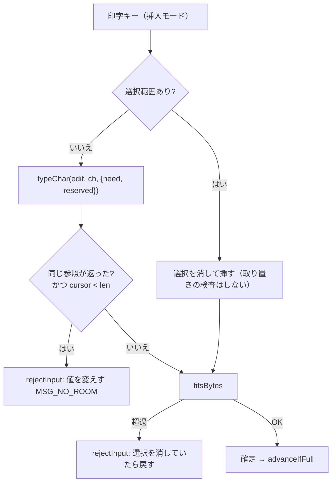

# レビューガイド: 挿入モードで欄が満杯のとき、黙って文字を捨てない

## 変更概要 / 目的

挿入モードで欄に入り切らない打鍵をしたとき、**末尾を黙って切り捨てていた**のを直す。

**実害は「1 文字消える」では済まなかった。** 実機で対照を取った結果:

| | 画面 | ワイヤ | **ホストが受け取った値** |
|---|---|---|---|
| 修正前 | `"    12-"` → `"    912"` | `"    912"` | **`91`** |
| 修正後 | `"    12-"` → `"    12-"` | `"    12-"` | **`-12`** |

`6S 0` はワイヤ上 6 バイトで最終バイトのゾーンが符号なので、画面の 7 桁から符号桁が落ちると
**符号も桁も違う値**がホストに入る。**画面には `912` と見えているのにホストは `91` を受け取る**
——利用者からは追えない食い違い。

## 重要ポイント

### 1. 取り置きは「走査開始位置をずらす」。引き算ではない

ACS の `reserveRoomForInsert` は、符号桁・DBCS 桁のぶん**走査の開始位置を末尾からずらす**。
**引き算にすると符号付き数値欄が全滅する**——符号は**最終桁**にあるので、
末尾から数えると必ず 0 で止まり、そこから引いても 0 のまま。

```
["1"," "," "," "," ","-"] の cursor=1:   引き算 → 0 / 開始位置ずらし → 4
```

`packages/web-ui/src/composables/fieldEdit.ts` の `trailingRoom(chars, { cursor, reserved })`。
**`reserved` は開始位置をずらす量**で、結果から引く数ではない。

### 2. 数えた位置と捨てる位置を揃える

`typeChar` は挿入後に末尾の空白を `need` 個捨てるが、**捨てる位置も `length-1-reserved`**。
末尾から捨てると、符号桁（非空白）で止まって 1 桁も捨てられず、配列が欄長を超えて伸び、
`fitsBytes` が落として「**空きがあるのに打てない**」になる。

### 3. 拒否の出口は 1 つ（`rejectInput`）

`ScreenGrid.vue` の `rejectInput(f, el, { restore, userInsertMode, dbcs })`。
**状態を戻すこと**と**通知を利用者の実モードに限ること**を 1 か所に閉じてある。
採否は `typeChar` / `dbcsType` の戻り値（拒否時は同一参照か `undefined`）と `fitsBytes` で決める。

**事前検査を置かないこと。** 以前 `canInsert` を前段に置いており、それが 2 つ目の出口になって
通知や状態の戻しが繰り返し漏れた（この work で同じ不変条件を 7 回落とした）。

### 4. 「欄末尾に止まっている」は拒否ではない

`typeChar` は `cursor >= chars.length` で**モードに関係なく**同一参照を返す。
これを拒否とみなすと**上書き中に挿入の文言が出て `advanceIfFull` も通らない**。
拒否とみなすのは `cursor < chars.length` のときだけ。

## 処理フロー



## 主要な変更箇所

- `packages/web-ui/src/composables/fieldEdit.ts` — `reservedTail()` / `trailingRoom()` の新設、
  `typeChar` が `need` / `reserved` を受けて**切り詰めずに拒否する**形へ、最終桁の拒否（ACS 準拠）
- `packages/web-ui/src/components/ScreenGrid.vue` — `roomOptsOf()` / `roomArgsOf()` / `rejectInput()`、
  打鍵 SBCS / 打鍵 DBCS / 貼り付け / IME の 4 経路への適用
- `scripts/verify-browser-insert-overflow.mjs`（新規）— 実機で修正前後を対照する手順
- `scripts/acs-probe/*.txt`（新規 4 本）— ACS 実機の挙動を測った手順

## リスク / 確認したい点

- **AC12（最終桁の上は拒否）は利用者から見える挙動変更**。挿入モードでは**最終桁に直接打てなくなり**、
  手前から押し出して埋める形になる。奇異に見えるが `scripts/acs-probe/single-field-insert-endpos.txt` の
  実測どおり（空きが残っていても ACS は拒否し、1 つ手前は通る）。
- **テストに守られていない防御的修正が 2 件ある**（`decisions.md` D12）。
  打鍵 SBCS の選択置換の復元と通知ゲートで、`hidden` × DBCS 欄にしか届かず単体テストで
  発火させられなかった。**「直したがテストは無い」と明記してある。**
- **IME の選択置換の復元はスコープ外**（`decisions.md` D16・利用者の判断）。
  HEAD からの既存欠陥で、戻す仕組みを 3 回作って 3 回壊したため design へ差し戻した。
  再現手順は台帳に転記済み。
- **既存の不安定テスト 1 件**（`tab-visibility.test.ts` の 5 秒タイムアウト）。
  同じコードで通ったり落ちたりする。この差分とは無関係。
