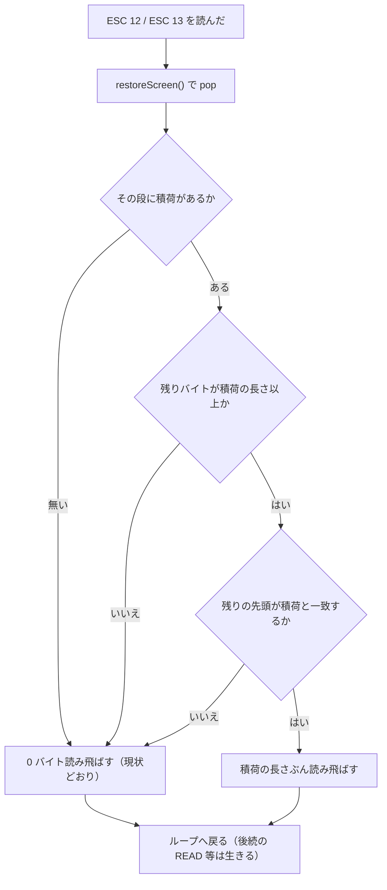
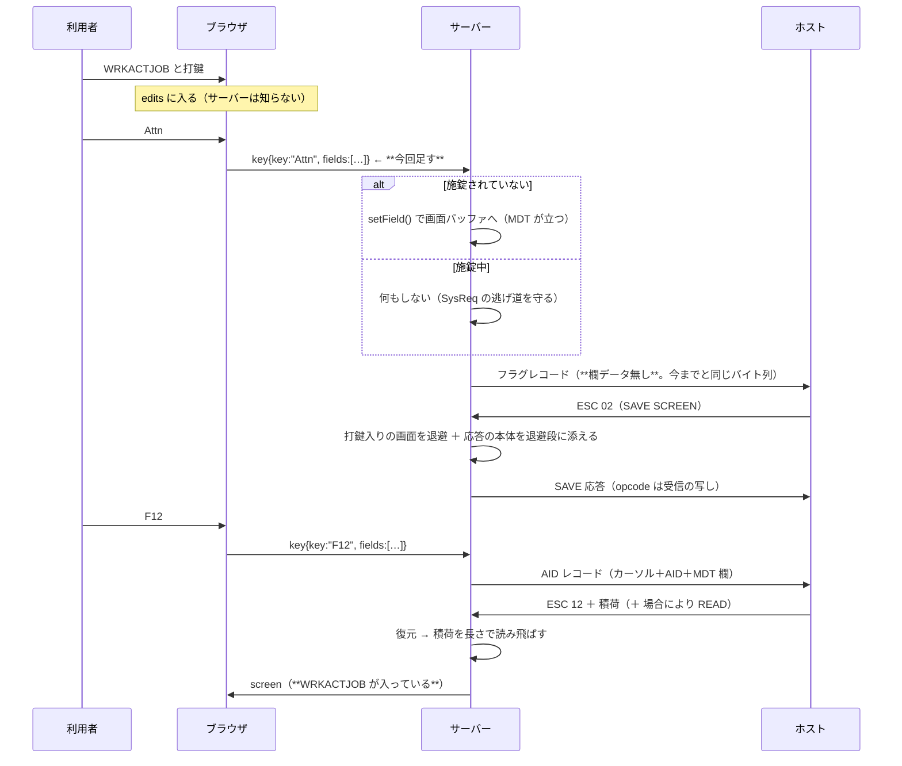

# 仕様: SAVE/RESTORE SCREEN と画面イメージ応答を ACS に合わせる

## 概要

Attn・SysReq・ヘルプから戻ると打鍵した文字と MDT が消える欠陥を、**ACS の実装を正典として**直す
（`AGENTS.md`「判断の原則」1）。直す点は 4 つ。

1. **積荷を自分で適用しない**——ホストが RESTORE SCREEN で返す「こちらが送った積荷」を、
   送った長さぶんだけ読み飛ばす。
2. **退避する状態を ACS の `Save5250Net` に揃える**——CA マスク・メッセージ行番号・保留中の READ /
   AID・施錠・挿入モードを加える。
3. **打鍵をサーバー側の画面バッファへ置く**——ACS が打鍵を表示バッファ（`HostPlane` / `TextPlane`）に
   持つのと同じ形にし、フラグキー（Attn / SysReq）でも欄をサーバーへ渡す（施錠中を除く）。
   **ホストへ送るバイト列は変えない。**
4. **応答の形を ACS に合わせる**——SAVE 応答の opcode を受信の写しにし、`writeCell` が打鍵文字を
   空白に化けさせないようにする。画面イメージ応答（`0x62` / `0x66` / `0x6A`）の前置・opcode は
   **DSM で実機に出させて測ってから**決める。

## 設計方針

- **ACS が正典。** 退避の中身も応答の形も、まず ACS がどうしているかで決める（research F1〜F4・F14・F17）。
- **推測しない。** 実機で確定できることは実機で確定する（`AGENTS.md`「判断の原則」2）。
  この design で「未確認」と書いた項目は、**test 工程で実機に出させてから確定**する。
- **境界だけは当 PJ の積荷形式に合わせる。** ACS は RESTORE で「レコードの残り全部」を積荷として
  消費するが、それは ACS の積荷（zlib・約 2,880 バイト）を前提にした境界で、
  **当 PJ の積荷（平文 WTD・793 バイト）ではホストが同じレコードに READ を載せてくる**
  （research F16。当 PJ 側で 2 回再現）。長さで読み飛ばす（decisions D10）。
- **退行しない形にする。** 積荷が無い・一致しないときは 1 バイトも読み飛ばさない＝現状の振る舞い。
  既存テストが固定している「RESTORE PARTIAL はパラメータを読まない／後続を捨てない」は保たれる。

## 対象範囲

| ファイル | 変更内容 |
|---|---|
| `packages/tn5250/src/screen/buffer.ts` | 退避スタックの型を広げる。積荷の本体・CA マスク・メッセージ行番号を退避。復元時に積荷を返す |
| `packages/tn5250/src/protocol/wtd-applier.ts` | `RESTORE_SCREEN` / `RESTORE_PARTIAL_SCREEN` で積荷を長さで読み飛ばす |
| `packages/tn5250/src/protocol/save-screen.ts` | 応答の opcode を受信の写しに。`writeCell` の既定を「文字を符号化」に |
| `packages/tn5250/src/session/session.ts` | SAVE 応答の本体をバッファへ渡す。保留 READ / AID / 施錠の退避・復元 |
| `packages/server/src/ws-handler.ts` | フラグキーでも欄を書く（施錠中を除く） |
| `packages/web-ui/src/session-controller.ts` | フラグキーでも `fields` を載せる |
| `packages/tn5250/test/` ほか | 回帰テスト |

## 依拠する既存の事実

- 解析ループは `while (r.remaining > 0)` で毎周 `ESC` ＋ コマンドを読む
  （`packages/tn5250/src/protocol/wtd-applier.ts:161`）。`RESTORE_SCREEN`（同 `:204`）と
  `RESTORE_PARTIAL_SCREEN`（同 `:218`）は `r` から 1 バイトも読まない。
- 1 レコード＝1 回の `applyDataStream`（`packages/tn5250/src/session/session.ts:594`）。
  レコード境界は telnet の IAC EOR（`packages/tn5250/src/telnet/telnet.ts:176-181`）。
- 退避スタックの型は `packages/tn5250/src/screen/buffer.ts:514-530`、push は `:564`、pop は `:620`。
- CA マスクは `buffer.ts:654` `aidNoDataMask`、設定は `:660-666` `setHeaderData()`、
  参照は `:692-700` `sendsDataForAid()` だけ。CLEAR UNIT で 0 に戻すが CLEAR UNIT ALTERNATE では戻さない（`:553`）。
- メッセージ行は `buffer.ts:147` `systemMessage`、行番号は `:664-666` `msgLineRow`。
  SAVE SCREEN / SAVE PARTIAL が `systemMessage` を能動的に消す（`wtd-applier.ts:201`・`:214`。
  テスト `packages/tn5250/test/system-message-lifetime.test.ts:79-90` が固定）。
- 積荷を組む `writeCell` は `cell.rawByte ?? 0x40`（`packages/tn5250/src/protocol/save-screen.ts:243`）。
  `setFieldValue` で入れた文字は `rawByte` を持たない（`buffer.ts:939-940`）。
- 応答の opcode は `OPCODE.RESTORE_SCREEN`(0x05) 固定（`save-screen.ts:29`）。
- 応答の振り分けは `session.ts:609-651`。SAVE 応答は `:611`、SAVE PARTIAL は `:617-619`。
- 施錠は `session.ts:271-273` の `keyboardLocked`（`state !== "ready"` の導出）。
  保留中の READ は `session.ts:161` `readCommand`、保留 AID は `:162`。
- フラグキーに欄を載せないのは意図的な決定（`packages/server/src/ws-handler.ts:1031-1034`。
  理由は「フラグレコードは欄を載せない」＋「`setField` が施錠中に `KEYBOARD_LOCKED` を投げ、
  SysReq という逃げ道が使えなくなる」）。web-ui 側は `session-controller.ts:1161`。
- ブラウザの編集差分は `packages/web-ui/src/stores/sessions.ts:481` で無条件に捨てられる。
- **未確認**: 挿入モードを当 PJ のどこが持つか（ACS は `PS5250.insertMode` を退避する）。coding で確かめる。
- **未確認**: ACS の `WTD_IC_addr` / ホーム位置 / ENPTUI・PMB に当 PJ の対応物があるか。coding で確かめる。

## インターフェース / データ構造

### 1. 退避スタックの型（`buffer.ts:514`）

既存の項目に加えて:

```ts
/** SOH の CA マスク（ACS `Save5250Net.SaveSOH_Byte5/6/7`）。 */
aidNoDataMask: number;
/** メッセージ行の行番号（ACS `Save5250Net.SaveSOH_msgline_num`）。 */
msgLineRow: number;
/**
 * 退避の時点でセッション層が持っていたもの（応答を組んだ直後に `attachSaveContext()` が入れる）。
 * `payload` = SAVE 応答として送った本体（ホストが RESTORE で返すので長さで読み飛ばす。D10）。
 * `readCommand` = 退避した画面が待っていた READ（ACS `SavePendingRead`）。
 */
saved: { payload: Uint8Array; readCommand: number } | undefined;
```

**セッション層の値もこの 1 本のスタックに入れる**（decisions D12）。別に持つと段数が 2 か所で
管理され、早期 return や例外でずれる——cross 点検がその実害を指摘した。
ACS も `Save5250Net` 1 つに画面と入力状態をまとめている（research F1）。

`systemMessage` は**退避しない**——ACS は `processSaveScreen` の冒頭で `clearErrorMode()` してから
`Save5250Net` を作る（research F2）。つまり**消えた後の状態を退避する**ので、当 PJ の現状
（SAVE で消す → その状態を退避）と一致する。既存テストも変えない。

### 2. 積荷を渡す口（`buffer.ts`）

```ts
/** 退避して、その段の深さ（1 起点）を返す。現在は `void`（`buffer.ts:620`）。 */
saveScreen(): number;
/** `saveScreen()` が返した段へ、退避の時点の値を添える（SAVE 応答を組んだ直後に session が呼ぶ）。 */
attachSaveContext(depth: number, ctx: { payload: Uint8Array; readCommand: number }): void;
/** 復元して、その段に添えられていた値を返す。 */
restoreScreen(): { restored: boolean; payload?: Uint8Array; readCommand?: number };
```

**段は「頂点」ではなく番号で指す。** 退避はコマンドごとに起こるのに応答を組むのはレコードを
流し終えた後なので、1 レコードに SAVE が 2 回入ると頂点では先の段に添えられない
（T4 点検が実測。2 段目の RESTORE で欠陥が無警告で再発した）。

### 3. セッション層の退避（`session.ts`）

ACS は `pending_read` / `pending_aid` / `keyboardLocked` を `Save5250Net` に入れる（research F1）。
当 PJ が退避するのは **`readCommand` だけ**で、**セッションに別のスタックは持たない**
——`attachSaveContext()` でバッファの段に入れ、`restoreScreen()` が返す。

- `pendingAid` は**退避しない**——`sendAid()` の Promise を解決する実行時の待ちで、
  ACS の `pending_aid`（データストリーム上の保留 AID）とは別物。
- `state`（施錠）も**退避しない**（decisions D12）——当 PJ の `state` は `sendAid()` の門番も
  兼ねるので、復元すると健全なセッションを施錠してしまう。
- **復元値の反映は `applyDataStream` の直後**（`ApplyResult.restoredReadCommand`）。
  後段には早期 return が 6 か所あり、同じレコードに READ SCREEN 等が載ると届かない。

どちらも AC12 の「未対応」として記録する。

### 4. 応答の opcode（`save-screen.ts`）

```ts
export function buildSaveScreenResponse(buf: ScreenBuffer, codec: Codec, replyOpcode: number): Uint8Array
export function buildSavePartialScreenResponse(buf: ScreenBuffer, codec: Codec, params: Uint8Array, replyOpcode: number): Uint8Array
```

呼び出し側（`session.ts:611`・`:617`）が、受信したレコードの opcode を渡す。
受信 opcode は `parseRecord()` が返している（`packages/tn5250/src/protocol/gds.ts`）。

## 振る舞いの詳細

### A. RESTORE SCREEN / RESTORE PARTIAL の積荷の読み飛ばし



- **一致は全バイトで見る**（793 バイトの比較は安い）。部分一致で読み飛ばすと、
  ホストが積荷を改変していた場合に**別物を黙って捨てる**。
- 一致しなかったときは**警告を出す**（`warn`）。黙って現状に落ちると、ホストの振る舞いが変わったときに
  気づけない。
- `ESC 13` は実機で形を観測できていない（research F9b）。**同じ仕組みを当てるが、積荷が無ければ
  0 バイト読み飛ばしなので、現在の振る舞いは変わらない。**

### B. 退避・復元する状態（ACS `Save5250Net` との対応）

| ACS（`Save5250Net`） | 当 PJ | 今回 |
|---|---|---|
| `SaveTextPlane` / `SaveHostPlane` / `SaveUnicodePlane` / `SaveNLSPlane` / `SaveDBCSPlane` | `cells` | **既にある** |
| `SaveGridPlane` / `SavePushButtonGridPlane` | `guiGridLines` / `guiSelections` ほか | **既にある** |
| `SaveFFT`（欄・MDT） | `fields` | **既にある** |
| `SaveCursorSBA` | `cursorAddr` | **既にある** |
| `SaveScreenSize` | `rows` / `cols` | **既にある** |
| `SaveSOH_Byte5/6/7`（CA マスク） | `aidNoDataMask` | **足す** |
| `SaveSOH_msgline_num` | `msgLineRow` | **足す** |
| `SavePendingRead` | `Session5250.readCommand` | **足す**（セッション層で積む） |
| `SaveKeyboardLocked` | `Session5250.state` | **未対応**（decisions D12）。当 PJ の `state` は `sendAid()` の門番も兼ねる別概念で、復元すると健全なセッションを施錠してしまう |
| `SaveInsertMode` | **ブラウザだけが持つ**（`packages/web-ui/src/components/EmulatorPane.vue:95` の `ref(false)`。`composables/fieldEdit.ts:13` が使う）。サーバー側に無い | **未対応**（T6 で確認）。別 backlog 項目「挿入モードが画面をまたいで残る」の主題なので、そこで扱う |
| `SaveHomePos` | **対応物が無い**（`packages/tn5250/src` に `homePos` 相当の概念なし） | **未対応**（T6 で確認） |
| `SaveWTD_IC_addr` | `packages/tn5250/src/protocol/wtd-applier.ts:142` の `cursorOrder.addr`。**1 レコード限りの保留値**でレコードをまたがない（`applyDataStream` の中で毎回作る） | **退避不要**（T6 で確認）。ACS の `WTD_IC_addr` は `DS5250` のフィールドでレコードをまたぐが、当 PJ は跨がない設計 |
| `SavePendingAID` | `session.ts:162` の `pendingAid` は `sendAid()` の Promise を解決する実行時の待ちで、ACS の「保留 AID」とは別概念 | **未対応**（別概念） |
| `SaveEx5250` / `SavePMBEventList`（ENPTUI） | 当 PJ に ENPTUI 実装なし | **未対応** |
| `SaveCursorVisible` | **対応物が無い**（`cursorVisible` 相当が `packages/tn5250/src` にも `packages/web-ui/src` にも無い） | **未対応**（T6 で確認） |

### C. 打鍵をサーバー側へ置く（フラグキーの同期）



- **ホストへ送るバイト列は変えない**（AC11）。フラグレコードは `buildFlagRecord` が組むので、
  欄を書いても送信内容は変わらない。**これは実機のワイヤで確かめる。**
- `edits.clear()`（`sessions.ts:481`）は**変更しない**。復元画面にはサーバー側の値が載って返るので、
  ブラウザは再描画するだけでよい。
- 施錠中は同期しない。web-ui は施錠中の入力自体を止めている（`ScreenGrid.vue:202` ほか）ので、
  失われる打鍵は無い——**この前提も test で確かめる**。

### D. `writeCell` の既定

`rawByte` が無いときは、セルの文字をコーデックで符号化して出す。符号化できないときだけ `0x40`。
`rawByte` を意図的に付けていない箇所（`setUnmappable` / `setShift` / ORDER 0x1C・0x1E）は、
**coding で 1 つずつ見て**、符号化してよいか・`0x40` のままかを決める（カタカナ表示モードでの
再解釈による化けを避けるための既存の意図がある）。

### E. 画面イメージ応答（`0x62` / `0x66` / `0x6A`）

**この design では決めない。** test 工程で DSM（`QsnPutInpCmd`）に出させて実機で測る:

1. `QsnPutInpCmd(0x62)` / `(0x66)` / `(0x6A)` を発行させ、**当 PJ の応答をホストが受理するか**を見る。
2. 同じことを **ACS でも行い**（`tap-proxy` ＋ ECL プローブ）、ACS の応答バイト列を採る。
3. 食い違えば **ACS に合わせる**（前置・opcode・未書き込み桁）。

資材は `scripts/host-src/dscmd.c` / `scripts/build-dscmd.mjs` / `scripts/diag-5250-commands.mjs`。
**実機に作ったものは片付ける。**

## ドメイン固有の考慮

- **ACS が情報を捨てているなら合わせない**（`AGENTS.md`「移植」節の例外）。今回その形は出ていない。
- `aidNoDataMask` は CLEAR UNIT で 0 に戻り、CLEAR UNIT ALTERNATE では戻らない（`buffer.ts:553`）。
  退避・復元を足してもこの非対称を壊さない。
- ログは stderr のみ・`console.*` 禁止。ライブラリ側は `@ts5250/base` の `log` sink 経由。
- ピュアロジック層に `node:*` を持ち込まない（`transport/` のみ）。
- コメントには出所（`file:line`・ACS のクラス／メソッド名・work slug）を書く（条項 `comment-provenance`）。

## エラー処理 / 異常系

- **積荷が一致しない**: 読み飛ばさず、`warn` を出して従来どおり解析する（＝退行しない）。
- **退避スタックが空で RESTORE が来た**: 現状どおり `warn`（`wtd-applier.ts:205`・`:228`）。
- **施錠中のフラグキー**: 欄を書かずにフラグレコードを送る（例外を投げない）。
- **`setField` が検証で失敗**（型・DBCS・長さ）: フラグキーでは**握りつぶさない**——
  今までと同じく `As400Error` を返す。握りつぶすと、値が入っていないのに入ったように見える。

## 受け入れ基準との対応

- AC1（打鍵と MDT が残る・ACS と同じ）: 入力は**実機の A/B**。ACS 側は `scripts/acs-probe.mjs`
  ＋ `scripts/acs-probe/attn-restore.txt`（基準線は research F11 で再取得済み: `WRKACTJOB` が残り
  カーソル 20,16）。当 PJ 側は B（退避の充実）＋ A（積荷の読み飛ばし）＋ C（打鍵の同期）で満たす。
- AC2（カーソルが戻る）: 入力は同じ A/B。`cursorAddr` は既に退避されている（`buffer.ts:521`）ので、
  積荷の再適用をやめれば満たせる見込み。実測で確かめる。
- AC3（メッセージ行・エラー状態・保留 READ が戻る）: 入力は ACS の `Save5250Net` の一覧（research F1）。
  B の表のとおり `msgLineRow` と `readCommand` / 施錠を足す。`systemMessage` は ACS と同じく
  「消した後の状態を退避」。
- AC4（`CAnn` の画面で F12 が欄データを送らない）: 入力は `aidNoDataMask` の退避（B）と
  `sendsDataForAid()`（`buffer.ts:692-700`）。実機は `KEYDSPF` 相当の画面。
- AC5（画面イメージ応答の決着）: 入力は E の実機計測（DSM ＋ ACS のワイヤ）。
- AC6（打鍵文字が空白に化けない）: 入力は D（`writeCell`）。
- AC7（既存経路の非回帰）: 入力は実機の SEU F1→F12・PDM F1・QSH の SAVE PARTIAL・窓の往復。
- AC8（回帰テストと緑）: 入力は `npm test` / `npm run build` / `npm run build -w @ts5250/web-ui` / `aidev smoke`。
- AC9（リポジトリの清潔さ・実機の片付け）: 入力は `git status` と DSM 資材の後始末。
- AC10（SAVE 応答の opcode が受信の写し）: 入力は research F14（ACS のワイヤで `0x04`）と
  `gds.ts` の `parseRecord()` が返す opcode。変更後に実機で往復を確かめる。
- AC11（送信バイト列を変えない）: 入力は research F17（ACS の Attn＝本体空、F12＝`14 1a 3c`）。
  当 PJ のワイヤを `scripts/tap-proxy.mjs` で同期の前後に採って比べる。
- AC12（ACS の退避一覧との対応づけ）: 入力は research F1 の一覧。B の表がその対応表になる。
  「未確認」の 4 項目は coding で確かめ、対応物が無ければ理由つきで「未対応」と記録する。
