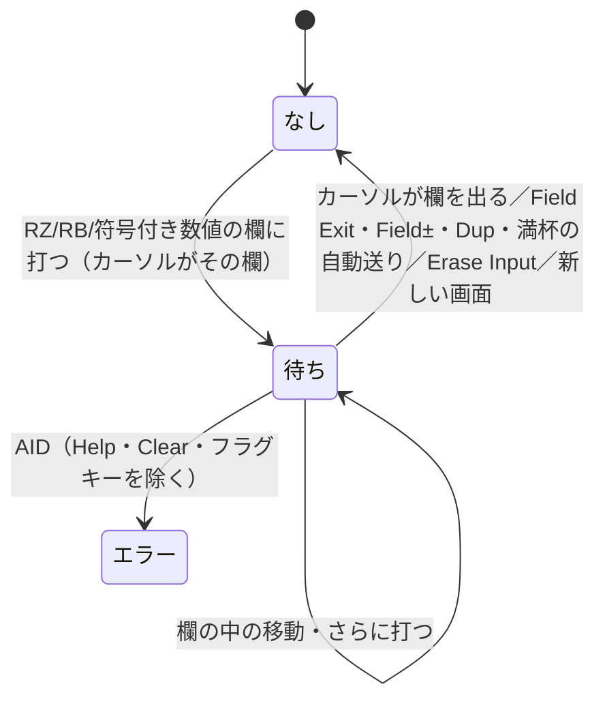

# 仕様: 欄を出ないまま AID を押したら、送らずに操作員エラーにする（ACS の 0020）

## 概要
「打ったあと、まだ欄を出ていない欄」をセッション状態に 1 つだけ持ち（`awaitingFieldExit`）、
送信の合流点 `sendKey` で見る。付け外しはペインが行う。

## 設計方針
- **ACS のフラグ（欄ごと）を「いまの欄 1 つ」に畳む**: 原典が見るのはカーソル下の 1 欄だけで、
  カーソルが欄を出た時点でその欄のフラグは立つ。よって「カーソルがいる欄に打った」ことだけを持ち、
  カーソルが出たら外せば同じ判定になる。
- **判定は `sendKey`**: ボタン・キー・ホイールの全経路が通る。セッション状態のカーソルはホスト由来なので、
  判定にカーソルを使わず、待ちの有無だけを見る（待ちが付いている＝カーソルがその欄にいる）。
- **エラー状態への入り方**: `sendKey` はセッション状態の `notice` に載せる。ペインが監視して、
  操作員エラーならローカルの通知へ移す（`showNotice` → エラー状態。①と同じ入口）。

## 対象範囲
- `packages/web-ui/src/stores/sessions.ts`（状態・破棄）
- `packages/web-ui/src/composables/mandatoryCheck.ts`（`needsFieldExit`）
- `packages/web-ui/src/composables/opMessages.ts`（`MSG_FIELD_EXIT_REQUIRED`・`isOperatorError`）
- `packages/web-ui/src/session-controller.ts`（`sendKey`）
- `packages/web-ui/src/components/EmulatorPane.vue`（付け外し・通知の移し替え・フォーカス移動の除外）

## 依拠する既存の事実
- 原典の条件と除外する AID: research F1。実機の振る舞い: research F2。
- 送信の合流点が `sendKey` であること: `session-controller.ts` の `sendKey` 冒頭の注記。
- Field Exit は値の反映（`edit`）→ `field-full` の順に出す: `ScreenGrid.vue` `fieldExitKey`。
- 新画面で編集差分を捨てる: `sessions.ts` `updateScreen`。

## 振る舞いの詳細

## エラー処理 / 異常系
- 待ちが指す欄が画面に無い（画面が変わった直後など）→ 止めない。

## 受け入れ基準との対応
- AC1: `sendKey` の判定・`needsFieldExit`・`focusMandatoryViolation` の除外。
- AC2: `noteFieldExited`（`onFieldFull`・erase-input）・カーソル監視・`needsFieldExit` の自動 Enter 除外・Help/Clear の除外。
- AC3: `state.notice` の監視・`updateScreen` の破棄。
- AC4: `test/aid-field-exit-required.test.ts` と mutation 10 通り。
