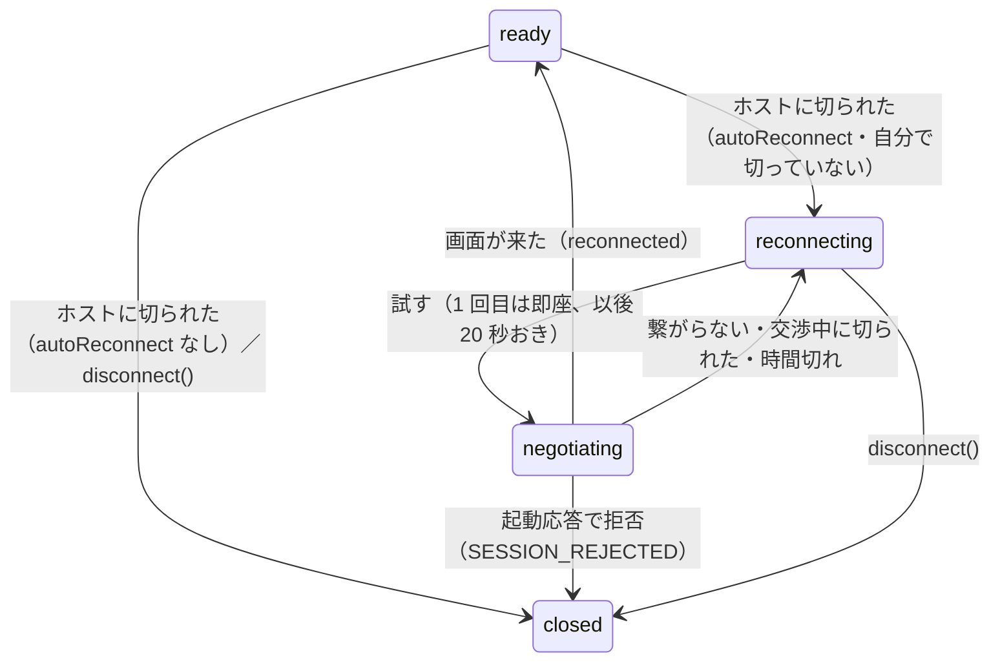

# 仕様: ホストに切られたら、ACS と同じく自動で繋ぎ直す

## 概要
コアの `Session5250` に `autoReconnect`（既定 false）を足し、同じオブジェクトのまま接続を張り直す。
サーバーはブラウザから開いたセッションでだけ ON にし、経過を `/ws` で知らせる。ブラウザは経過を出し、送らない。

## 設計方針
- **層は ACS と同じ**: ECL のコア＝既定 OFF、画面の層＝ON。当 PJ ではコア＝既定 OFF、ブラウザ用＝ON、MCP＝OFF。
- **同じ `Session5250` のまま張り直す**: サーバーやブラウザ側の購読（screen・alarm・closed）をそのまま生かせる。
  接続ごとの状態（画面バッファ・起動応答・1 レコード目・Read の種類・メッセージ待ち）は作り直す。
- **諦める条件**: 自分から切った（`disconnect()`）・ホストが起動応答で拒否した（`SESSION_REJECTED`）。
  繋がらない・交渉中に切られた・時間切れは試し続ける（ACS も状態 2 のまま続く）。
- **前の画面は、新しい接続の最初のレコードまで残す**（施錠したまま）。切られた瞬間に白くしない。

## 対象範囲
- `packages/tn5250/src/session/session.ts`（`establish` への分解・`handleClose`・`tryReconnect`・`disconnect`）
- `packages/server/src/{ws-handler,ws-messages,session-manager}.ts`
- `packages/web-ui/src/{session-controller.ts,stores/sessions.ts,composables/opMessages.ts,components/EmulatorPane.vue}`

## 依拠する既存の事実
- 原典と実機の ACS: research F1・F2。当 PJ の変更前: F4。
- サーバーの購読は `WsConnection.subscribeSession` で `entry.session` に張る（`ws-handler.ts`）。
- 起動応答の拒否は `SESSION_REJECTED`（`session.ts` の `handleRecord`）。

## 振る舞いの詳細

## 受け入れ基準との対応
- AC1: コアの `handleClose` / `tryReconnect`。
- AC2: `ws-handler` の `host-reconnecting` / `host-reconnected` / 施錠した `screen` / `jobinfo`、ブラウザの `hostReconnect`。
- AC3: `disconnect()` の `userClosed`、`SESSION_REJECTED` で `finalClose`、`autoReconnect` の既定。
- AC4: `auto-reconnect.test.ts`（コア）・`ws-host-reconnect.test.ts`（サーバー）・`host-reconnect.test.ts`・`type-ahead.test.ts`（ブラウザ）、
  実機の `verify-auto-reconnect.mjs`・`verify-ws-auto-reconnect.mjs`。
