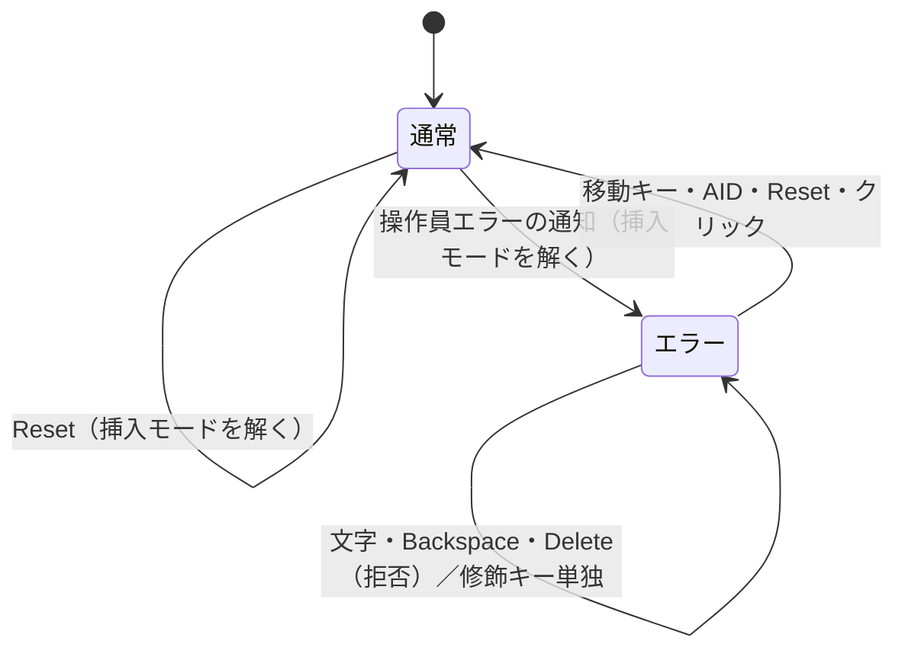

# 仕様: 操作員エラーでキーボードを施錠し、Reset キーで解く

## 概要
`EmulatorPane` に**エラー状態**（`errorMode`）を持たせ、`.pane` の capture で打鍵を振り分ける。

## 設計方針
- **入口を 1 つに寄せる**: 通知は `showNotice(text)` を通し、`isOperatorError(text)` ならエラー状態に入る。
  `notice.value = …` の直接代入を残さない（残すとその経路だけ施錠されない）。
- **振り分けは capture で行う**: `.pane` の `@keydown.capture` は入力欄の keydown より先に走る。
  拒否は `preventDefault` + `stopPropagation` で欄へ届かせない。
- **Reset は keyup で判定**: 左 Ctrl の押下で Reset にすると Ctrl+C のたびに走る。
  押下後に他のキーを挟まず離したときだけ Reset とする。

## 対象範囲
- `packages/web-ui/src/composables/opMessages.ts`（`isOperatorError`）
- `packages/web-ui/src/components/EmulatorPane.vue`（状態・振り分け・Reset・クリック）

## 依拠する既存の事実
- 入口: `ACS PS5250.setErrorCode` が `error_mode = true`（`research.md` F1）。
- 抜ける経路: `processReset` / `keyDown` 1004〜1007 / `processAIDCode` / `canClearErrorModeViaMouseClick`（F2）。
- キーごとの振る舞い: 実機（F3・F5）。挿入モード解除: 実機 2 経路と `ECLPS.reset`（F6。F4 の読みは D3 で破棄）。
- 当 PJ の通知: ScreenGrid が `emit("notice", …)`（`ScreenGrid.vue` の型違反・`MSG_NO_ROOM`・`MSG_PROTECTED`）、
  ペインは `onNotice` で受ける。キーの捕捉は `.pane` の `@keydown.capture`（在席の合図も兼ねる）。

## インターフェース / データ構造
- `isOperatorError(text: string): boolean`（`opMessages.ts`）。
- `EmulatorPane` 内部: `errorMode` / `showNotice` / `clearNotice` / `exitErrorMode` /
  `onKeydownCapture` / `onKeyupCapture` / `onPointerdownCapture`。外へ出す API は無い。

## 振る舞いの詳細

## エラー処理 / 異常系
- 未測定のキー（Field Exit・Erase EOF・Dup・IME・Ctrl 組み合わせ）は**抜ける側**（D2）。

## 受け入れ基準との対応
- AC1: `onKeydownCapture` の `isEditingKey` 分岐。
- AC2: 同 `exitErrorMode`（移動キー等）・`onAid`・`onPointerdownCapture`・`showNotice` の判定。
- AC3: `leftCtrlAlone` と `onKeyupCapture`。
- AC4: `test/operator-error-mode.test.ts` と mutation 4 通り。
