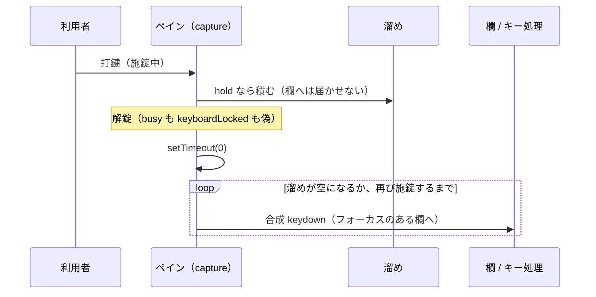

# 仕様: 施錠中・応答待ち中の打鍵を捨てずに溜め、解錠で再生する（先打ち）

## 概要
ペイン（`EmulatorPane`）の keydown capture で、施錠中の端末のキーを溜める。解錠したら、
合成した keydown を同じ入口（フォーカスのある欄）へ投げて再生する。

## 設計方針
- **溜めるのは capture**: 入力欄より先に見て、溜めたキーは欄にもペインのキー処理にも届かせない。
- **再生は同じ入口**: 合成 keydown を投げれば、欄の型検査・操作員エラー・キー割り当て・0020 がそのまま効く。
  別の再生経路を作ると、これらを二重に持つことになる。
- **再生の時機**: 解錠（`busy` も `keyboardLocked` も偽）を監視し、**次のタスク**（`setTimeout(0)`）で流す。
  新しい画面の欄フォーカス（ScreenGrid の `focusCursorField`）は nextTick（マイクロタスク）なので、その後になる。
- **AID で止める**: 再生した AID で再び施錠したら止め、残りは次の解錠で続きから（ACS も残りを `keyBuffer` に戻す）。
- **分類は純関数**（`useKeymap.ts` の `typeAheadKind`）: `hold` / `flag`（Attn・SysReq）/ `help` / `pass`。

## 対象範囲
- `packages/web-ui/src/composables/useKeymap.ts`（`typeAheadKind`）
- `packages/web-ui/src/components/EmulatorPane.vue`（溜め・再生・破棄・Insert のその場処理）

## 依拠する既存の事実
- ACS の溜め・破棄・その場処理の分岐: research F1（`ECLPS.SendKeys` の定数文字列）。実機: research F2。
- 施錠中に捨てている箇所: research F3。
- 新画面の欄フォーカスは nextTick: `ScreenGrid.vue` の `focusCursorField` の呼び出し（`nextTick(() => focusCursorField())`）。
- Attn / SysReq の判定: `useKeymap.ts` `isEscapeAidEvent`。

## 振る舞いの詳細

- Reset（左 Ctrl 単独）・Attn・SysReq・Help・切断で捨てる。Attn・SysReq はそのまま送る。
- Insert は溜めずにその場で挿入モードを切り替える（ACS は `[insert]` を溜めない）。
- 予約中・マクロ再生中・システム要求行では溜めない（従来どおり捨てる）。
- 上限 1000 キー（ACS の上限は未確認）。

## エラー処理 / 異常系
- 再生中の操作員エラー: 以降の合成 keydown はエラー状態の規則（①）で振り分けられる（ACS も `keyDown` がエラー中の規則で処理）。

## 受け入れ基準との対応
- AC1: `holdTypeAhead`・`replayTypeAhead`・`onFkeyAid` の溜め。
- AC2: `replayTypeAhead` の施錠での停止。
- AC3: `resetKey`・`holdTypeAhead` の flag / help・`canHoldTypeAhead`・切断の監視・Insert。
- AC4: `test/type-ahead.test.ts` と mutation。`keyboard-locked-input.test.ts` の注記を見直す。
