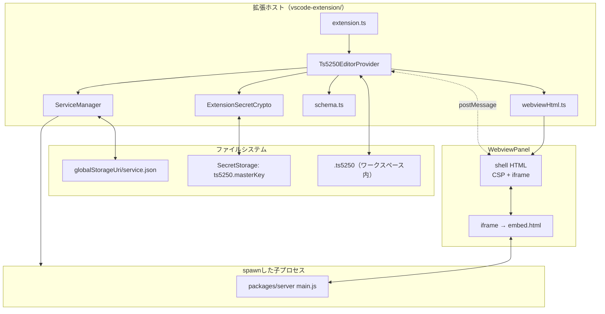
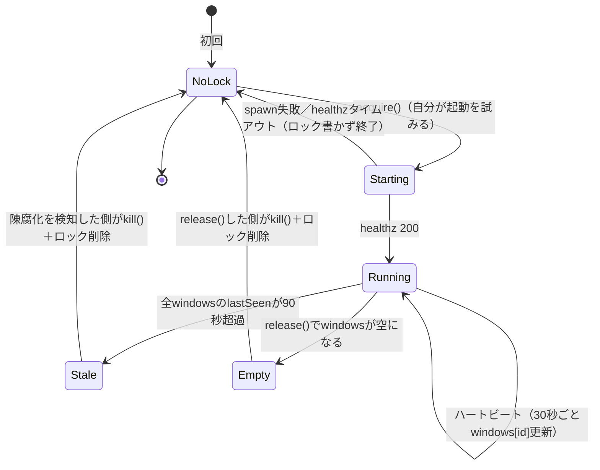

# 設計: VSCode拡張機能によるts5250画面のWebView表示（構造設計）

design.md で決めた方針（プロセス管理／暗号化／経路の非対称／embed.html／shell+iframe／
設定フォーム／調停プロトコル）を、tasks で分解できる粒度まで構造化する。ここでは特に
design.md が曖昧に書いていた2点——**メッセージプロトコル**と**ロックファイルの状態遷移**——
を形式化する。

## アーキテクチャ概要



## コンポーネント / モジュール

| モジュール | 責務 | 依存 |
|---|---|---|
| `extension.ts` | `activate`/`deactivate`。`Ts5250EditorProvider`の登録、`windowId`（`crypto.randomUUID()`）の生成 | vscode API |
| `ts5250EditorProvider.ts` | `CustomTextEditorProvider`実装。ドキュメント↔WebView間の同期、メッセージのハンドリング | ServiceManager, ExtensionSecretCrypto, schema.ts, webviewHtml.ts |
| `serviceManager.ts` | ロックファイルの読み書き・spawn・healthz・ハートビート・参照カウント | node:child_process, node:fs, node:crypto(乱数) |
| `secretCrypto.ts` | AES-256-GCM暗号化・復号（`v1:iv:tag:ct`）、master keyのSecretStorage初期化 | node:crypto, vscode.SecretStorage |
| `schema.ts` | `.ts5250`のJSONスキーマ検証（zodは使わず軽量な手書き検証——拡張機能はバンドルサイズに敏感。design方針は変えず実装選択のみ） | なし |
| `webviewHtml.ts` | shell HTMLの文字列生成（CSP・nonce・iframe） | vscode.Webview（`asWebviewUri`/`cspSource`） |
| `packages/web-ui/src/embed.ts` | クエリ文字列から`app`等の非秘匿パラメータを読み、`postMessage`ハンドシェイクで秘匿情報を受け取り、`EmbedApp.vue`をmount | Vue, session-controller.ts |
| `EmbedApp.vue` | 対象ペイン1つ＋設定ボタンの描画。`openSession()`呼び出し | EmulatorPane/SpoolPane/SqlPane/IfsPane, SettingsForm.vue |
| `SettingsForm.vue` | 接続情報フォーム。フォーカストラップ・Escapeキャンセル | なし（親から値を受け取り、`postMessage`で送るだけ） |

## インターフェース / データモデル

### メッセージプロトコル（拡張ホスト ⇄ shell ⇄ embed.html）

3者間の`postMessage`は**同一のメッセージ型を素通し**する（shellは中継のみで内容を見ない・
書き換えない。Simple Browserと同じ「shellは薄い層」の原則）。

```ts
// vscode-extension/src/protocol.ts（拡張ホスト・web-ui embed.ts の双方が type-only import する）
export type HostToWebviewMessage =
  | { type: "connect"; payload: ConnectPayload }   // 初回オープン・再接続
  | { type: "saved"; payload: ConnectPayload }      // 設定保存が完了し、新しい値で繋ぎ直す
  | { type: "saveError"; message: string }          // WorkspaceEdit失敗・復号失敗等
  | { type: "fileInvalid"; message: string };       // .ts5250のJSONが不正

export type WebviewToHostMessage =
  | { type: "ready" }                                // iframeロード完了。connectを催促する
  | { type: "save"; payload: SettingsFormValues }    // 設定フォームの保存
  | { type: "openExternal"; url: string };           // 画面内リンクを既定ブラウザで開く（Simple Browser踏襲）

export interface ConnectPayload {
  app: "emulator" | "printer" | "sql" | "ifs";
  host: string;
  port?: number;
  tls?: boolean;
  ccsid?: number;
  katakanaVariant?: "katakana" | "katakana-ex";
  terminal?: "5250" | "3270";
  deviceName?: string;
  screenSize?: "24x80" | "27x132";
  enhanced?: boolean;
  ifsPath?: string;
  sqlInitial?: string;
  /** emulatorのみ。直接WsOpenへ渡す平文（E1） */
  user?: string;
  password?: string;
  /** printer(スプール表示)/sql/ifsのみ。個人設定への登録が済んだ参照（E2/E3。design.md「設計方針3」訂正後） */
  systemRef?: string;
}

export interface SettingsFormValues {
  host: string;
  port?: number;
  tls?: boolean;
  ccsid?: number;
  deviceName?: string;
  user?: string;
  /** 平文。拡張ホストが受け取ってすぐ暗号化する（保持しない） */
  password?: string;
}
```

- **`app`は起動時のURLクエリ**（`embed.html?app=emulator`）で渡す——iframeの初期ロード時点で
  「どのVueコンポーネントをmountするか」を決める必要があり、`postMessage`ハンドシェイク
  （非同期）を待つとチラつく。**秘密を含まない**ためURLに乗せてよい
- **`user`/`password`/`systemRef`はURLに乗せない**。`ready`受信後の`connect`メッセージで
  渡す（design方針の「パスワードをURLに出さない」を型で表現）
- shellは`WebviewToHostMessage`を`webview.onDidReceiveMessage`でそのまま
  `Ts5250EditorProvider`へ渡し、`HostToWebviewMessage`は`panel.webview.postMessage()`で
  そのままiframeへは渡らない——**shellのJS（`webviewHtml.ts`が埋め込む小さなスクリプト）が
  `iframe.contentWindow.postMessage(msg, iframeOrigin)`へ転送する**、という1段だけの中継

### ロックファイルの状態遷移



- **`Starting`は状態ファイルに書かない**（design方針7の「最後に書いた者が勝つ」レースは、
  ロックファイルへ`Running`として書き込む一瞬だけの競合であり、`Starting`という中間状態を
  永続化する意味が無い——書く前にクラッシュしても`NoLock`のまま残るだけで安全側）
- **`Stale`の判定は「読み取った側」が行う**（常駐する監視プロセスは持たない。`acquire`/
  `release`のたびに全`windows`エントリを走査し、90秒超過分を除去してから自分のエントリを
  足し引きする——読み取りのたびに掃除する、いわゆる遅延GC方式）

### `own:<id>`（プリンター(スプール表示)/SQL/IFS用の個人設定）の導出

~~```ts
// id = sha256(document.uri.toString()).slice(0, 16)（16進）
// 例: file:///home/user/work/prod.ts5250 → own:3f2a9c1b8e7d4a10
```~~

**（03-sql-ifs着手時に訂正。`decisions.md` D1）**: `POST /api/systems`はidを
呼び出し側から指定できず、サーバーが`newSystemId(name)`で自動採番する
（`packages/server/src/config-store.ts`の`addSystem`）——決定的な導出は
既存APIの上では不可能だった。実装は**初回`POST`で採番されたidを
`context.globalStorageUri/systemRefs.json`へキャッシュし、2回目以降はそのidへ
`PUT`で同期する**方式を採る。

- ファイルパスが変わる（rename/move）とURIが変わり、対応表に新しいエントリが増える
  （旧エントリはキャッシュにもconnections.jsonにも孤立して残る）。
  **意図的に許容する**——個人設定はUI上「自分の設定」一覧に並ぶだけで、信頼設定
  （パス書込・コマンド実行）を持たないため実害が無い。定期的な掃除機構は今回のスコープに
  含めない（tasksへの申し送り）

## 処理フロー / シーケンス

design.md「振る舞いの詳細」のシーケンス図がそのまま正（重複させない）。ここでは
**メッセージプロトコルの型がどのシーケンスのどの矢印に対応するか**だけ補足する。

- design.md「初めて開く」シーケンスの`postMessage(接続パラメータ)` = `{type:"connect", payload}`
- design.md「設定ボタンでの保存」シーケンスの`postMessage({type:"save", ...})` =
  `WebviewToHostMessage`の`save`ケース。応答は`{type:"saved", payload}`（成功）または
  `{type:"saveError", message}`（失敗）

## 設計判断

- **メッセージ型を1ファイル（`protocol.ts`）に集約し、拡張ホストとembed.tsの両方がimportする**。
  理由: 別々に定義すると、フィールド追加時に片方だけ更新されて型が食い違う
  （AGENTS.md条項`paired-artifact-sync`が指す「対になる資産」そのもの）。`vscode-extension/`
  と`packages/web-ui/`は別npmパッケージなので、`protocol.ts`は**`vscode-extension/src/`に
  置き、`packages/web-ui`側はビルド時に相対パスでtype-only importする**か、あるいは
  `packages/web-ui/src/embed-protocol.ts`として**値ではなく型定義だけを両側に手で複製し、
  テストで一致を固定する**（`dependency-direction.test.ts`と同種の走査）——**どちらを
  採るかはtasksで決める**（後者はビルド非依存で単純、前者は二重管理が起きない。
  tasksへの申し送り）
- **shellはメッセージの中身を検査しない**（Simple Browserと同じ「薄い中継」）。
  理由: shell側にロジックを持たせると、embed.html（Vue側）とextension host（拡張側）の
  2箇所に分かれていたロジックが3箇所に増える。shellの責務は「iframeのCSP／origin管理」に
  限定する
- **ロックファイルに`Starting`状態を持たせない**（上記）。理由: 中間状態を永続化すると、
  クラッシュ時に「起動中のまま固まった」という新しい陳腐化パターンが増え、
  `Stale`判定のロジックが2種類（`Running`用と`Starting`用）必要になる。`Starting`を
  持たないことで、陳腐化判定は「`Running`のwindowsが空 or 全滅」の1種類に単純化できる

## tasks への申し送り

- **分割の単位候補**:
  1. `vscode-extension/`の骨格（`package.json`・`extension.ts`・空の`Ts5250EditorProvider`・
     shell HTML表示まで。WebSocket接続はまだ張らない）
  2. `ServiceManager`（ロックファイル・spawn・healthz・ハートビート）単体（拡張の他部分と
     切り離してユニットテスト可能）
  3. `ExtensionSecretCrypto`単体（`node:crypto`のみでテスト可能）
  4. `packages/web-ui`の`embed.html`/`embed.ts`/`EmbedApp.vue`（既存`openSession()`と
     ペインコンポーネントの組み合わせ。web-uiのテスト環境で先行して検証できる）
  5. `SettingsForm.vue`（フォーカストラップ含む。単独でコンポーネントテスト可能）
  6. 上記を結線するメッセージプロトコル（`protocol.ts`と両側のハンドラ）
  7. プリンター(スプール表示)/SQL/IFS向けの個人設定同期（`own:<id>`導出・`POST`/`PUT /api/systems`呼び出し）
  8. パッケージング（`scripts/prepare-server.mjs`・`.vscodeignore`・`vsce package`）
- **2と3は1・4より先に着手して独立にテストできる**（他コンポーネントへの依存が無いため）
- **実機接続の確認（AC3）はtest工程で行う**——`.env.verify`の検証環境を使う
