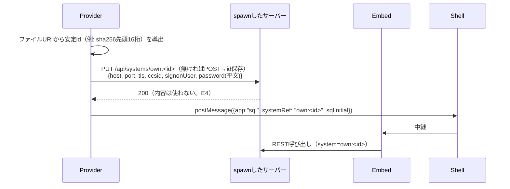
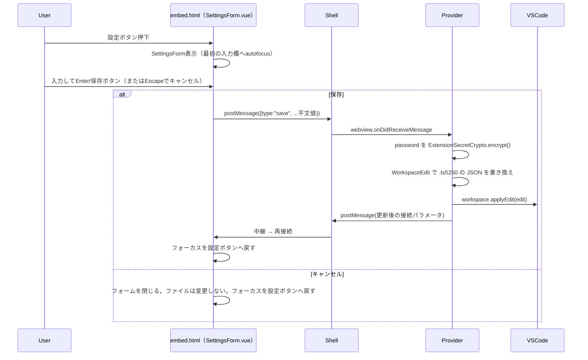

# 仕様: VSCode拡張機能によるts5250画面のWebView表示

## 概要

リポジトリ直下に新設する`vscode-extension/`（`electron/`と同じ立て付け）が、`.ts5250`拡張子の
JSON設定ファイルをCustom Text Editorとして扱い、内容に応じたアプリ（エミュレータ/プリンター
/SQL/IFS）1つ分の最小WebViewを表示する。WebViewの中身は`packages/web-ui`に新設する軽量エントリ
（`embed.html`）で、既存の`openSession()`等の関数をそのまま呼び出す。バックグラウンドサービス
（`packages/server`）はVSCode拡張ホストの子プロセスとして起動し、VSCode全体で単一インスタンスを
ロックファイル方式で調停する。

## 設計方針

### 1. サービスのプロセス管理: `child_process.spawn` + `kill()`（`import()`方式は不採用）

`electron/main.cjs`は`packages/server`の`main()`を**同一プロセス内で`import()`**して使うが
（`electron/main.cjs:165-167`）、これはElectronのmainプロセス＝アプリ全体だからこそ成立する。
`packages/server/src/main.ts:345-350`の SIGINT/SIGTERM ハンドラは`process.exit(0)`を直接呼ぶ——
VSCode拡張ホストで同じ方式を取ると、サーバーだけを止めるつもりの操作が拡張ホスト全体
（＝他の拡張機能も含む）を巻き込みかねない。よって**`child_process.spawn`で別プロセスとして
起動し、`child.kill()`で個別に止める**。システムに`node`が入っていない利用者環境でも動くよう、
`spawn(process.execPath, [SERVER_MAIN, ...args], { env: { ...process.env,
ELECTRON_RUN_AS_NODE: "1" } })`とする（research F2）。

### 2. パスワード: 拡張機能が自前のAES-256-GCM実装を持ち、`.ts5250`ファイル自身に暗号文を持たせる

`packages/server/src/secret-crypto.ts`の`SecretCrypto`はパッケージの公開API
（`packages/server/src/index.ts`）から**再輸出されていない**——内部実装であり、外部パッケージが
直接importすることを想定していない。また、requirements decisions.md D2で確定したとおり、
**`.ts5250`ファイル自体に暗号文（`passwordEnc`）を持たせて自己完結させる**必要がある。

`vscode-extension/`は`node:crypto`だけで完結する独立実装
（`vscode-extension/src/secretCrypto.ts`。`SecretCrypto`と同じ`v1:iv:tag:ct`形式・AES-256-GCM）
を持つ。master keyは初回起動時に32byte乱数を生成し、`vscode.ExtensionContext.secrets`
（SecretStorage。research F8——OS標準の資格情報ストアに保存される）へ`ts5250.masterKey`という
キーで保存する。**`packages/server`本体のmaster key（`AS400_SECRET_KEY`）とは別物**——
`.ts5250`の暗号文はこの拡張機能の鍵でのみ復号できる。

この方式を選んだ理由（代替案を退けた理由）:
- 「`@ts5250/server`からSecretCryptoを直接import」は不採用——公開APIの外にある実装詳細への
  依存になり、AGENTS.md「使うものは在り処から取る」の逆（在り処が公開されていないものを
  裏から取る）になる
- 「暗号化をやめてVSCode SecretStorageだけで完結させる（ファイルには触れない）」は不採用——
  requirements US4/AC7/AC8（`.ts5250`ファイル自体をコミットしても安全）を満たせない。
  SecretStorageは拡張機能のグローバルな鍵置き場としてのみ使う

### 3. アプリ種別ごとの接続経路が非対称（design時に判明した事実。coding直前に訂正）

research時点では「`.ts5250`の接続情報をそのままサーバーへ渡す」という一様な経路を想定していたが、
design で既存コードを読んだ結果、**エミュレータと、それ以外（プリンター/スプール表示・SQL・IFS）
で経路が異なる**ことが判明した（詳細は「依拠する既存の事実」E1〜E4）。

**訂正（`decisions.md` D3）**: design承認時点では「エミュレータ/プリンター」を直接接続の
グループとしていたが、tasks工程で`SpoolPane.vue`の実装を読んだ結果、「プリンター/スプール表示」
機能（要望文の「スプール表示」）は`SpoolPane.vue`が担い、`WsOpen`ではなく
`/api/host/spools`等のREST APIを`source: { system: props.system }`で呼ぶ
（`SpoolPane.vue:130,162,228,272`）——**SQL/IFSと同じsystem参照必須の経路**であることが分かった。
以下は訂正後の正しい分類。

- **エミュレータのみ**: WebSocketの`open`メッセージ（`WsOpen`）が`host`/`port`/`user`/
  `password`等を**直接**受け付ける（system/sessionの登録は不要。`ws-messages.ts:14-89`）。
  拡張機能が復号した平文をそのまま`WsOpen`へ乗せる
- **プリンター/スプール表示・SQL・IFS**: REST API（`host-sql.ts`・`host-ifs.ts`・
  スプール関連ルート等が使う`resolveSource`）は**`system`または`session`の参照を必須**とする
  （`host-api.ts:19-27`の`sourceSchema.refine`）。既存サーバーを無改造で使う制約
  （requirements非機能要件）があるため、この必須要件は動かせない。よって`.ts5250`が
  `app: "printer"`（スプール表示）・`app: "sql"`・`app: "ifs"`のいずれかのときは、
  拡張機能が個人設定（`connections.json`。`context.globalStorageUri`内、`packages/server`が
  `--connections`で読み書きする既存の仕組みそのまま）へ**この`.ts5250`ファイル専用の
  システムを1件登録・同期**し（`POST`/`PUT /api/systems`。`config-routes.ts:243-271`）、
  `system: "own:<id>"`を参照してREST APIを呼ぶ

**この設計は暗号文を二重に持つ**（`.ts5250`の`passwordEnc`＝拡張機能の鍵で暗号化／
`connections.json`の`passwordEnc`＝サーバー自身の鍵で暗号化）。`.ts5250`側が可搬な正本、
`connections.json`側はプリンター/スプール表示・SQL・IFSのREST層を満たすためだけの
**派生・使い捨て状態**と位置づける
（`.ts5250`が更新されるたびに`PUT`で上書きする。ユーザーが直接`connections.json`を見る・
編集することは想定しない）。この二重persistを避ける代替案（サーバー側にsystem不要の直接接続
モードを新設する）は、既存サーバーを無改造で使うという要件上の制約と衝突するため見送った
（ユーザー承認済み）。

### 4. 単一アプリ専用WebViewの中身: `packages/web-ui`に新規エントリ`embed.html`を追加

research F9のとおり、`openSession()`（`session-controller.ts:745`）はワークスペース管理
（`workspaceStore`）に依存せず呼び出せる。Viteのマルチページビルド
（`build.rollupOptions.input`）で`embed.html`を追加し、新規`EmbedApp.vue`が
`openSession()`と対応するペインコンポーネント（`EmulatorPane.vue`/`SpoolPane.vue`/
`SqlPane.vue`/`IfsPane.vue`）だけをマウントする。既存コンポーネントの改変は不要。

### 5. WebViewの構成: Simple Browser方式（shell HTML + iframe + postMessage中継）

research F1のとおり、VSCode公式Simple Browser拡張と同じ構成——**拡張機能が持つshell HTML**
（CSP: `frame-src http://127.0.0.1:*;`・`<iframe sandbox="allow-scripts allow-forms
allow-same-origin">`）が、サーバーが配信する`embed.html`を`http://127.0.0.1:<port>/embed.html`
としてiframe表示する。shellはメッセージを中継するだけの薄い層に留める（iframeの中身
＝`embed.html`側にアプリのロジックを置く）。

### 6. 設定ボタンのフォーム: WebView（`embed.html`）内のHTML/Vueフォーム（QuickInputは不採用）

VSCode標準の`QuickInput`（`showInputBox`連続呼び出し）はキーボード操作・フォーカス復帰が
標準で満たせる利点があったが、**利用者の希望により不採用**——「画面から設定情報を入力できる」
という要望の体験としては、画面と地続きのフォームの方が要望に忠実なため、`EmbedApp.vue`内の
新規コンポーネント（`SettingsForm.vue`）として実装する。既存の`InfoPopover.vue`
（`packages/web-ui/src/components/InfoPopover.vue`）と同じ「バックドロップ＋本体」の見た目を
踏襲するが、**`InfoPopover.vue`自体はフォーカストラップを持たない**（バックドロップクリックで
閉じるだけ）ため、AC-I3/AC-I4（キーボードだけで完結・フォーカスの行き先）は
`SettingsForm.vue`側で自前実装する（最初の入力欄への`autofocus`・`Tab`循環・`Escape`で
キャンセルして呼び出し元のボタンへフォーカスを戻す）。

### 7. 複数ウィンドウ間のサービス調停: ロックファイル + healthz + ハートビート（自前実装）

research F10のとおりVSCode公式APIは無い。`context.globalStorageUri/service.json`に
`{ pid, port, startedAt, windows: { [windowId]: lastSeenIso } }`を持ち、以下のプロトコルで
調停する（詳細は「振る舞いの詳細」）。**local single-userツールとして「十分な頑健さ」を狙い、
分散ロックの完全性までは求めない**——最悪ケース（起動の競合・停止漏れ）は自己修復する設計とする。

## 対象範囲

- 新設: `vscode-extension/`（`package.json` / `src/extension.ts` /
  `src/ts5250EditorProvider.ts` / `src/serviceManager.ts` / `src/secretCrypto.ts` /
  `src/schema.ts` / `src/webviewHtml.ts` / `scripts/prepare-server.mjs`）
- 新設: `packages/web-ui/embed.html` / `packages/web-ui/src/embed.ts` /
  `packages/web-ui/src/EmbedApp.vue` / `packages/web-ui/src/components/SettingsForm.vue`
- 変更: `packages/web-ui/vite.config.ts`（マルチページビルドの入力追加）
- ~~変更なし: `packages/server`~~ **最小限の変更あり**（既存CLI引数・`WsOpen`・`/api/systems`は
  そのまま使う、という意図は変わらない。ただし`embed.html`の静的配信には
  `app.ts`への1行追加が必要だった——既存のSPAフォールバックが`favicon.*`と同じ理由で
  `embed.html`も吸い込んでいたため。`01-embed-ui/decisions.md` D1）

## 依拠する既存の事実

（research.md のF1〜F11に加え、design時に新たに確認した事実）

- E1: `WsOpen`（`packages/server/src/ws-messages.ts:14-89`）は`system`/`session`参照を
  一切指定せずに`host`/`port`/`tls`/`ccsid`/`deviceName`/`terminal`/`screenSize`/
  `katakanaVariant`/`enhanced`/`user`/`password`を直接指定できる（「ブラウザ直指定」
  モードとコメントされている・`ws-messages.ts:57-88`）
- E2: SQL/IFS等のREST APIが経由する`resolveSource`（`host-api.ts:82-90`）は
  `sourceSchema`（同ファイル:19-27）を通り、`system`または`session`のどちらかが
  **必須**（`.refine((v) => Boolean(v.system ?? v.session), ...)`）。直接host/port指定は
  受け付けない
- E3: 個人設定のシステム（`connections.json`）は`signon`（`passwordEnc`/`passwordEnv`）を
  持てる——`systemSchema`（`config-types.ts:196-233`）は`signon`をサーバー設定・個人設定の
  両方に共通で持たせており、個人設定固有の制限（`printer`/`pcCommand`を持てない。
  `config-types.ts:490-500`のコメント）は**信頼設定（パス書込・コマンド実行）に限る**。
  自分のIBM iパスワードを自分の個人設定へ保存することは一般ユーザーにも許されている
  （AGENTS.md「アカウント・権限設計」表の「一般ユーザー」行「作成・編集: 自分の設定のみ」）
- E4: `POST /api/systems`（`config-routes.ts:243-255`）は`toSystemRecord`
  （同ファイル:82-105）で平文`password`を受け取り`store.encryptPassword()`で暗号化して
  保存する。応答には`signon`の中身（暗号文含む）を含めない設計（`system`をそのまま
  返す実装だが、`resolver.listSystems`側でのマスキングは`GET`のみに効く。
  **`POST`/`PUT`の応答に暗号文が含まれるかは未確認——design段階では踏み込まず、
  拡張機能側は応答のsignonを読まず自前で保持した値のみを使う**ことでこの未確認点を
  無害化する）
- E5: `packages/web-ui/src/components/EmulatorPane.vue`は`workspaceStore`をimportしない
  （import一覧確認済み・`EmulatorPane.vue:1-40`）——`openSession()` +
  対象ペインコンポーネントだけで単一セッション表示が成立する前提の裏付け
- E6: `packages/server/src/app.ts:140`の`/healthz`は`{status, sessions}`を返す——
  調停プロトコルの生死判定に使う

## インターフェース / データ構造

### `.ts5250`ファイルスキーマ（JSON）

既存の`WsOpen`/`systemSchema`のフィールド名にそろえる（同じ語彙を再利用し、読み手が
既存コードと結びつけられるようにする）。

```jsonc
{
  "app": "emulator",              // "emulator" | "printer" | "sql" | "ifs"
  "host": "AS400",
  "port": 992,
  "tls": true,
  "ccsid": 5035,
  "katakanaVariant": "katakana-ex", // ccsid===930のときだけ意味を持つ（emulator/sql/ifsで個人設定を登録する際に使う）
  "terminal": "5250",             // emulatorのみ。"5250" | "3270"
  "deviceName": "DEV01",          // emulatorのみ。省略可
  "screenSize": "24x80",          // emulatorのみ。"24x80" | "27x132"
  "enhanced": false,              // emulatorのみ
  "ifsPath": "/home/MYUSER",      // ifsのみ。初期表示ディレクトリ（省略可）
  "sqlInitial": "SELECT * FROM ...", // sqlのみ。初期クエリ文字列（省略可）
  "signon": {
    "user": "MYUSER",
    "passwordEnc": "v1:....:....:...." // SettingsFormで入力後に拡張機能が書き込む。省略可（未設定なら接続時に毎回プロンプト）
  }
}
```

- `app`必須。他はapp種別に応じて意味を持つ／持たないが、スキーマ上は緩く許容し
  無意味な組み合わせは拡張機能側で無視する（サーバー設定の`assertTypeConsistent`ほど
  厳密な相互排他は課さない——単一ファイル・単一利用者なので実害が小さい）
- `signon`省略時は`SettingsForm`を開くまで接続できない（AC1の「対応する画面が表示される」は
  満たすが、接続はサインオン情報が要る場合エラー表示のうえ設定を促す）

### 拡張機能側モジュール

```ts
// vscode-extension/src/secretCrypto.ts
export class ExtensionSecretCrypto {
  static async fromSecretStorage(secrets: vscode.SecretStorage): Promise<ExtensionSecretCrypto>;
  encrypt(plain: string): string;  // "v1:iv:tag:ct"
  decrypt(blob: string): string;
}

// vscode-extension/src/serviceManager.ts
export class ServiceManager {
  constructor(globalStorageUri: vscode.Uri, windowId: string);
  async acquire(): Promise<{ port: number }>;  // 参照カウントを +1 し、必要なら起動
  async release(): Promise<void>;              // 参照カウントを -1 し、0なら停止
}

// vscode-extension/src/ts5250EditorProvider.ts
export class Ts5250EditorProvider implements vscode.CustomTextEditorProvider {
  resolveCustomTextEditor(document, webviewPanel, token): Promise<void>;
}
```

### ロックファイル（`context.globalStorageUri/service.json`）

```jsonc
{
  "pid": 12345,
  "port": 34567,
  "startedAt": "2026-09-24T12:00:00Z",
  "windows": { "3f2a...": "2026-09-24T12:05:00Z" }  // windowId -> 最終ハートビート(ISO)
}
```

## 振る舞いの詳細

### シーケンス: `.ts5250`を初めて開く（このウィンドウで最初の1枚）

```mermaid
sequenceDiagram
  participant User
  participant VSCode
  participant Provider as Ts5250EditorProvider
  participant SM as ServiceManager
  participant Lock as service.json
  participant Server as spawnしたサーバー
  participant Shell as WebView shell HTML
  participant Embed as embed.html(iframe)

  User->>VSCode: .ts5250 を開く
  VSCode->>Provider: resolveCustomTextEditor(document, panel)
  Provider->>SM: acquire()
  SM->>Lock: 読む
  alt ロックあり かつ /healthz 応答あり
    SM-->>Provider: 既存ポートを返す（windows[windowId]更新）
  else ロック無し／陳腐化
    SM->>Server: spawn(process.execPath, [...], ELECTRON_RUN_AS_NODE=1)
    SM->>Server: /healthz ポーリング
    Server-->>SM: 200 OK
    SM->>Lock: port/pid/startedAt/windows[windowId] を書く
    SM-->>Provider: port を返す
  end
  Provider->>Shell: webview.html = shell HTML（CSP + iframe src）
  Shell->>Embed: iframe読み込み（http://127.0.0.1:<port>/embed.html?app=...）
  Provider->>Provider: .ts5250の内容をパース・passwordEnc復号
  Provider->>Shell: postMessage(接続パラメータ; 平文signon含む)
  Shell->>Embed: postMessage 中継
  Embed->>Server: openSession()経由でWS接続
  Server-->>Embed: 画面データ
```

### シーケンス: プリンター/スプール表示・SQL・IFSアプリを開くときの個人設定同期（上記「サーバーへ接続」を置き換え）



### シーケンス: 設定ボタンでの保存



### 複数ウィンドウ間の調停プロトコル

- **取得（`acquire`）**: ロックファイルを読み、`port`への`/healthz`が1秒以内に200を返せば
  再利用（`windows[windowId]`を現在時刻で更新して書き戻す）。読めない／healthz失敗なら
  「自分が起動する」——`spawn`後、空きポート込みでロックファイルを**新規内容で上書き**する
  （厳密な排他ロックは取らない。同時に複数ウィンドウが起動を試みた場合、**最後に書いた
  ものが勝つ**）。
  ~~先に起動した側のサーバーはどこからも参照されずタイムアウトで孤立するが、1回の
  healthz往復（≦1秒）の間しか起こらない狭いレースであり、孤立したサーバーは
  「自分のwindowsが空のまま一定時間」ハートビートの陳腐化条件で自己終了するため
  実害は小さい~~ **（02-extension-coreのtaskcheck T7で訂正）**: 陳腐化判定は
  `windows`に載っているエントリしか見ないため、**どのロックからも参照されなくなった
  孤児プロセスは自己終了しない**——これは誤りだった。実装（`ServiceManager.acquire`）は
  書き込み直後に再読込みし、自分の書き込みが他ウィンドウの書き込みで上書きされていたら
  **自分が起動したプロセスを自分で畳んで**勝者のポートへ乗り換える方式で解決している
  （`02-extension-core/decisions.md`参照）
- **ハートビート**: WebViewを1枚以上開いているウィンドウは30秒ごとに
  `windows[windowId]`を現在時刻で更新する
- **解放（`release`）**: そのウィンドウの最後のWebViewが閉じたら`windows[windowId]`を削除。
  他の`windows`エントリのうち**最終更新が90秒より古いものは陳腐化とみなして無視**
  （クラッシュしたウィンドウが参照カウントを永久に残さないため）。実質的に`windows`が
  空になったら、`kill()`してロックファイルを削除する
- **拡張機能の`deactivate()`**: ベストエフォートで同じ解放処理を呼ぶ（VSCodeがウィンドウを
  正常に閉じる場合の主経路。クラッシュ時はハートビート陳腐化に委ねる）

### 同一ファイルの多重オープン（AC9）

`registerCustomEditorProvider`の`supportsMultipleEditorsPerDocument`を**指定しない
（＝false相当）**。VSCodeが同一リソースに対して単一のカスタムエディタインスタンスへ
自動的に寄せる（research F7）ため、拡張機能側での重複排除ロジックは不要。

## ドメイン固有の考慮

- **秘密の取り扱い**: AGENTS.md「秘密の扱い」節に準拠し、拡張機能が扱う秘密を保存する
  置き場（`vscode-extension/`が生成する可能性のあるローカルファイル。ただし設計上、
  平文はどこにも永続化しない）を新設する場合は、その場で`.gitignore`を確認する
  （`context.globalStorageUri`はワークスペース外＝リポジトリの外なので対象外だが、
  `.ts5250`ファイル自体はワークスペース内に置かれうるため、リポジトリへの
  コミットを前提に暗号化を必須にしている——設計方針2）
- **パッケージ構成**: `vscode-extension/`はリポジトリ直下、`packages/*`のレイヤ規約
  （`no-restricted-imports`等）の対象外——`electron/`と同じ扱い。`packages/server`への
  依存はランタイム同梱（`prepare-app.mjs`と同型の`prepare-server.mjs`）のみで、
  ソースレベルの依存関係グラフ（`dependency-direction.test.ts`）には影響しない
- **ログ**: 子プロセスの標準出力/エラーは拡張機能の`vscode.window.createOutputChannel`
  （拡張機能の慣習）へ流す。`packages/server`自体のpinoログ設定（AGENTS.md「ログは
  stderrのみ」）は変更しない——子プロセスのstderrをそのまま奪うだけ

## エラー処理 / 異常系

- **ポート確保に失敗**（空きポートが無い）: `electron/main.cjs`の`findFreePort`と同じ
  20回リトライ後に例外。WebViewには起動失敗の理由とOutputChannelへの誘導を表示する
- **`/healthz`がタイムアウト**（起動が20秒以内に完了しない）: `electron/main.cjs`の
  `waitForHealth`と同じ扱い。WebViewに失敗理由を表示
- **`passwordEnc`の復号失敗**（master key不一致・改ざん）: `SettingsForm`を開かせて
  再入力を促す（エラーメッセージで「保存されているパスワードを読み取れません。
  再度入力してください」）。ファイルの他のフィールドはそのまま尊重する
- **`.ts5250`のJSONが不正**（パース失敗・`app`欠落）: WebViewにエラー内容を表示し、
  VSCode標準のテキストエディタでの修正を促す（CustomTextEditorはテキストとしても
  開けるよう強制はしない——不正な間はエラー表示のプレースホルダーをWebViewに出す）
- **設定フォーム保存中に他プロセスがファイルを変更していた**（`onDidChangeTextDocument`が
  保存前に飛んでいた）: `WorkspaceEdit`は現在のドキュメント内容を基準に差分を作るため、
  VSCode標準の競合解決（適用失敗時は`applyEdit`が`false`を返す）に従う。失敗時は
  フォームにエラーを表示し、変更を破棄させて再度開き直すよう促す（サイレントな上書きはしない）
- **ロックファイルのポートへ接続できるがヘルスチェックが異常値を返す**（別アプリが同じ
  ポートを別の目的で使っている等の極端なケース）: 陳腐化とみなして自分が新規に起動する
  （ロックファイルを上書き）

## 受け入れ基準との対応

- AC1: `Ts5250EditorProvider`が`.ts5250`を開くたびにWebViewを表示し（設計方針5）、
  `app`フィールドに応じたペインをEmbedApp.vueがマウントする（設計方針4）
- AC2: `EmbedApp.vue`はワークスペースUI（タブ帯・システム切替）を持たない新規エントリ
  （対象範囲・E5）
- AC3: エミュレータは`WsOpen`直接指定（E1）で実際に接続できる。test工程で
  `.env.verify`記載の検証環境に対して確認する
- AC4: `ServiceManager.acquire`とロックファイルの参照カウント（「振る舞いの詳細」の調停プロトコル）
- AC5: `ServiceManager.release`とロックファイルの参照カウント（「振る舞いの詳細」の調停プロトコル）
- AC6: `SettingsForm`の保存フローが`WorkspaceEdit`で`.ts5250`へ書き戻す（設定ボタンの
  シーケンス図）
- AC7: `ExtensionSecretCrypto`（設計方針2）が平文パスワードを`.ts5250`内で暗号化する
- AC8: 同上。SQL/IFSの二重persist（`connections.json`側）はローカル派生状態であり、
  `.ts5250`側が正本という位置づけを変えない（設計方針3）
- AC9: `supportsMultipleEditorsPerDocument`を指定しないことで自動的に満たす（研究F7・
  「振る舞いの詳細」）

- AC-I1: WebViewパネルの開閉は`resolveCustomTextEditor`/`onDidDispose`に対応
  （シーケンス図）。閉じても`.ts5250`ファイルの内容は変更されない（保存操作を伴わない限り）
- AC-I2: `SettingsForm`の保存/キャンセルの二分岐（設定ボタンのシーケンス図）
- AC-I3: `SettingsForm.vue`が最初の入力欄へ`autofocus`し、`Tab`でフォーム内を循環させる
  （設計方針6。`InfoPopover.vue`にはこの機能が無いため新規実装が要る）
- AC-I4: `SettingsForm.vue`が開いた直後は最初の入力欄へ、`Escape`/保存後は設定ボタンへ
  フォーカスを戻す（設計方針6）
- AC-I5: `SettingsForm`が閉じている間、既存の`EmulatorPane.vue`のキー処理
  （`makeKeydownHandler`等、変更なし）がそのまま効く。フォームを開いている間は
  フォーム側がフォーカスを持つため、フォームのinput要素がキーイベントを受け取り
  エミュレータ側には伝播しない（DOM上の自然な帰結。追加の抑止ロジックは不要）
