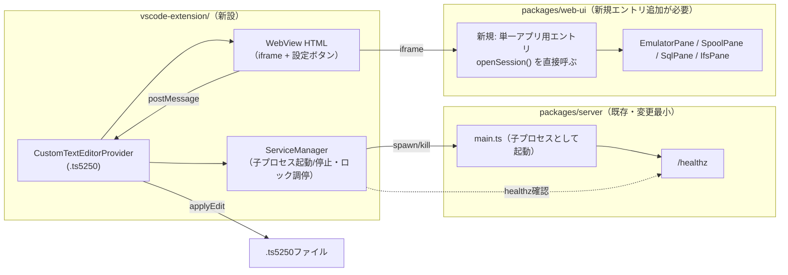

# 調査: VSCode拡張機能によるts5250画面のWebView表示

## 調査の問い

- Q1: WebViewから既存の`packages/server`（HTTP/WS）へ、ローカルホストのiframeとして繋ぐことは
  VSCodeの拡張機能で技術的に可能か（CSPで塞がれないか）
- Q2: バックグラウンドサービス（`packages/server`）を拡張ホストからどう起動・停止するのが安全か
  （`electron/main.cjs`のような`import()`方式が転用できるか）
- Q3: `.ts5250`ファイルへの書き戻し（設定ボタンでの編集内容をファイルへ反映）は
  どのVSCode APIで実現するか
- Q4: 同一`.ts5250`ファイルを複数回開いたときにタブが増殖しないことは保証されるか
  （AC9・requirements未確定事項）
- Q5: パスワードの暗号化フィールド（D2で決定）を実装する既存資産はあるか
- Q6: 単一アプリ専用の最小WebView UIは、既存web-uiのVueコンポーネントを再利用できるか
- Q7: 「VSCode全体で1つ」のサービス管理（複数ウィンドウをまたぐ単一起動）はVSCode APIで
  素直に実現できるか
- Q8: `.vsix`にサーバーの実行時依存（hono/ws/pino等）を同梱する前例はあるか

## 判明した事実

- F1: **WebViewからローカルホストをiframe表示するのは技術的に可能**。VSCode組み込みの
  Simple Browser拡張が実際にこの構成で動いている（`microsoft/vscode`
  `extensions/simple-browser/src/simpleBrowserView.ts`）。CSPは
  `frame-src *;`で全許可し、`<iframe sandbox="allow-scripts allow-forms allow-same-origin allow-downloads">`
  という属性のiframeへ`index.js`側でURLを注入する構成。GitLabのWeb IDEフォークで
  「localhostへのiframeが禁止」と報告されている事例は、GitLab独自の追加CSPパッチが原因であり
  （出典: GitLab issue #59「prevent security vulnerabilities that originated from hosting
  the Web IDE on a single domain」）、**VSCode Desktop本体の制約ではない**。
- F2: **拡張ホスト（extension host）はNode.jsの完全な実行環境**であり、`child_process`が
  使える。ただしElectron由来のプロセスなので`process.execPath`はElectron実行ファイルを指し、
  素の`node`コマンドとしては使えない——`ELECTRON_RUN_AS_NODE=1`を環境変数に立てて
  `spawn(process.execPath, [...], { env: { ...process.env, ELECTRON_RUN_AS_NODE: "1" } })`する
  ことで、システムに`node`が入っていない利用者環境でも動く（Electron公式ブログ・
  `matthewslipper.com`の解説記事、および`vitest-dev/vscode`・`edamagit`等の実例で広く使われる手法）。
- F3: **既存`packages/server`の`main()`は`process.exit(0)`をSIGINT/SIGTERM経由でしか止められない**
  （`packages/server/src/main.ts:345-350`）。`electron/main.cjs`はこの`main()`を
  **同一プロセス内で`import()`**して使っているが（`electron/main.cjs:165-167`）、これは
  Electronのmainプロセス＝アプリ全体だからこそ成立する（プロセス終了＝アプリ終了で問題ない）。
  **VSCode拡張ホストで同じ方式を取ると、サーバーを止めるつもりのSIGTERMが拡張ホスト
  プロセス全体を巻き込みかねず、他の拡張機能まで巻き添えになる**。よって拡張機能では
  **`child_process.spawn`で別プロセスとして起動し、`child.kill()`で個別に止める**方式を
  採るべきという設計上の結論が導ける（`main()`に戻り値・stopハンドルは無いため、
  in-process方式では「サーバーだけ」を止める経路が無い）。
- F4: `electron/main.cjs`には転用可能な実装パターンが複数ある——**空きポート探索**
  （`findFreePort`・`electron/main.cjs:54-67`）、**`/healthz`ポーリング**
  （`waitForHealth`・`electron/main.cjs:122-140`）、**CLI引数の組み立て**
  （`--http` / `--web-root` / `--profiles` / `--connections` / `--auto-secret-key` /
  `--secret-key-file`・`electron/main.cjs:156-164`）。`packages/server/src/main.ts:153-216`が
  対応するCLIパーサ。
- F5: `.vsix`への実行時依存同梱は、`electron/scripts/prepare-app.mjs`がElectron向けに
  既にほぼ同じ問題を解いている——`server`パッケージの`package.json`を起点に`@ts5250/*`の
  依存を辿って集め（`collectLibPackages`・`prepare-app.mjs:57-71`）、第三者依存だけを
  `npm install --omit=dev`で解決し（`prepare-app.mjs:123-127`）、自前パッケージは
  実体コピー（ワークスペースのシンボリックリンクはelectron-builderの複写やWindows展開で
  壊れるため。`prepare-app.mjs:13-16`のコメントに実測の裏づけ）。**この仕組みはVSCode拡張の
  packaging（`vsce package`前のステージング）にもほぼそのまま転用できる**。
- F6: `.ts5250`ファイルへの書き戻しは、VSCodeの**`CustomTextEditorProvider`**が想定どおりの
  API——ドキュメントモデルは標準の`TextDocument`で、WebViewからのメッセージを受けて
  `vscode.WorkspaceEdit`を組み立て`vscode.workspace.applyEdit()`する、というのが公式サンプル
  （`vscode.dev`の"Custom Editor API"ガイド・`microsoft/vscode-docs`）の標準パターン。
  これによりVSCode標準の保存・Undo・Diffがそのまま効く（requirements FR7）。
  ただし`applyEdit`は同期呼び出しを要求する一方`onDidReceiveMessage`は非同期なので、
  連続した編集イベントの競合に注意が必要（`microsoft/vscode` issue #149016）。
- F7: 同一ドキュメントを複数タブで開いたときの挙動は`registerCustomEditorProvider`の
  `supportsMultipleEditorsPerDocument`オプションで制御できる。**既定は`false`相当**
  （明示的に`true`を渡さない限り、VSCodeは同一リソースに対して複数のカスタムエディタ
  インスタンスを作らず、既存のものを再利用・フォーカスする）。AC9（同じ`.ts5250`を
  2回開いてもタブが増えない）は、このオプションを**明示的に指定しない（またはfalseにする）**
  ことで自然に満たせる。
- F8: パスワードの暗号化は`packages/server/src/secret-crypto.ts`の`SecretCrypto`
  （`encrypt()`:78行目 / `decrypt()`:87行目）がAES-256-GCMで既に実装済み。master keyは
  環境変数から渡される設計（既存の`--auto-secret-key --secret-key-file`と同型）。
  **VSCode側の置き場所としては`vscode.ExtensionContext.secrets`（SecretStorage API）が
  候補になる**——OS標準の資格情報ストア（macOS Keychain / Windows Credential Manager /
  Linux libsecret）に保存され、Electronの`safeStorage`を介す（`vscode-api.js.org`の
  `SecretStorage`インターフェース解説）。ただしSecretStorageは拡張機能単位でグローバルな
  ストレージであり、複数ウィンドウ・複数ワークスペースをまたいで同じ値が見える
  （単一利用者前提のAGENTS.md「認証オフ = 単一の信頼ユーザー」の想定と整合する）。
- F9: 単一アプリ専用の最小WebViewは、既存web-uiの**アーキテクチャ上、実現しやすい**。
  `openSession(open: WsOpen, label, meta?, systemRef?, configRef?): Promise<string>`
  （`packages/web-ui/src/session-controller.ts:745`）が「セッションを開く」ロジックを
  UIから独立した関数として既に持っており、`sessionsStore.add(state)`でストアへ登録する
  （同ファイル:795）。`EmulatorPane.vue`（`packages/web-ui/src/components/EmulatorPane.vue`）は
  `sessionsStore` / `systemsStore` / `viewSettings`等のモジュールスコープの store を参照する
  だけで、`App.vue`のタブ帯・ワークスペース管理（`workspaceStore`）には依存していない
  （import一覧に`workspaceStore`が無いことを確認済み）。**新規の軽量エントリポイント
  （例: 新規Vueルート）が`openSession()`を直接呼び、対応するペイン
  （`EmulatorPane.vue` / `SpoolPane.vue` / `SqlPane.vue` / `IfsPane.vue`）だけを
  マウントする構成は、既存コードの改変なしで成立する**。
- F10: 「VSCode全体で1つ」のバックグラウンドサービスという要求（requirementsで確定済み）に
  対応する**VSCode公式APIは存在しない**。VSCode Desktopでは、ウィンドウ（トップレベルの
  `BrowserWindow`）ごとに独立した拡張ホストプロセスが立つため、単純な「拡張のグローバル変数」
  では複数ウィンドウ間の単一インスタンスを保証できない。Electronの
  `app.requestSingleInstanceLock()`に相当する仕組みはVSCode拡張ホストには公式には無い
  （検索で確認できたのは一般的なロックファイル手法のみで、VSCode拡張向けの定番パターンは
  見つからなかった）。**設計で自前の調停が必要**——`context.globalStorageUri`配下に
  ポート番号とPIDを書いたロックファイルを置き、起動時に`/healthz`へ疎通確認して
  生きていれば再利用、いなければ自分が起動する、という方式が現実的な候補
  （`packages/server`は既に`/healthz`を持つ・`packages/server/src/app.ts:140`）。
  「最後のWebViewが閉じたら停止」も同様に、各ウィンドウが自分のWebView数を
  ロックファイル上の参照カウントに反映する形の自前実装が要る。
- F11: `packages/server`の`/healthz`は`{ status: "ok", sessions: deps.sessions.size }`を返す
  （`packages/server/src/app.ts:140`）。起動確認だけでなく、セッション数を使った
  死活監視にも使える。

## 影響範囲

- `packages/server`: 変更は最小（CLI引数はそのまま使える。F4）。子プロセスとして
  spawnする前提を崩さない範囲であれば無変更で使える可能性が高い
- `packages/web-ui`: 単一アプリ専用の軽量エントリを**新規追加**する必要がある
  （F9で実現性は確認済みだが、実装自体はこのworkで行う）
- `vscode-extension/`: 新設一式（リポジトリ直下、`electron/`と同じ立て付け）

## 実現性 / リスク

- **iframe表示は実現可能**（F1）。VSCode本体機能と同じ手法。
- **サービスの起動・停止は`spawn`+`kill`方式に決め打てる**（F3）。`import()`方式
  （electronと同じ）は拡張ホストでは採用不可——プロセスを巻き込むリスクがあるため。
- **リスク（未解決のまま design へ送る）**: 複数ウィンドウをまたぐ単一サービスの調停
  （F10）は、VSCodeの公式機構が無いための自前実装になる。ロックファイル＋`/healthz`
  疎通確認という方向性は妥当だが、**プロセスがクラッシュしてロックだけ残る／
  参照カウントがウィンドウのクラッシュで減算されない**といった縮退時の扱いは
  designで詰める必要がある（例: ロックファイルにタイムスタンプを持たせ、
  一定時間`/healthz`に応答が無ければ陳腐化とみなす、等）。
- **パッケージングは前例あり**（F5）が、`.vsix`のサイズ上限（VSCode Marketplaceは
  未使用だが`.vsix`自体にも実用上の上限がある）を`electron/dist`の実測と比較しておくと
  design時の判断材料になる（今回のresearchでは未計測）。

## 実装アンカー

- A1: サーバー起動パラメータの組み立て（空きポート探索・healthz待機・CLI引数）—
  参考実装（`electron/main.cjs:54-171`の`findFreePort` / `waitForHealth` / `startServer`）。
  拡張機能側は`import()`を`child_process.spawn(process.execPath, [SERVER_MAIN, ...args],
  { env: { ...process.env, ELECTRON_RUN_AS_NODE: "1" } })`に置き換える
- A2: サーバーCLI引数パーサ（`packages/server/src/main.ts:153-216`）——
  `--http` / `--web-root` / `--profiles` / `--connections` / `--auto-secret-key` /
  `--secret-key-file`はそのまま使える
- A3: `/healthz`エンドポイント（`packages/server/src/app.ts:140`）——起動確認・
  死活監視・複数ウィンドウ間の調停のいずれにも使う
- A4: パスワード暗号化（`packages/server/src/secret-crypto.ts`の`SecretCrypto.encrypt()`
  78行目 / `decrypt()`87行目）——`.ts5250`の暗号化フィールドもこの実装を流用する
- A5: セッションを開く既存関数（`packages/web-ui/src/session-controller.ts:745`
  `openSession()`）——新規の単一アプリ用エントリはここを直接呼ぶ
- A6: パッケージング参考実装一式（`electron/scripts/prepare-app.mjs`全体）——
  `.vsix`向けステージングスクリプトのひな形として流用する
- A7: `.ts5250`のCustom Editor登録・WebView本体・書き戻しロジックは**未特定**
  （新規ファイルなので存在しない。design/tasksで配置を決める）
- A8: 単一アプリ専用の軽量Vueエントリ（`packages/web-ui`側の新規ファイル）は**未特定**
  （design/tasksで配置を決める。F9の通り`openSession()`と対象ペインコンポーネントの
  組み合わせで実現可能なことは確認済み）

## 実装時の注意

- `packages/server/src/main.ts:345-350`のSIGINT/SIGTERMハンドラは`resultSets.closeAll()`と
  `pool.closeAll()`を呼んでから`process.exit(0)`する。**子プロセスとして起動した場合、
  拡張機能側は`child.kill()`（既定でSIGTERM相当）を送れば、このハンドラ経由で
  後片付きの終了になる**——独自の終了シーケンスを別途実装する必要はない
- `electron/main.cjs`の`resolveDataDir` / `resolveProfiles`（44-119行目）は「開発時は
  repoルート、パッケージ時はuserData」という分岐を持つ。VSCode拡張では**userDataに相当する
  置き場が`context.globalStorageUri`**になる（`.ts5250`ファイル自体はワークスペース内に
  あるが、サーバーの`connections.json`・master key相当の情報はグローバルストレージ側に
  置くことになりそうだが、この対応関係はdesignで確定する）
- `EmulatorPane.vue`の冒頭コメント（`packages/web-ui/src/App.vue:22-33`）にある
  「`visibleTabs`で数えてはいけない」等の**タブ集計の罠は、単一アプリ専用エントリには
  引き継がれない**（そもそもタブの概念を持ち込まないため）——ただし逆に、既存の
  ワークスペース関連ストア（`workspaceStore`）を誤って参照すると、単一セッション表示のはずが
  ワークスペースの状態に巻き込まれる可能性があるので、新規エントリは`workspaceStore`を
  importしないよう注意する

## design への申し送り

- サービスのプロセス管理は**`child_process.spawn` + `ELECTRON_RUN_AS_NODE`**で決め打ってよい
  （F2, F3）。`import()`方式は不採用（他拡張を巻き込むリスクがあるため）
- 複数ウィンドウをまたぐ単一サービスの調停ロジック（ロックファイル・参照カウント・
  クラッシュ時の陳腐化判定）は、requirementsの未確定事項のうち**唯一この研究で
  完全には解決しなかった**。design で具体的なプロトコル（ロックファイルのスキーマ・
  タイムアウト値・異常系）を確定する
- master keyの置き場所は`vscode.ExtensionContext.secrets`（SecretStorage）が有力候補（F8）。
  設定ボタンから入力したパスワードを暗号化する際の鍵をどこから取得するか、
  複数ウィンドウで同じ鍵を共有できるか（SecretStorageはグローバルなのでできるはず）を
  designで確定する
- 単一アプリ専用WebViewは、web-ui側に新規Vueエントリを追加する方針で進めてよい
  （F9）。既存コンポーネント（`EmulatorPane.vue`等）の改変は不要と見込まれるが、
  実際に組んでみないと確定しない部分（`viewSettings`等グローバル設定ストアの
  初期化タイミング等）はtasks/codingで検証する
- `.ts5250`ファイルへの書き戻しは`CustomTextEditorProvider` + `WorkspaceEdit`で実現する
  （F6）。同時編集の競合（F6の`applyEdit`非同期性の注意）はdesignで直列化の方針を決める
- `supportsMultipleEditorsPerDocument`を指定しない（=false）ことで、AC9
  （同一ファイルの多重オープン防止）は追加実装なしで満たせる見込み（F7）
