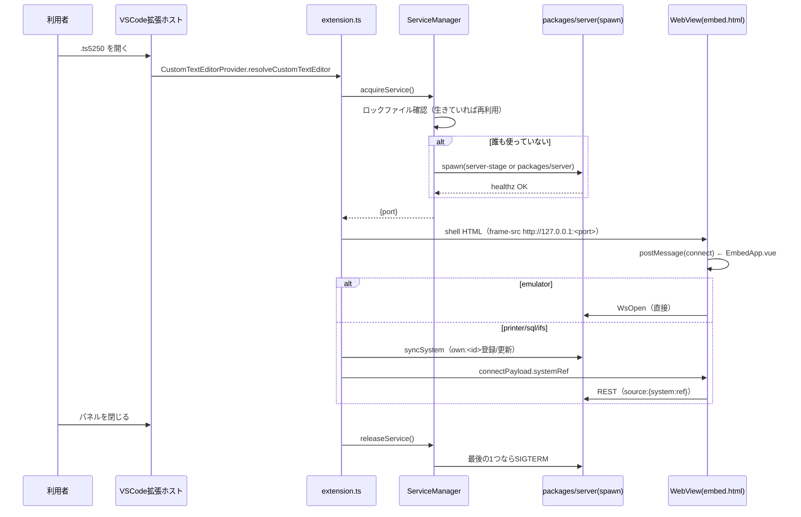

# レビューガイド: VSCode拡張機能によるts5250画面のWebView表示

## 変更概要 / 目的

`.ts5250`という独自拡張子の設定ファイルをVSCodeで開くと、その中身（接続先ホスト・CCSID・
アプリ種別＝emulator/printer/sql/ifs）に応じたWebViewが開く。裏側のサーバー
（`@ts5250/server`）はVSCode全体で1つだけ起動し、最後のパネルが閉じたら止まる
（1画面ごとに別サービスが立つのを禁止、というのが利用者の最初の要求）。設定ボタンから
WebView内のHTMLフォームで接続情報を編集でき、`.ts5250`ファイル自体（`WorkspaceEdit`経由）へ
書き戻る。

## 重要ポイント

1. **サービスは2階層の参照カウントで守られている**
   （`vscode-extension/src/extension.ts:63-100`、`decisions.md` D1 @02-extension-core）:
   - `ServiceManager`（`vscode-extension/src/serviceManager.ts`）＝**ウィンドウ横断**。
     `context.globalStorageUri/service.json`のロックファイルで、同じPCの複数VSCodeウィンドウが
     同じ1プロセスを共有する。
   - `extension.ts`内の`localCount`＝**同一ウィンドウ内の複数パネル**。1つのウィンドウで
     `.ts5250`を2つ開いても、`ServiceManager`側のエントリは1つのまま（ハートビートの
     更新だけ）なので、ウィンドウ内で別途数えないと1つ目のパネルを閉じた瞬間に
     まだ使っているパネルの分もサービスが止まってしまう。

2. **emulator と printer/sql/ifs で経路が違う**（`design.md`「設計方針3」訂正、`decisions.md` D3）:
   emulatorは`WsOpen`で直接繋ぐが、printer(スプール表示)/sql/ifsは
   サーバー側に`own:<id>`という**system参照**を事前登録しないと動かない
   （`SpoolPane.vue`/`SqlPane.vue`/`IfsPane.vue`が`{tabId,active,system}`という
   REST寄りのpropsを使うため）。この登録・同期を担うのが`systemSync.ts`。

3. **`own:<id>`のidはサーバーが採番する**ので決定的に導出できない
   （`systemSync.ts:9-18`のコメント、`decisions.md` D1 @03-sql-ifs）。初回`POST`の応答
   （`{system:{ref}}`。`id`という欄は無い）をローカルの対応表（`systemRefs.json`）へ
   キャッシュし、2回目以降はそのrefへ`PUT`で同期する。**この`ref`と`id`の取り違えは
   単体テストのモックが同じ勘違いをしていたため素通りし、実プロセス統合テストで
   初めて見つかった**（`systemSync.integration.test.ts`）。

4. **パスワードは2重に暗号化を経由する**: WebViewフォーム → 拡張機能内で
   `ExtensionSecretCrypto`（AES-256-GCM。VSCodeの`SecretStorage`が鍵を持つ）で暗号化して
   `.ts5250`へ書き戻す → emulatorはそのまま`ConnectPayload`へ復号して渡すだけだが、
   printer/sql/ifsは`syncSystem`経由でサーバーへ**平文**を渡し（ローカルloopback限定）、
   サーバー側がAES-256-GCMで`passwordEnc`として`connections.json`へ保存する
   （`toSystemRecord`。`packages/server/src/config-routes.ts:101-103`）。**平文がファイルに
   残らないことを親の統合testで実際に確認済み**（`systemSync.password-integration.test.ts`）。

5. **配布は`.vsix`単独で自己完結する**（`vscode-extension/scripts/prepare-server.mjs`）。
   `@ts5250/*`の実体コピー＋サードパーティ依存の`npm install --omit=dev`で
   `server-stage/`を作り、拡張機能に同梱する。開発時（`Development`）と配布後
   （`Production`）でパスの組み立てが変わる（`extension.ts`の`resolveServerPaths`）。
   **この2つが同じレイアウトを独立に決め打ちしている**ため、対応関係を
   `serverStageLayout.test.ts`で固定している（review round1指摘、`04-packaging/decisions.md` D1）。

## 処理フロー

## 主要な変更箇所

- `vscode-extension/src/extension.ts:27-40` — dev/packaged分岐（`resolveServerPaths`）
- `vscode-extension/src/serviceManager.ts:75-132` — ロックファイル調停（acquire/release）
- `vscode-extension/src/ts5250EditorProvider.ts` — `resolvePayload`（emulator vs printer/sql/ifsの分岐）
- `vscode-extension/src/systemSync.ts` — `own:<id>`登録・同期
- `packages/web-ui/src/EmbedApp.vue` — WebView側のアプリ切り替え・再接続時のre-entrancyガード
- `packages/server/src/app.ts` — `/embed.html`がSPAフォールバックに飲まれるバグの修正
- `vscode-extension/scripts/prepare-server.mjs` — `.vsix`同梱物の組み立て

## リスク / 確認したい点

- **VSCode拡張ホストでの実地動作は未検証**（このセッションの実行環境に拡張ホストが無い）。
  `context.extensionMode`の分岐・WebViewの実表示・フォーカストラップ・実キー入力は、
  実際に`.vsix`をインストールするか`--extensionDevelopmentPath`で確認する必要がある。
- **ロックファイル調停に1回だけ観測したレア事象**（`decisions.md` D2）: 全ファイル並行の
  実プロセス統合テストで、2つのプロセスが同時に「自分が勝者」と誤認し孤児プロセスが
  残るケースを1回観測した。再現条件を確定できておらず、backlog
  （`.aidev/backlog/session-lifecycle.md`）へ送って次work任せにしている。単一利用者の
  ローカルツールとして実害は限定的（余分なnodeプロセスが1つ残る程度）と判断した。
